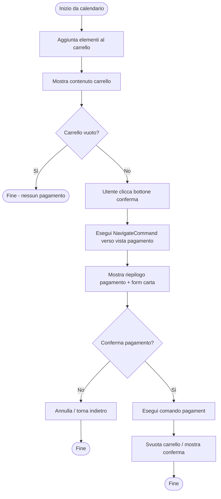
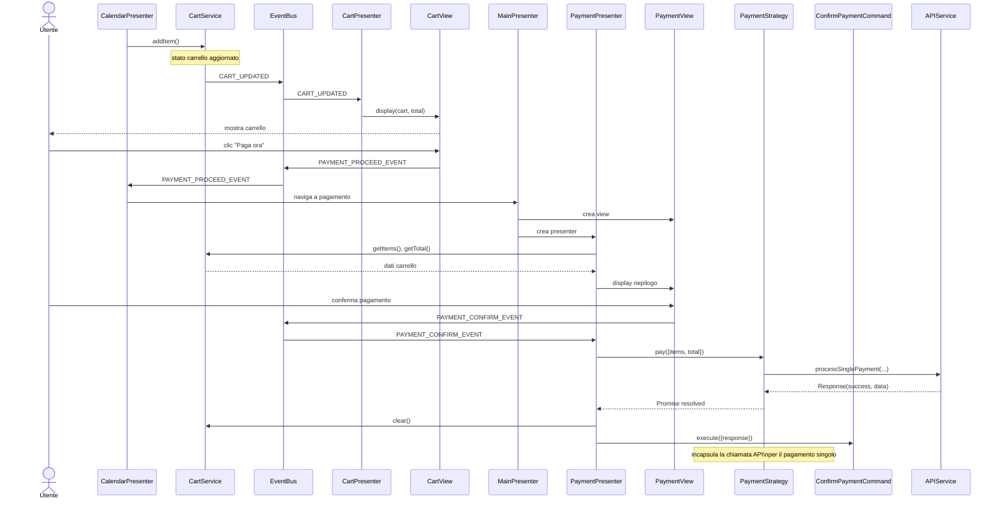
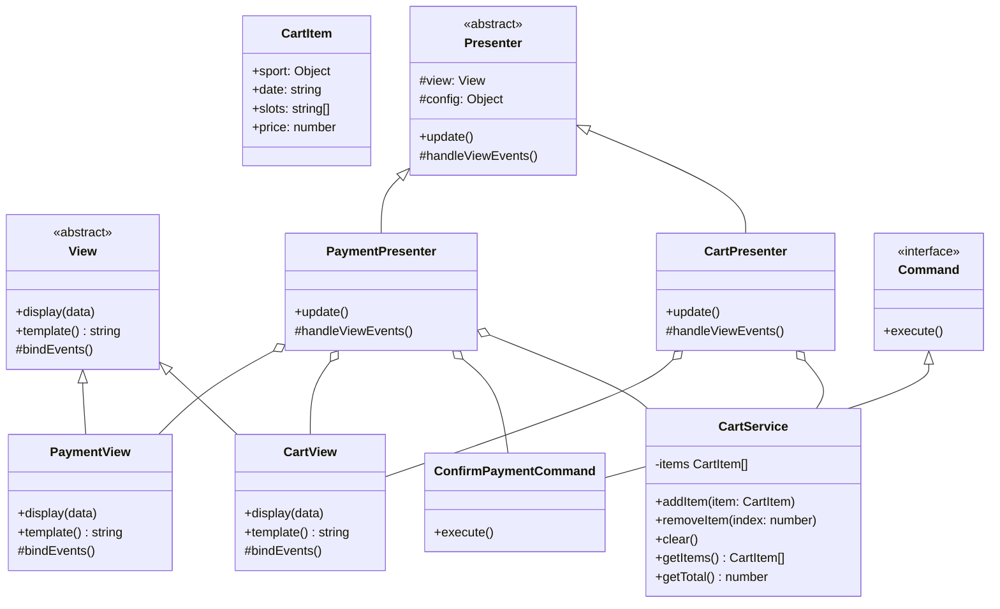

# Modulo Pagamento - Frontend

## Casi d'uso correlati
- **UC04**: Prenotare campo sportivo (parte di conferma e riepilogo)
- **UC06**: Iscriversi a una lezione di un corso (parte di conferma e riepilogo)
- **UC08**: Effettuare pagamento singolo

## Panoramica

Il modulo **pagamento** gestisce:
- l'aggregazione delle prenotazioni selezionate dall'utente in un **carrello**,
- il **riepilogo** degli elementi da pagare,
- la **conferma del pagamento** e l'eventuale svuotamento del carrello.

La logica di chiamata all'API di pagamento è incapsulata in una `PaymentStrategy`, iniettata nel `PaymentPresenter` dalla `ViewFactory`. In questo modo è possibile differenziare:

- il **pagamento singolo** (UC08), che usa `NormalPaymentStrategy` e opera sui dati presenti nel carrello;
- il **pagamento abbonamento** (UC09), che usa `SubscriptionPaymentStrategy` e opera sui dati dell'abbonamento selezionato.

## Diagramma di attività (carrello e pagamento)

## Diagramma di sequenza (frontend - pagamento singolo)

## Diagramma delle classi

