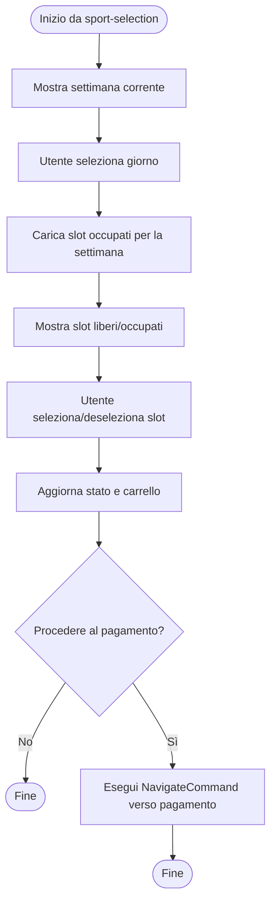
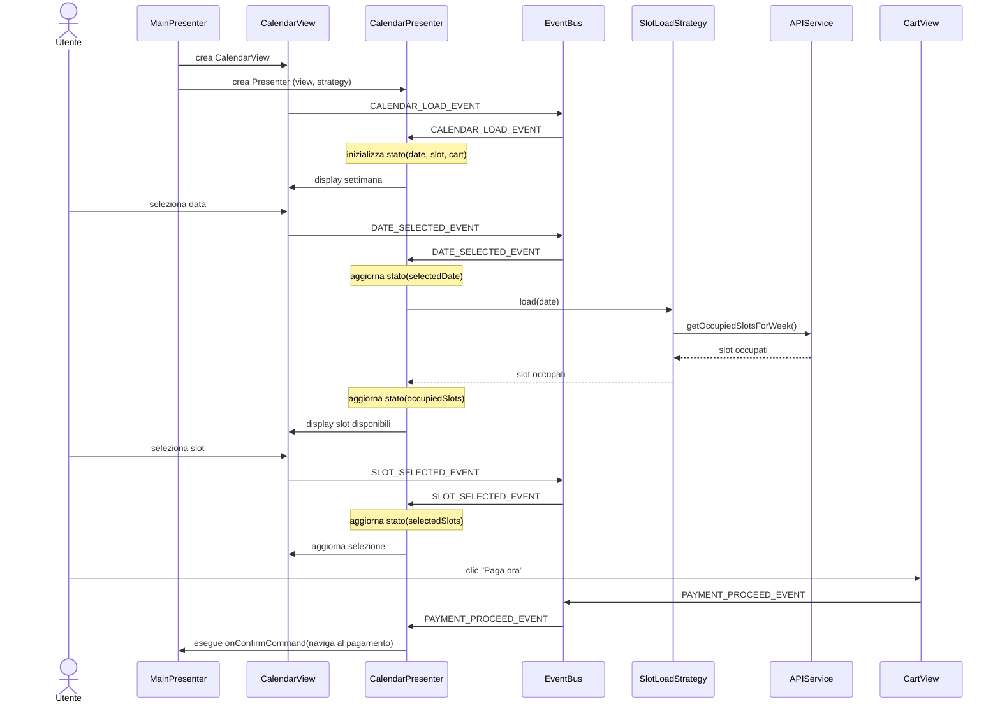
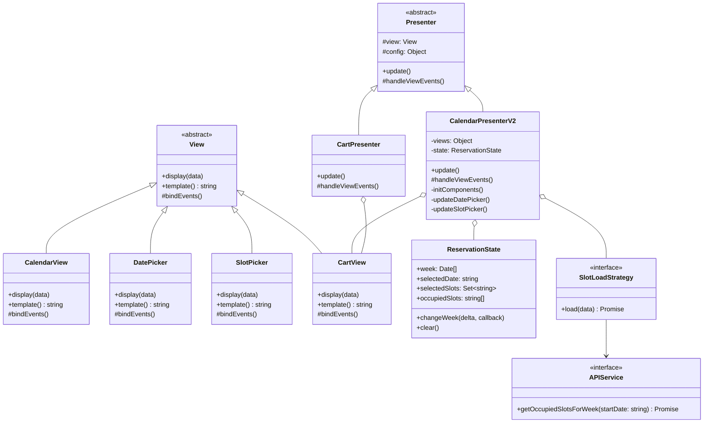

# Modulo Prenotazione - Frontend (Calendario)

## Casi d'uso correlati
- **UC03**: Visualizzazione Disponibilità Campi (Selezione data e slot)
- **UC04**: Prenotazione Campo Sportivo
- **UC05**: Visualizzazione Corsi (Selezione data e visualizzazione disponibilità)
- **UC06**: Iscrizione a una Lezione

## Panoramica

Il modulo **prenotazione** gestisce la selezione di **data** e **slot orari** per un campo/corso, a partire da uno sport o corso selezionato nel modulo *sport-selection*.

Componenti principali:
- `CalendarView`
- `CalendarPresenterV2`
- `DatePicker`
- `SlotPicker`
- `ReservationState`
- `CartView` / `CartPresenter`
- `APIService`
- `SlotLoadStrategy`
- `NavigateCommand` (verso il modulo pagamento)

## Diagramma di attività (selezione e conferma slot)

## Diagramma di sequenza (frontend)

## Diagramma delle classi

