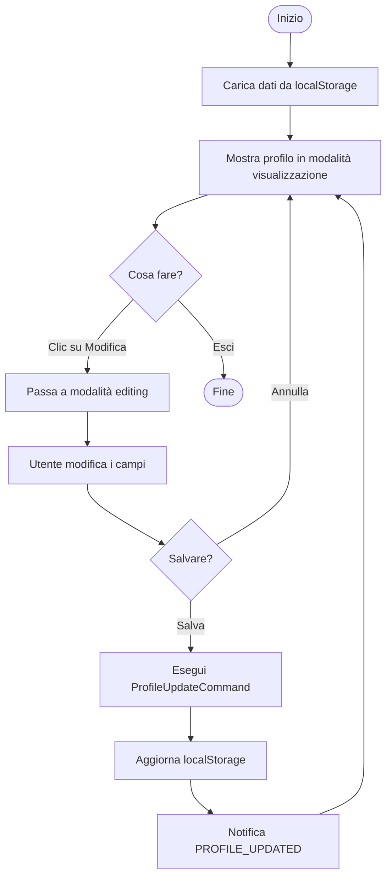
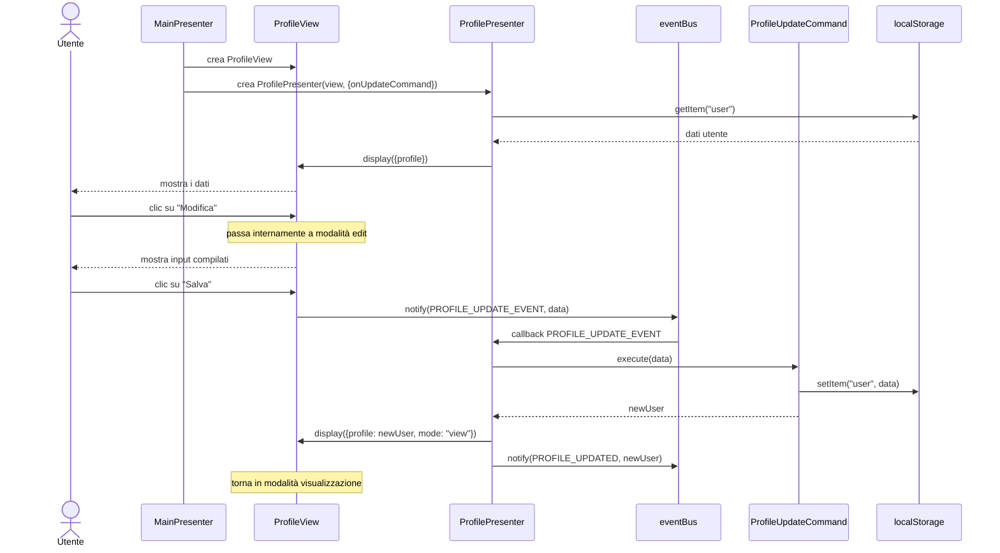
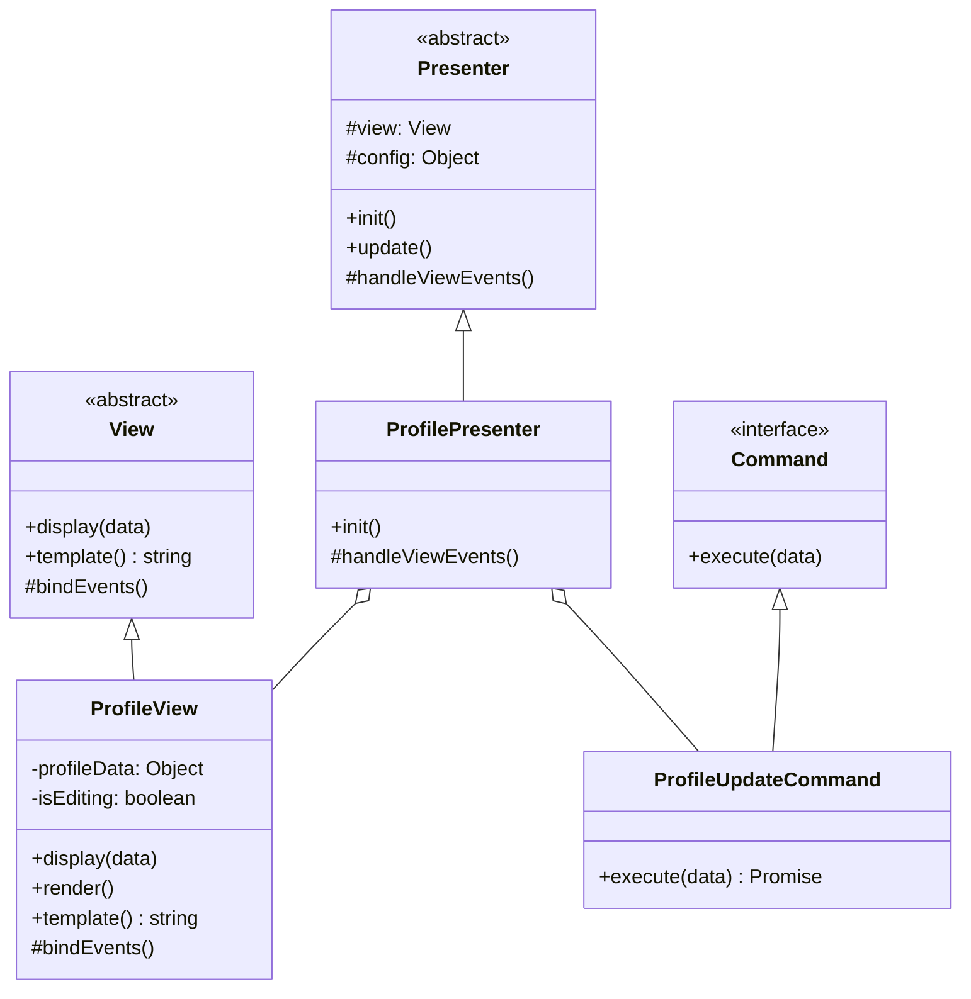

# Modulo Profilo - Frontend

## Casi d'uso correlati
- **UC02**: Visualizzare e gestire profilo utente

## Panoramica

Il modulo **profilo** permette all'utente di visualizzare le proprie informazioni personali e di modificarle. Utilizza il pattern **Command** per gestire l'aggiornamento dei dati e invia notifiche globali tramite l'**EventBus** quando il profilo viene aggiornato

## Diagramma di attività (visualizzazione e modifica)

## Diagramma di sequenza (frontend)

## Diagramma delle classi

