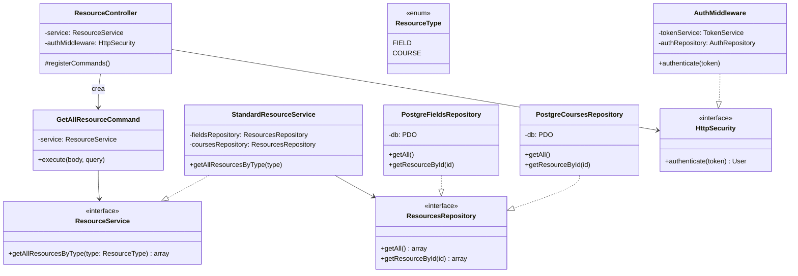
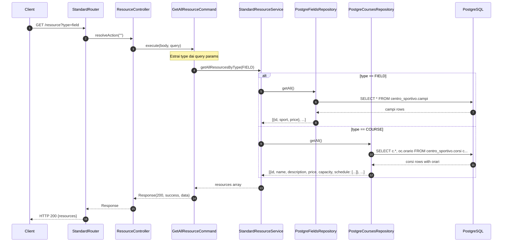
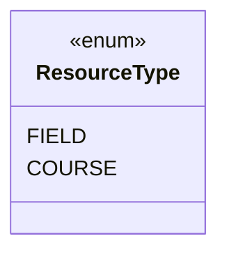
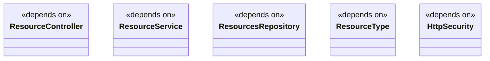

# Modulo resources - Backend

## Panoramica

Questo modulo gestisce le risorse del centro sportivo, inclusi campi sportivi e corsi. Fornisce operazioni di lettura per ottenere tutti i resource o filtrare per tipo.

## Diagramma delle Classi



## Flusso di Lettura Resource (Diagramma di Sequenza)



## Endpoint

| Metodo | Path | Descrizione |
|--------|------|-------------|
| GET | `/resource` | Ottiene tutti i resource |
| GET | `/resource?type=field` | Ottiene solo i campi sportivi |
| GET | `/resource?type=course` | Ottiene solo i corsi |

## Comandi

### GetAllResourceCommand

```php
class GetAllResourceCommand extends Command {
    public function __construct(private ResourceService $service) {}
    
    public function execute(array $params, array $query = []): Response {
        $type = $query['type'] ?? null;
        
        if ($type === null) {
            // Return all resources merged
            $fields = $this->service->getAllResourcesByType(ResourceType::FIELD);
            $courses = $this->service->getAllResourcesByType(ResourceType::COURSE);
            $result = array_merge($fields, $courses);
        } else {
            $resourceType = ResourceType::from($type);
            $result = $this->service->getAllResourcesByType($resourceType);
        }
        
        return new Response(200, true, $result);
    }
    
    public function getRequiredBodyParameters(): array { return []; }
    public function getRequiredQueryParameters(): array { return []; }
    public function getRequiredHttpMethod(): string { return 'get'; }
    public function requiresAuthentication(): bool { return false; }
    public function getRequiredRoles(): array { return []; }
}
```

## ResourceType Enum



### Struttura Dati

**Campi (Fields):**
```json
{
  "id": 1,
  "sport": "calcio",
  "price": 50.00
}
```

**Corsi (Courses):**
```json
{
  "id": 1,
  "name": "Corso Padel Base",
  "description": "Introduzione al padel",
  "price": 90.00,
  "capacity": 18,
  "schedule": ["09:00", "11:00", "15:00"]
}
```

## Dipendenze del Modulo



## Note

- Il modulo utilizza **PostgreSQL** come database
- L'endpoint è **pubblico** (nessuna autenticazione richiesta)
- I corsi includono gli orari dalla tabella `orari_corsi`
- I campi sono semplici record dalla tabella `campi`
- Il parametro `type` nei query params è opzionale