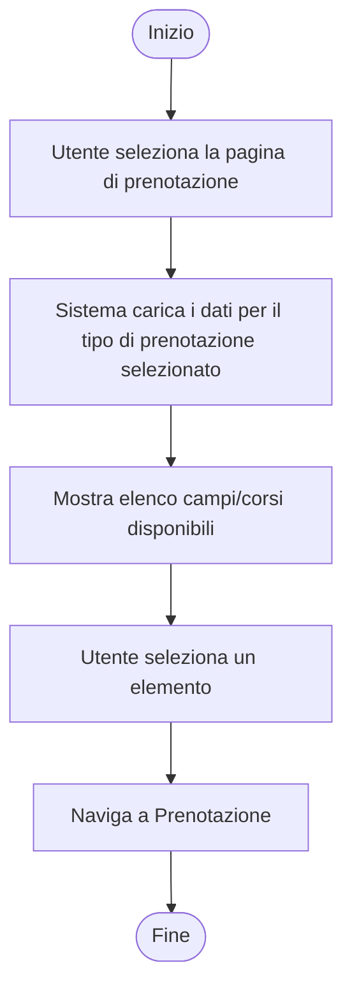
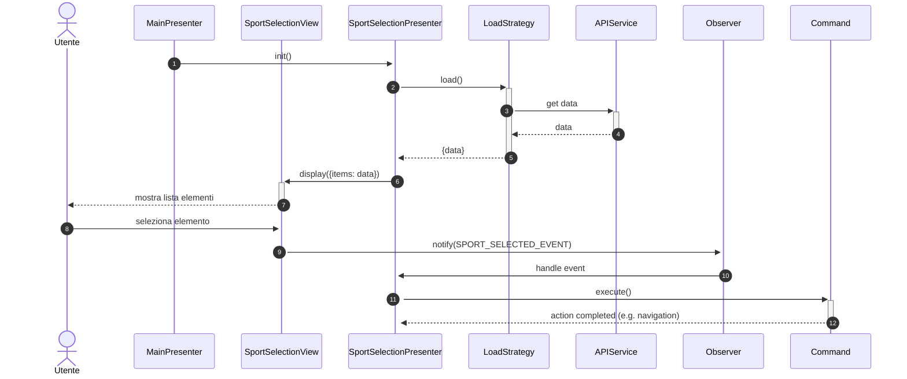
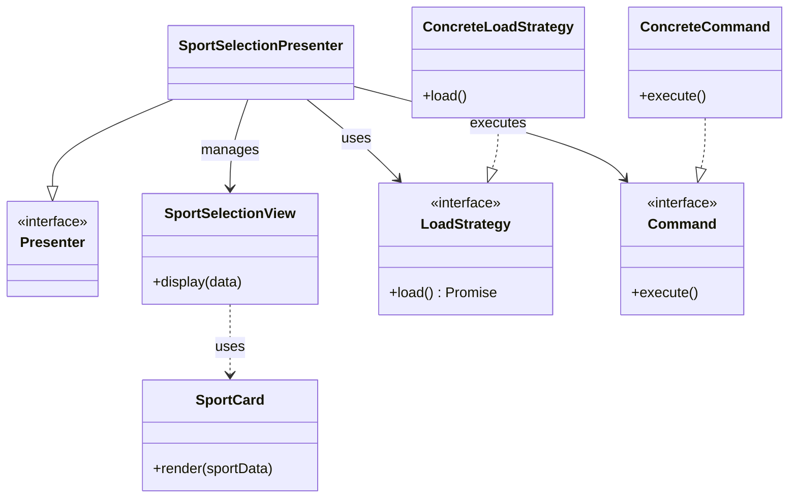

# Modulo Selezione Sport - Frontend

## Casi d'uso Correlati
- **UC03**: Visualizzazione Disponibilità Campi
- **UC05**: Visualizzare corsi

Questo modulo gestisce la visualizzazione e la selezione dei campi e degli sport disponibili.

## Diagramma di Attività

### Flusso Selezione (con Strategy e Command)

## Diagramma delle Classi

