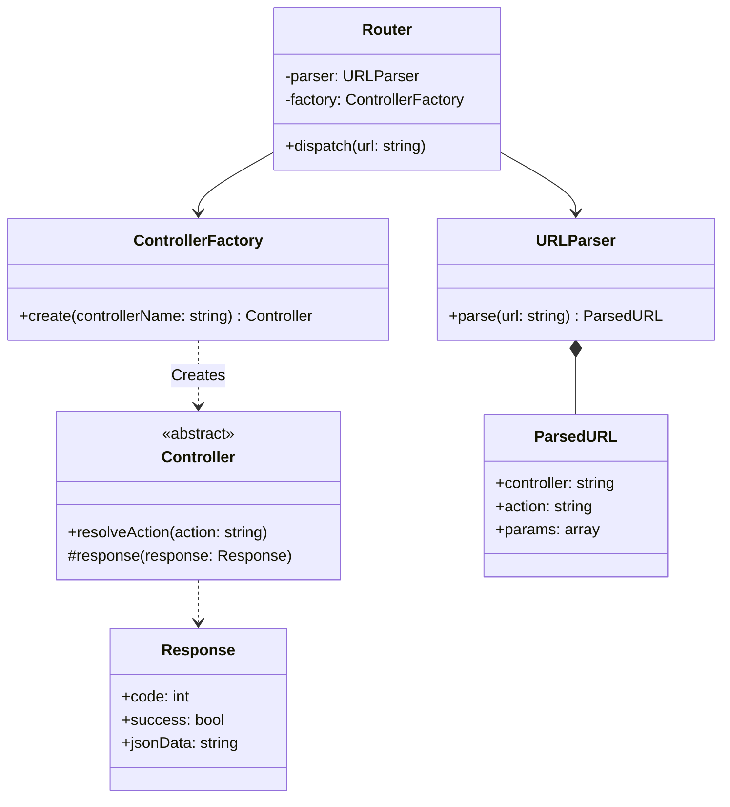
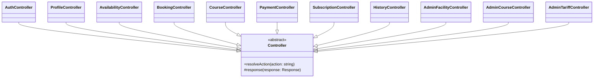
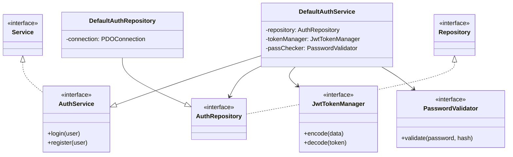
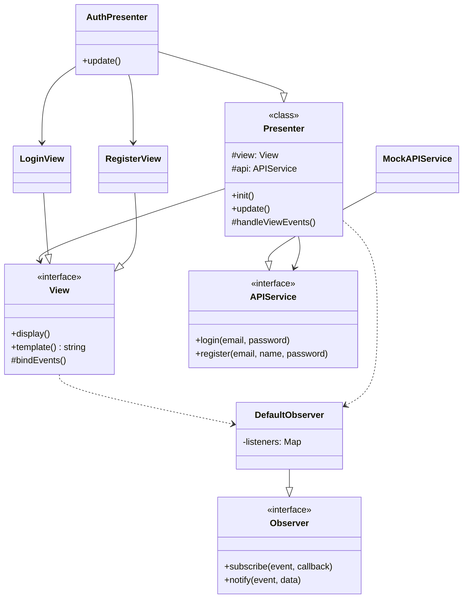

# Architettura Base del Sistema

## Backend

L'architettura backend segue un pattern MVC con separazione netta tra Routing, Controller, Service e Repository.

### Core Components

### Gerarchia Controller

Tutti i controller del sistema estendono la classe astratta `Controller`.

### Services e Repositories

I servizi e i repository sono definiti tramite interfacce per garantire il disaccoppiamento.

## Frontend

L'architettura frontend implementa il pattern MVP (Model-View-Presenter) con Observer per la gestione degli eventi.

