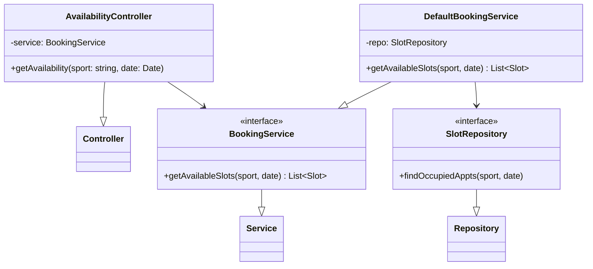
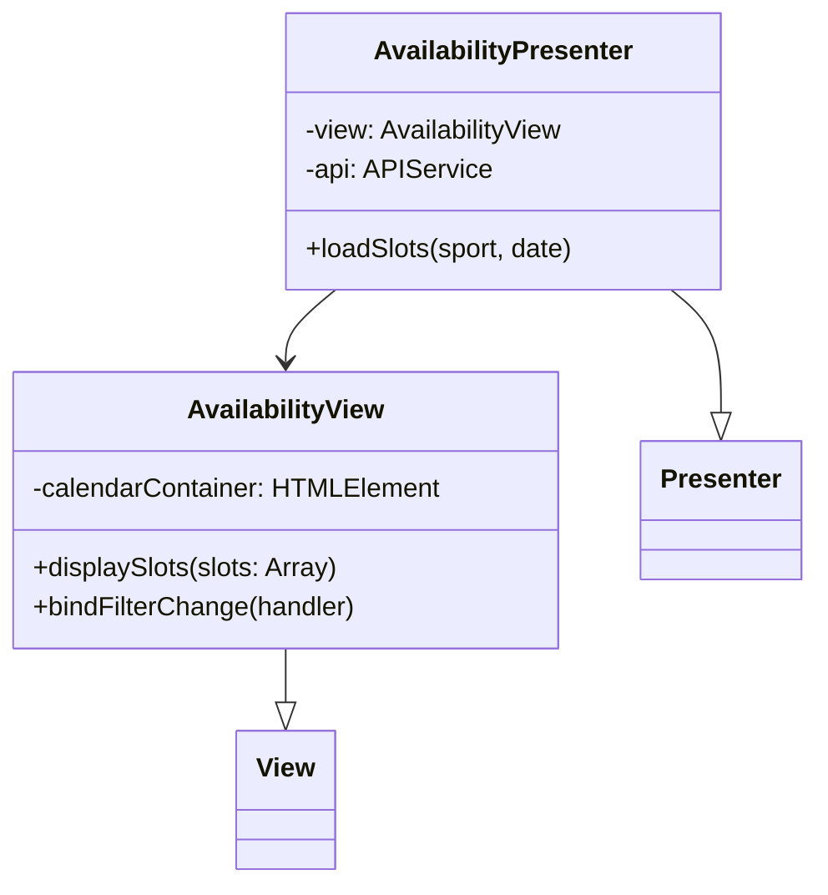
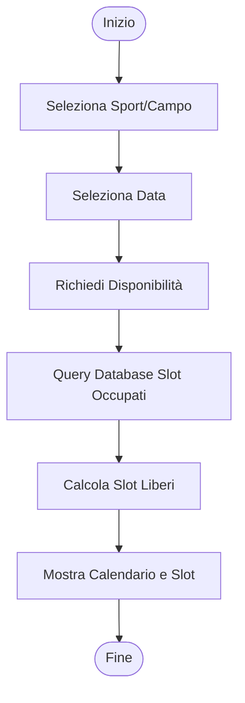
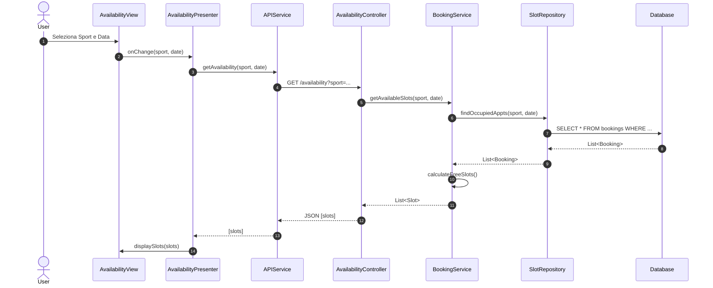

# UC03 - Visualizzazione Disponibilità

## Diagramma delle Classi

Vedi [Architettura Base](Architettura_Base.md).

### Backend

### Frontend

## Diagramma di Attività

## Diagramma di Sequenza

### Full Flow

