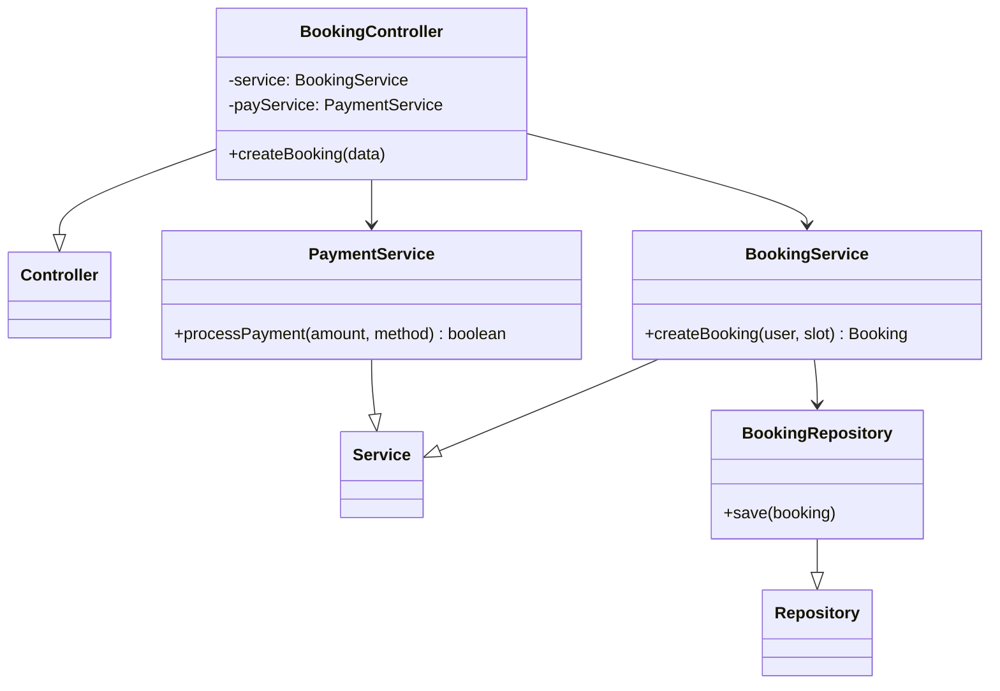
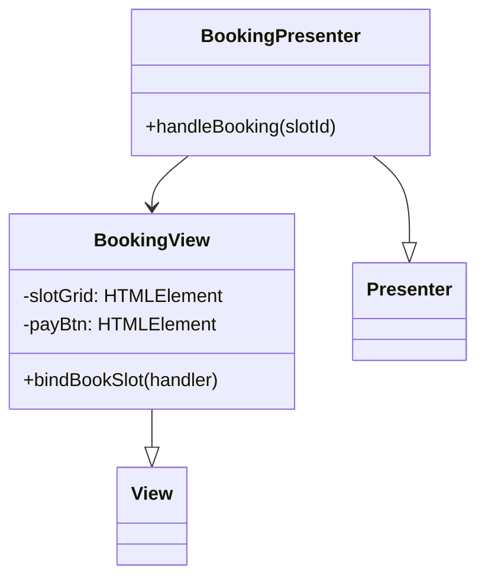
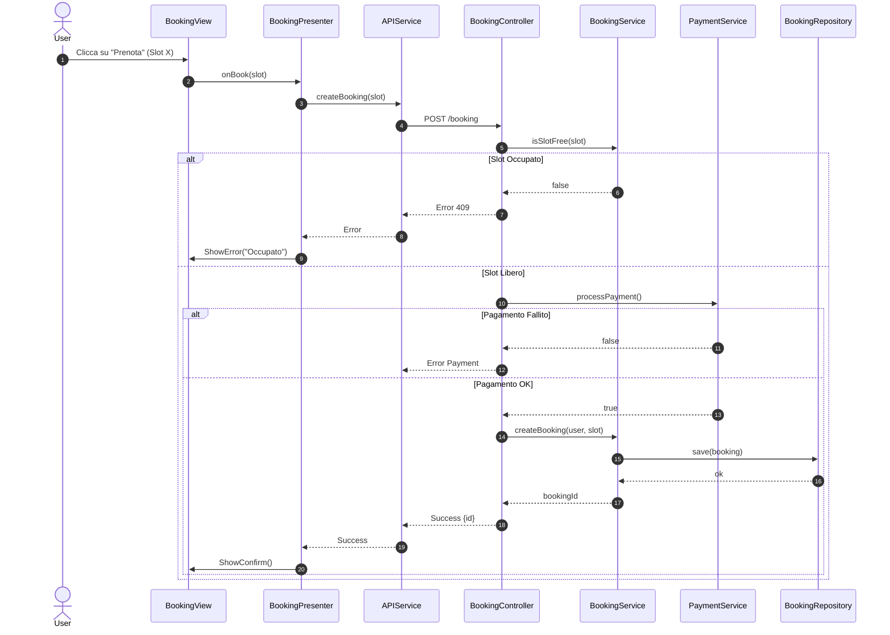

# UC04 - Prenotazione Campo Sportivo

## Diagramma delle Classi

Vedi [Architettura Base](Architettura_Base.md).

### Backend


### Frontend


## Diagramma di Attività
```mermaid
flowchart TD
    Start([Inizio]) --> ViewSlots[Visualizza Slot (UC03)]
    ViewSlots --> Select[Seleziona Slot Libero]
    Select --> Block[Blocco Temporaneo Slot]
    Block --> Payment[Richiesta Pagamento]
    Payment --> PayProcess{Pagamento OK?}
    PayProcess -- No --> Release[Rilascia Slot]
    Release --> ShowError[Mostra Errore]
    ShowError --> End([Fine])
    PayProcess -- Si --> CreateBooking[Crea Prenotazione]
    CreateBooking --> SaveDB[Salva su DB]
    SaveDB --> Confirm[Mostra Conferma]
    Confirm --> End
```

## Diagramma di Sequenza

### Booking Process

