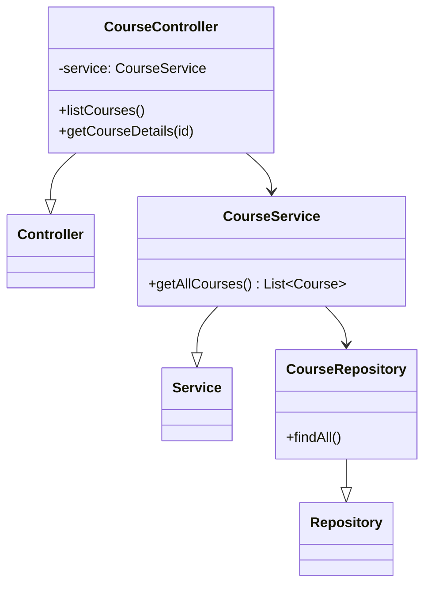
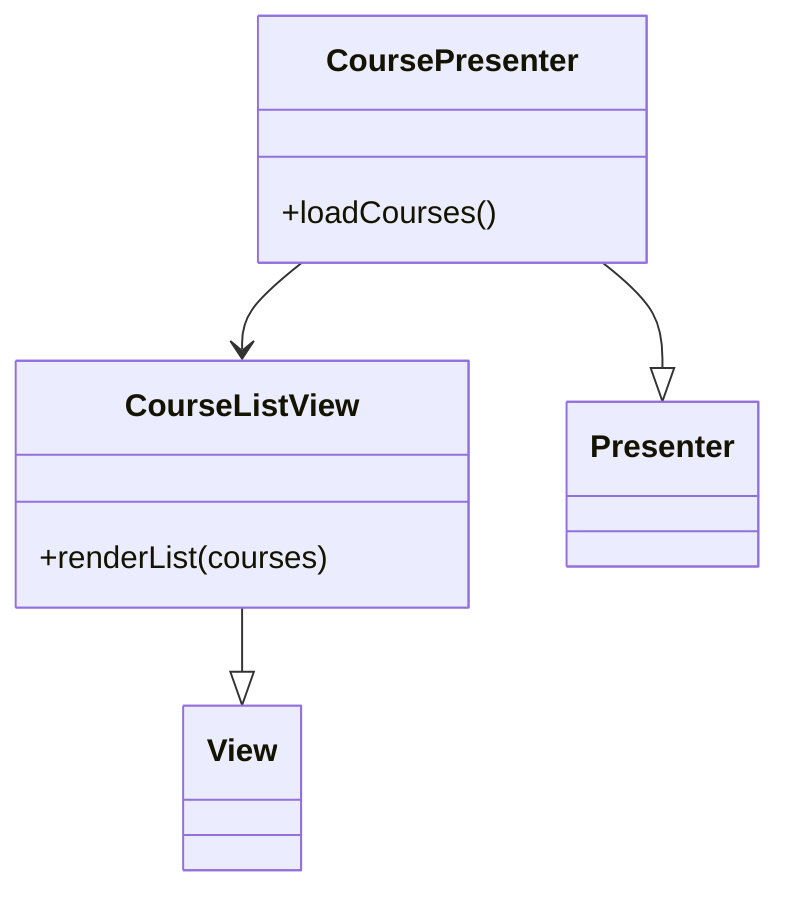
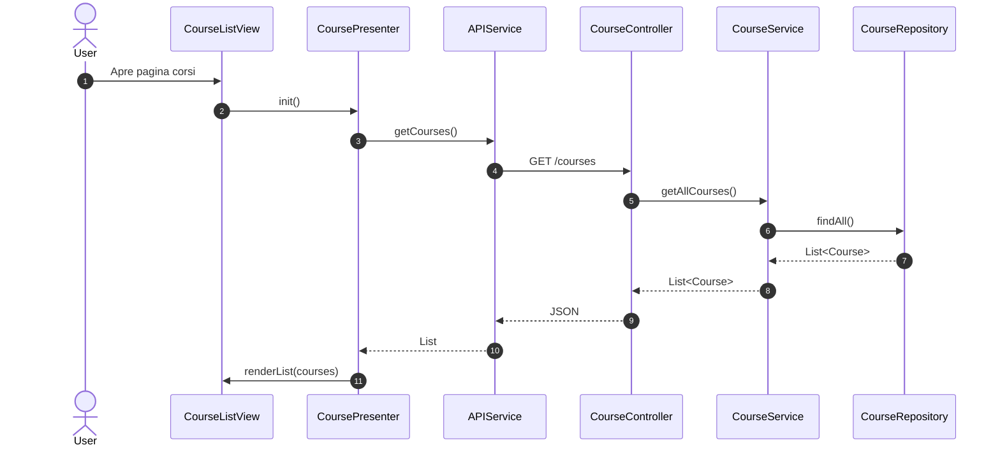

# UC05 - Visualizzazione Corsi

## Diagramma delle Classi

Vedi [Architettura Base](Architettura_Base.md).

### Backend


### Frontend


## Diagramma di Attività
```mermaid
flowchart TD
    Start([Inizio]) --> OpenCourses[Apri Pagina Corsi]
    OpenCourses --> ReqCards[Richiedi Lista Corsi]
    ReqCards --> Fetch[Recupera da DB]
    Fetch --> Show[Mostra Lista Cards]
    Show --> Filter{Filtra?}
    Filter -- Si --> UpdateList[Aggiorna Lista]
    UpdateList --> Show
    Filter -- No --> Detail{Vedi Dettaglio?}
    Detail -- Si --> ViewDetail[Mostra Dettagli (UC06)]
    Detail -- No --> End([Fine])
```

## Diagramma di Sequenza

