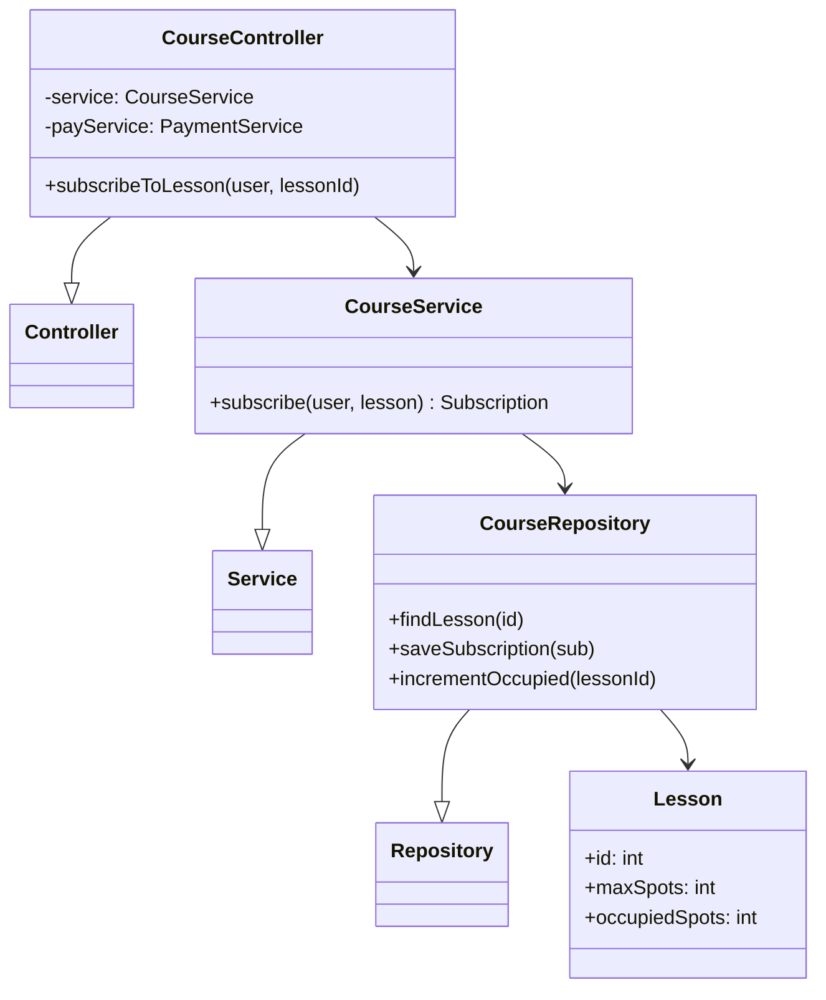
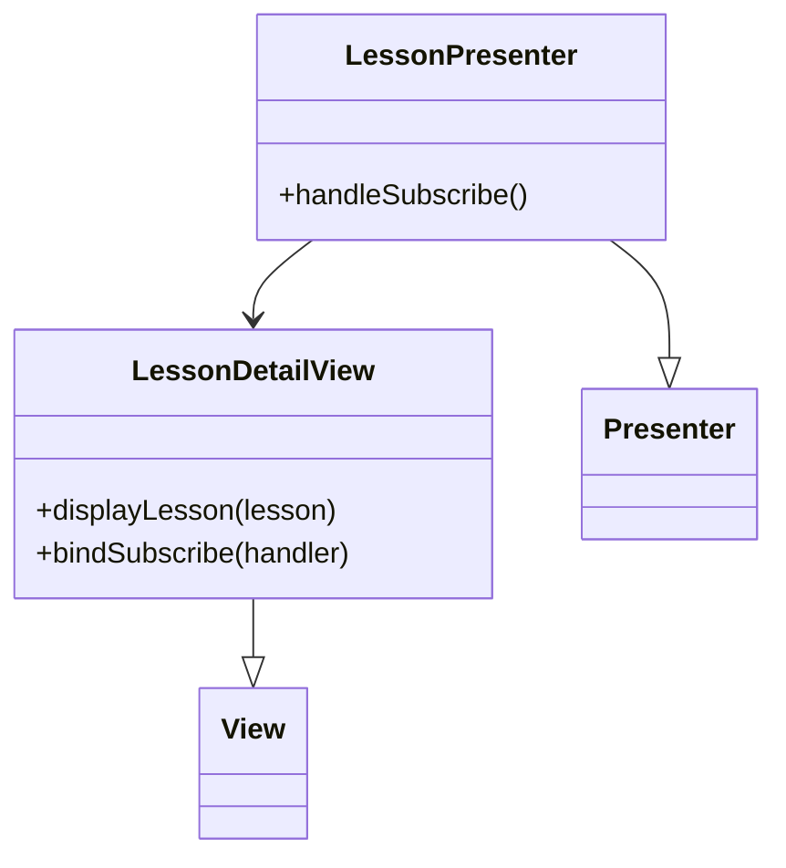
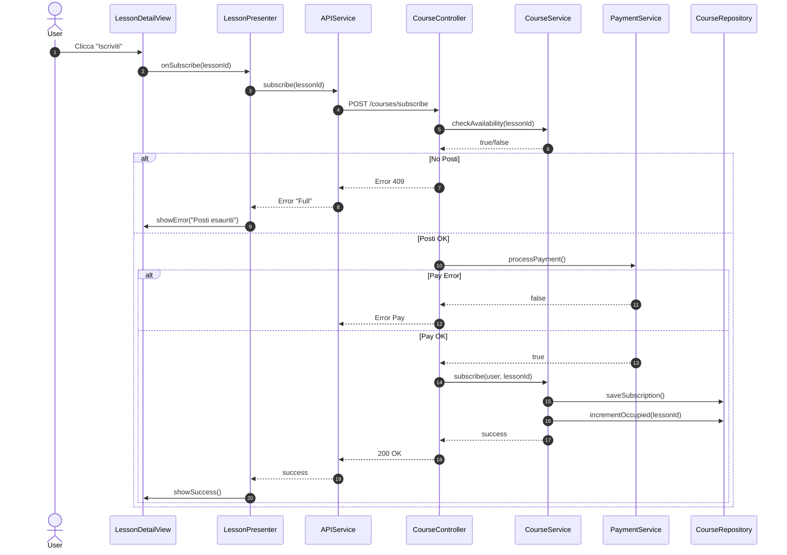

# UC06 - Iscrizione a una lezione di un corso

## Diagramma delle Classi

Vedi [Architettura Base](Architettura_Base.md).

### Backend


### Frontend


## Diagramma di Attività
```mermaid
flowchart TD
    Start([Inizio]) --> ViewList[Visualizza Corsi (UC05)]
    ViewList --> SelectCourse[Seleziona Corso]
    SelectCourse --> ViewLessons[Visualizza Lezioni]
    ViewLessons --> SelectLesson[Seleziona Lezione]
    SelectLesson --> CheckSpots{Posti Disponibili?}
    CheckSpots -- No --> ShowError[Avviso Posti Esauriti]
    ShowError --> End([Fine])
    CheckSpots -- Si --> Pay[Pagamento (UC08)]
    Pay --> PayResult{Esito OK?}
    PayResult -- No --> ShowPayError[Errore Pagamento]
    ShowPayError --> End
    PayResult -- Si --> Register[Registra Iscrizione]
    Register --> UpdateSpots[Aggiorna Posti]
    UpdateSpots --> Confirm[Mostra Conferma]
    Confirm --> End
```

## Diagramma di Sequenza

