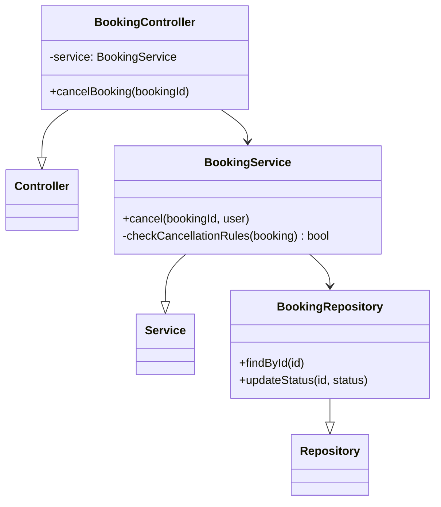
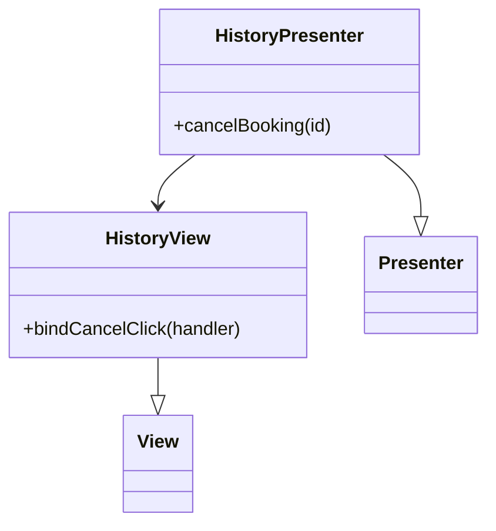
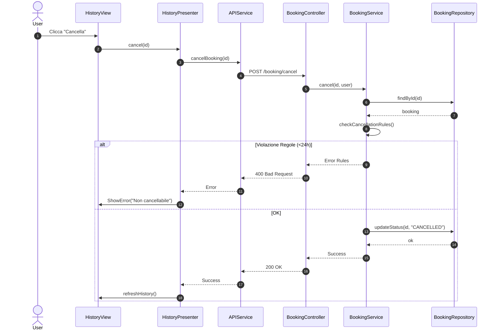

# UC07 - Cancellazione Prenotazione

## Diagramma delle Classi

Vedi [Architettura Base](Architettura_Base.md).

### Backend


### Frontend


## Diagramma di Attività
```mermaid
flowchart TD
    Start([Inizio]) --> ViewHistory[Visualizza Storico (UC10)]
    ViewHistory --> SelectItem[Seleziona Prenotazione]
    SelectItem --> RequestCancel[Richiedi Cancellazione]
    RequestCancel --> CheckTime{> 24h prima?}
    CheckTime -- No --> ShowError[Errore: Troppo Tardi]
    ShowError --> End([Fine])
    CheckTime -- Si --> ProcessCancel[Processa Cancellazione]
    ProcessCancel --> UpdateDB[Aggiorna DB]
    UpdateDB --> Refund[Eventuale Rimborso]
    Refund --> Confirm[Mostra Conferma]
    Confirm --> End
```

## Diagramma di Sequenza

