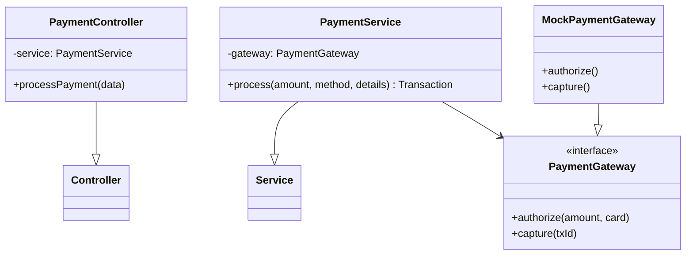
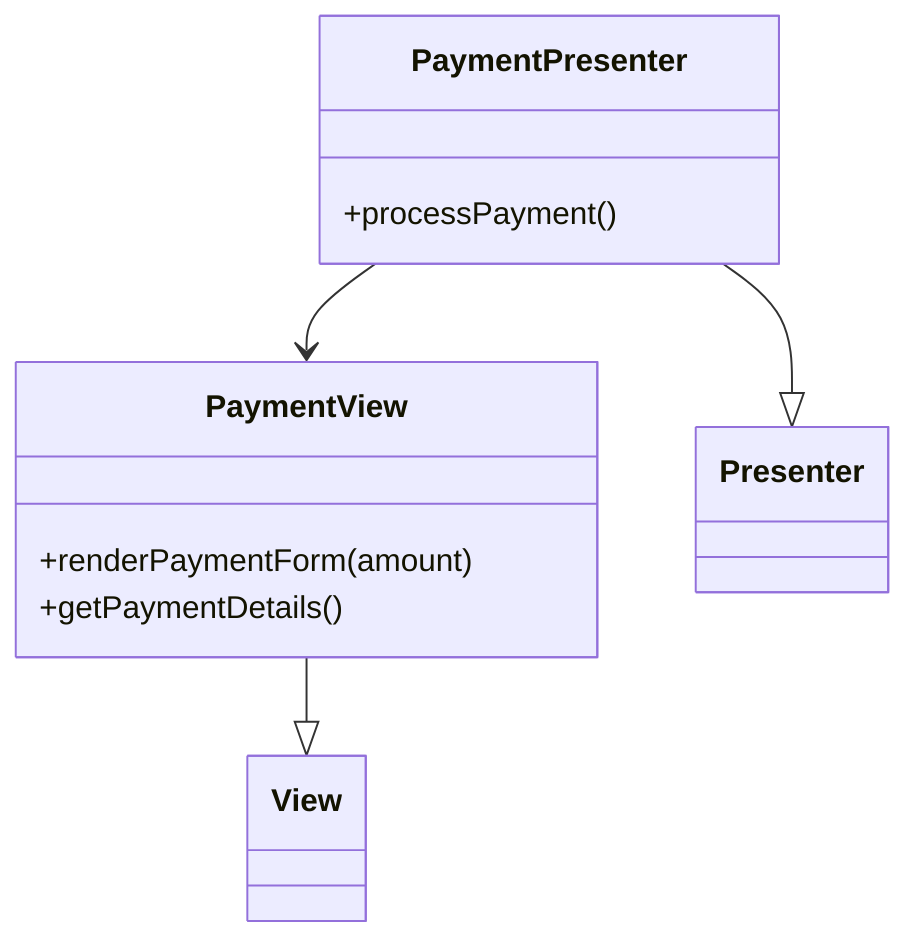
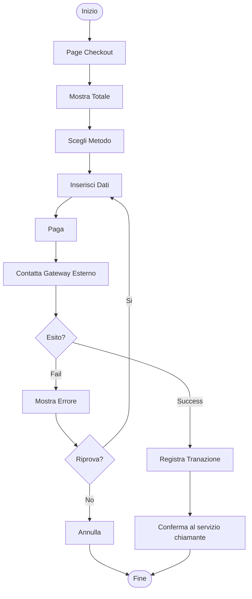
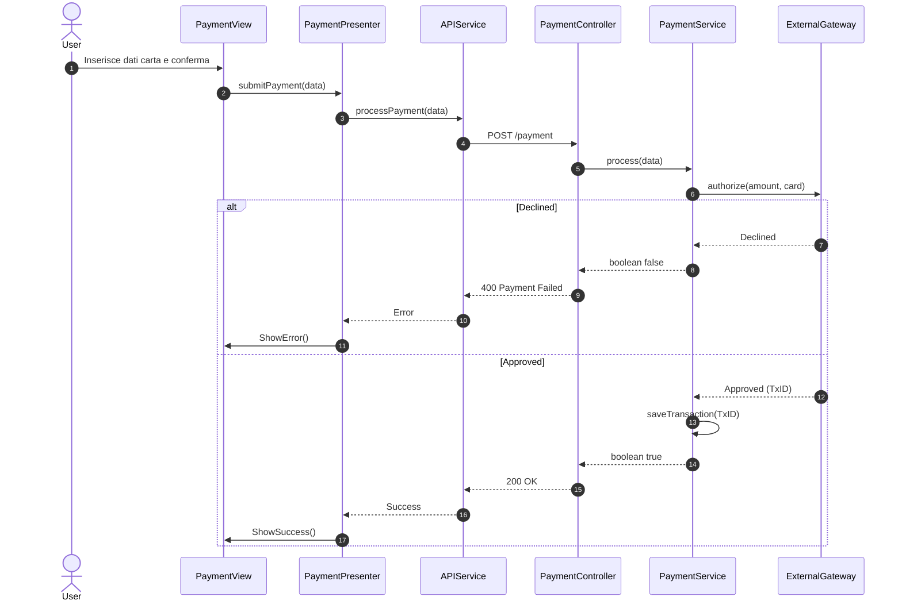

# UC08 - Effettuare Pagamento Singolo

## Diagramma delle Classi

Vedi [Architettura Base](Architettura_Base.md).

### Backend

```mermaid
classDiagram
    class PaymentController {
        -service: PaymentService
        +processPayment(data)
    }
    PaymentController --|> Controller

    class PaymentService {
        -gateway: PaymentGateway
        +process(amount, method, details) Transaction
    }
    PaymentService --|> Service

    class PaymentGateway {
        <<interface>>
        +authorize(amount, card)
        +capture(txId)
    }

    class MockPaymentGateway {
        +authorize()
        +capture()
    }
    
    MockPaymentGateway --|> PaymentGateway
    PaymentService --> PaymentGateway
```

### Frontend

```mermaid
classDiagram
    class PaymentView {
        +renderPaymentForm(amount)
        +getPaymentDetails()
    }
    PaymentView --|> View
    
    class PaymentPresenter {
        +processPayment()
    }
    PaymentPresenter --|> Presenter
    
    PaymentPresenter --> PaymentView
```

## Diagramma di Attività

```mermaid
flowchart TD
    Start([Inizio]) --> Checkout[Page Checkout]
    Checkout --> ShowAmount[Mostra Totale]
    ShowAmount --> SelectMethod[Scegli Metodo]
    SelectMethod --> InputData[Inserisci Dati]
    InputData --> Submit[Paga]
    Submit --> ContactGateway[Contatta Gateway Esterno]
    ContactGateway --> Result{Esito?}
    Result -- Fail --> ShowError[Mostra Errore]
    ShowError --> Retry{Riprova?}
    Retry -- Si --> InputData
    Retry -- No --> Cancel[Annulla]
    Cancel --> End([Fine])
    Result -- Success --> Record[Registra Tranazione]
    Record --> Confirm[Conferma al servizio chiamante]
    Confirm --> End
```

## Diagramma di Sequenza

```mermaid
sequenceDiagram
    autonumber
    actor User
    participant View as PaymentView
    participant Presenter as PaymentPresenter
    participant API as APIService
    participant Controller as PaymentController
    participant Service as PaymentService
    participant Gateway as ExternalGateway

    User->>View: Inserisce dati carta e conferma
    View->>Presenter: submitPayment(data)
    Presenter->>API: processPayment(data)
    API->>Controller: POST /payment
    Controller->>Service: process(data)
    Service->>Gateway: authorize(amount, card)
    alt Declined
        Gateway-->>Service: Declined
        Service-->>Controller: boolean false
        Controller-->>API: 400 Payment Failed
        API-->>Presenter: Error
        Presenter->>View: ShowError()
    else Approved
        Gateway-->>Service: Approved (TxID)
        Service->>Service: saveTransaction(TxID)
        Service-->>Controller: boolean true
        Controller-->>API: 200 OK
        API-->>Presenter: Success
        Presenter->>View: ShowSuccess()
    end
```
