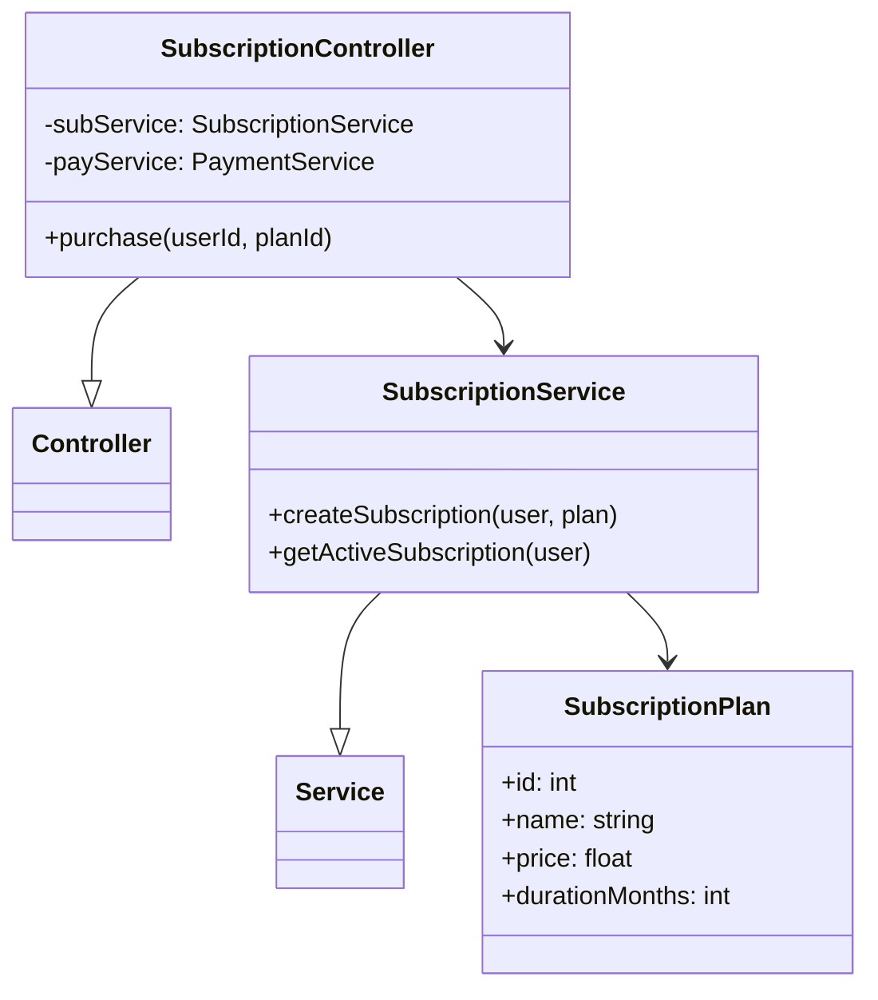
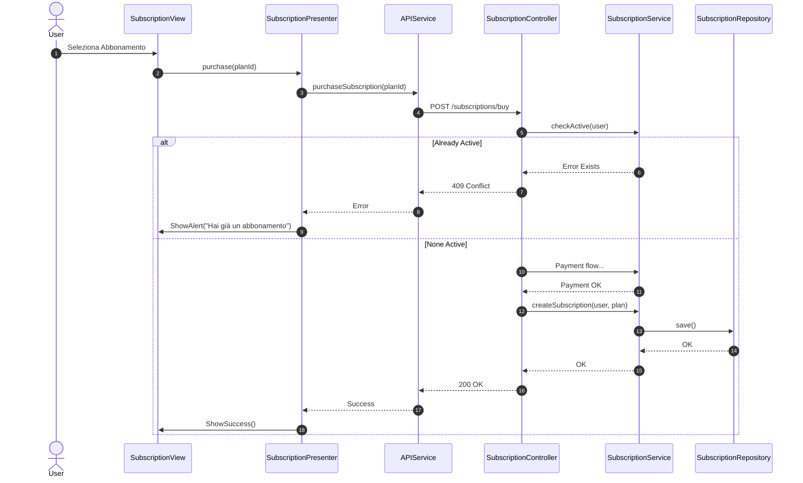

# UC09 - Acquistare Abbonamento

## Diagramma delle Classi

Vedi [Architettura Base](Architettura_Base.md).

### Backend


## Diagramma di Attività
```mermaid
flowchart TD
    Start([Inizio]) --> ListPlans[Lista Abbonamenti]
    ListPlans --> Select[Seleziona Piano]
    Select --> CheckActive{Ha già abbonamento?}
    CheckActive -- Si --> ShowInfo[Avviso Già Attivo]
    ShowInfo --> End([Fine])
    CheckActive -- No --> Pay[Pagamento (UC08)]
    Pay --> Result{Esito?}
    Result -- No --> ShowError
    Result -- Si --> Activate[Attiva Abbonamento]
    Activate --> SetDates[Imposta Scadenza]
    SetDates --> Save[Salva DB]
    Save --> Confirm[Conferma]
    Confirm --> End
```

## Diagramma di Sequenza

