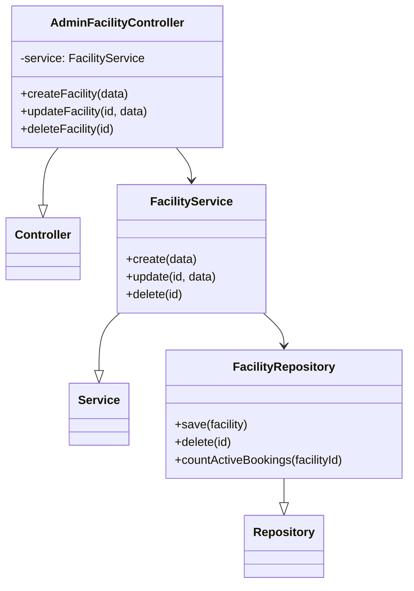
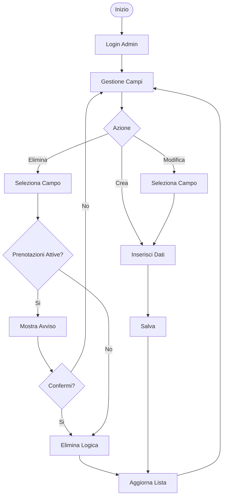
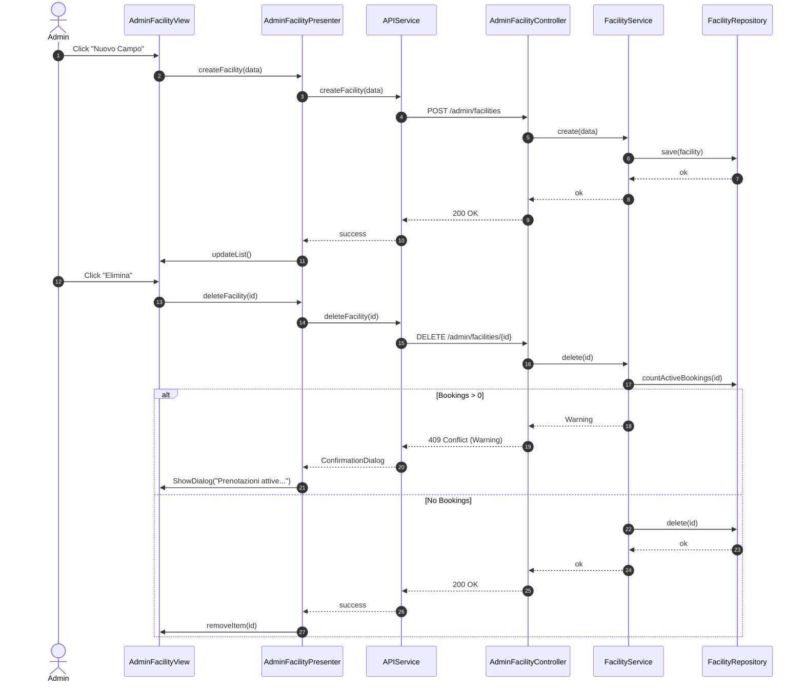

# UC11 - Gestione Campi Sportivi (Admin)

## Diagramma delle Classi

Vedi [Architettura Base](Architettura_Base.md).

### Backend

```mermaid
classDiagram
    class AdminFacilityController {
        -service: FacilityService
        +createFacility(data)
        +updateFacility(id, data)
        +deleteFacility(id)
    }
    AdminFacilityController --|> Controller

    class FacilityService {
        +create(data)
        +update(id, data)
        +delete(id)
    }
    FacilityService --|> Service

    class FacilityRepository {
        +save(facility)
        +delete(id)
        +countActiveBookings(facilityId)
    }
    FacilityRepository --|> Repository

    AdminFacilityController --> FacilityService
    FacilityService --> FacilityRepository
```

## Diagramma di Attività

```mermaid
flowchart TD
    Start([Inizio]) --> AdminLogin[Login Admin]
    AdminLogin --> Manage[Gestione Campi]
    Manage --> Choice{Azione}
    Choice -- Crea --> Form[Inserisci Dati]
    Choice -- Modifica --> SelectEdit[Seleziona Campo]
    Choice -- Elimina --> SelectDel[Seleziona Campo]
    
    Form --> Save[Salva]
    SelectEdit --> Form
    SelectDel --> CheckBookings{Prenotazioni Attive?}
    CheckBookings -- Si --> Warning[Mostra Avviso]
    Warning --> Confirm{Confermi?}
    Confirm -- No --> Manage
    Confirm -- Si --> Delete[Elimina Logica]
    CheckBookings -- No --> Delete
    Delete --> UpdateList[Aggiorna Lista]
    Save --> UpdateList
    UpdateList --> Manage
```

## Diagramma di Sequenza

```mermaid
sequenceDiagram
    autonumber
    actor Admin
    participant View as AdminFacilityView
    participant Presenter as AdminFacilityPresenter
    participant API as APIService
    participant Controller as AdminFacilityController
    participant Service as FacilityService
    participant Repo as FacilityRepository

    Admin->>View: Click "Nuovo Campo"
    View->>Presenter: createFacility(data)
    Presenter->>API: createFacility(data)
    API->>Controller: POST /admin/facilities
    Controller->>Service: create(data)
    Service->>Repo: save(facility)
    Repo-->>Service: ok
    Service-->>Controller: ok
    Controller-->>API: 200 OK
    API-->>Presenter: success
    Presenter->>View: updateList()
    
    Admin->>View: Click "Elimina"
    View->>Presenter: deleteFacility(id)
    Presenter->>API: deleteFacility(id)
    API->>Controller: DELETE /admin/facilities/{id}
    Controller->>Service: delete(id)
    Service->>Repo: countActiveBookings(id)
    alt Bookings > 0
        Service-->>Controller: Warning
        Controller-->>API: 409 Conflict (Warning)
        API-->>Presenter: ConfirmationDialog
        Presenter->>View: ShowDialog("Prenotazioni attive...")
    else No Bookings
        Service->>Repo: delete(id)
        Repo-->>Service: ok
        Service-->>Controller: ok
        Controller-->>API: 200 OK
        API-->>Presenter: success
        Presenter->>View: removeItem(id)
    end
```
