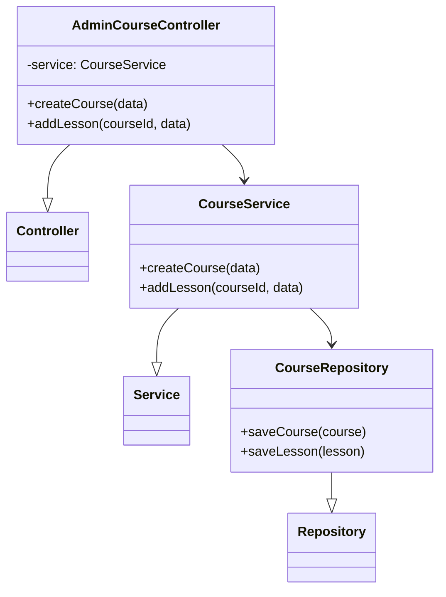
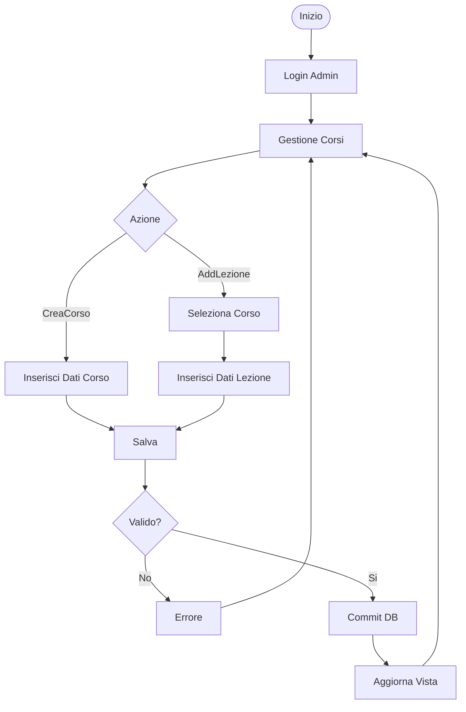
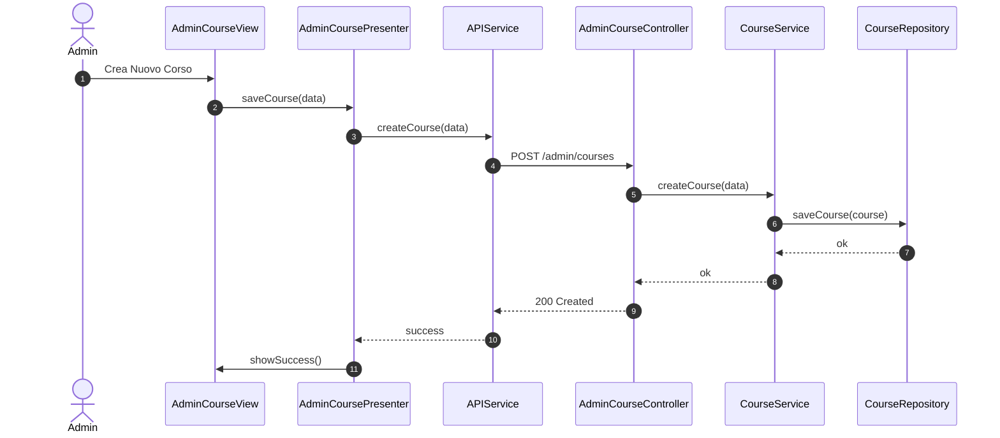

# UC12 - Gestione Corsi e Lezioni (Admin)

## Diagramma delle Classi

Vedi [Architettura Base](Architettura_Base.md).

### Backend

```mermaid
classDiagram
    class AdminCourseController {
        -service: CourseService
        +createCourse(data)
        +addLesson(courseId, data)
    }
    AdminCourseController --|> Controller

    class CourseService {
        +createCourse(data)
        +addLesson(courseId, data)
    }
    CourseService --|> Service

    class CourseRepository {
        +saveCourse(course)
        +saveLesson(lesson)
    }
    CourseRepository --|> Repository

    AdminCourseController --> CourseService
    CourseService --> CourseRepository
```

## Diagramma di Attività

```mermaid
flowchart TD
    Start([Inizio]) --> AdminLogin[Login Admin]
    AdminLogin --> Manage[Gestione Corsi]
    Manage --> Choice{Azione}
    Choice -- CreaCorso --> FormCourse[Inserisci Dati Corso]
    Choice -- AddLezione --> SelectCourse[Seleziona Corso]
    SelectCourse --> FormLesson[Inserisci Dati Lezione]
    
    FormCourse --> Save[Salva]
    FormLesson --> Save
    Save --> Validate{Valido?}
    Validate -- No --> Error[Errore]
    Error --> Manage
    Validate -- Si --> Commit[Commit DB]
    Commit --> Update[Aggiorna Vista]
    Update --> Manage
```

## Diagramma di Sequenza

```mermaid
sequenceDiagram
    autonumber
    actor Admin
    participant View as AdminCourseView
    participant Presenter as AdminCoursePresenter
    participant API as APIService
    participant Controller as AdminCourseController
    participant Service as CourseService
    participant Repo as CourseRepository

    Admin->>View: Crea Nuovo Corso
    View->>Presenter: saveCourse(data)
    Presenter->>API: createCourse(data)
    API->>Controller: POST /admin/courses
    Controller->>Service: createCourse(data)
    Service->>Repo: saveCourse(course)
    Repo-->>Service: ok
    Service-->>Controller: ok
    Controller-->>API: 200 Created
    API-->>Presenter: success
    Presenter->>View: showSuccess()
```
