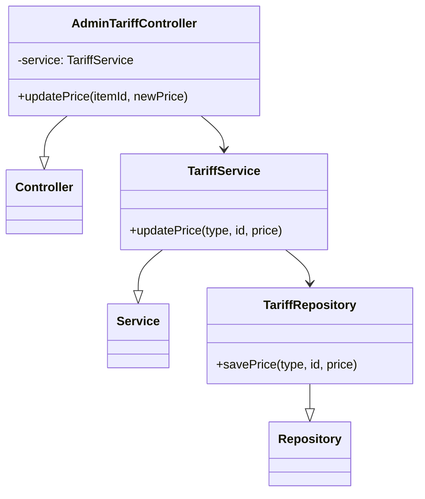
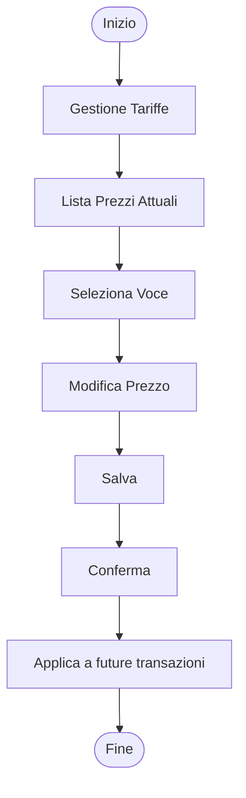
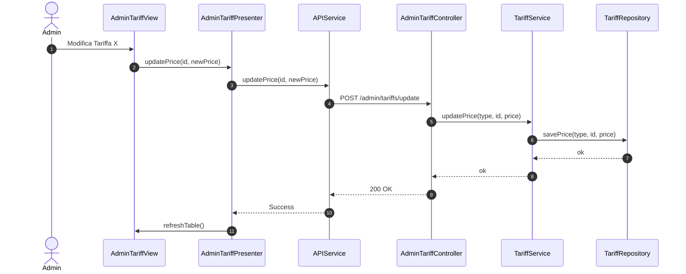

# UC13 - Gestione Tariffe e Abbonamenti

## Diagramma delle Classi

Vedi [Architettura Base](Architettura_Base.md).

### Backend

```mermaid
classDiagram
    class AdminTariffController {
        -service: TariffService
        +updatePrice(itemId, newPrice)
    }
    AdminTariffController --|> Controller

    class TariffService {
        +updatePrice(type, id, price)
    }
    TariffService --|> Service

    class TariffRepository {
        +savePrice(type, id, price)
    }
    TariffRepository --|> Repository

    AdminTariffController --> TariffService
    TariffService --> TariffRepository
```

## Diagramma di Attività

```mermaid
flowchart TD
    Start([Inizio]) --> Manage[Gestione Tariffe]
    Manage --> List[Lista Prezzi Attuali]
    List --> Select[Seleziona Voce]
    Select --> Edit[Modifica Prezzo]
    Edit --> Save[Salva]
    Save --> Confirm[Conferma]
    Confirm --> Apply[Applica a future transazioni]
    Apply --> End([Fine])
```

## Diagramma di Sequenza

```mermaid
sequenceDiagram
    autonumber
    actor Admin
    participant View as AdminTariffView
    participant Presenter as AdminTariffPresenter
    participant API as APIService
    participant Controller as AdminTariffController
    participant Service as TariffService
    participant Repo as TariffRepository

    Admin->>View: Modifica Tariffa X
    View->>Presenter: updatePrice(id, newPrice)
    Presenter->>API: updatePrice(id, newPrice)
    API->>Controller: POST /admin/tariffs/update
    Controller->>Service: updatePrice(type, id, price)
    Service->>Repo: savePrice(type, id, price)
    Repo-->>Service: ok
    Service-->>Controller: ok
    Controller-->>API: 200 OK
    API-->>Presenter: Success
    Presenter->>View: refreshTable()
```
