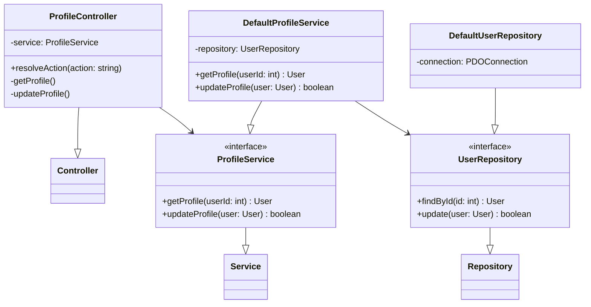
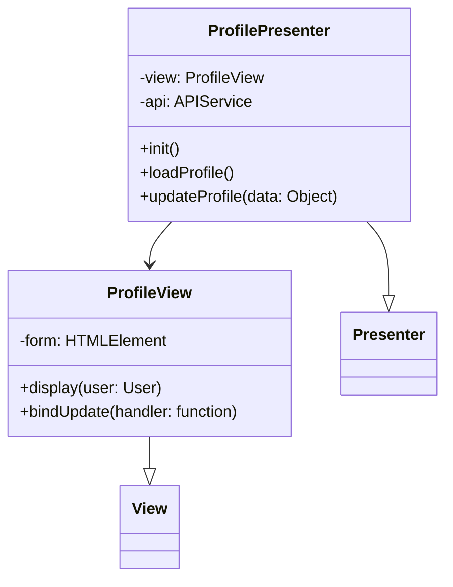
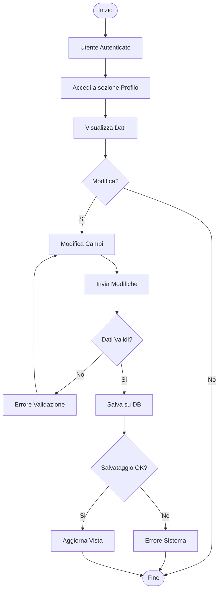
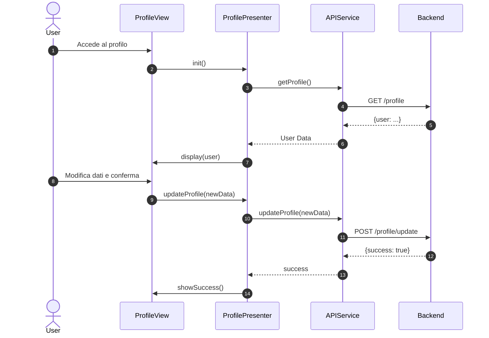
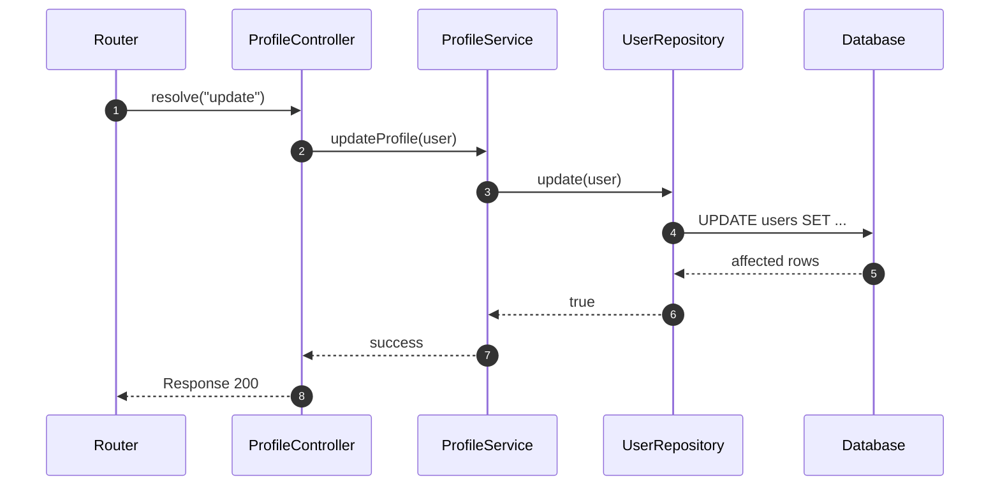

# UC02 - Gestione Profilo Utente

## Diagramma delle Classi

Vedi [Architettura Base](Architettura_Base.md) per le classi comuni.

### Backend

### Frontend

## Diagramma di Attività

## Diagramma di Sequenza

### Frontend

### Backend (Update Flow)

