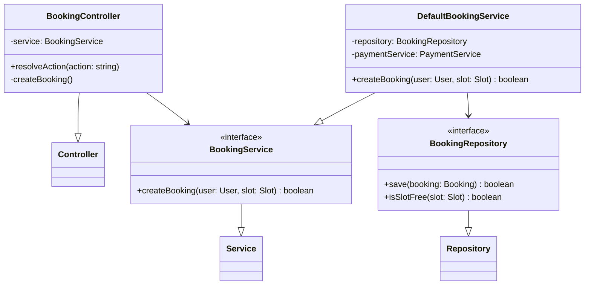
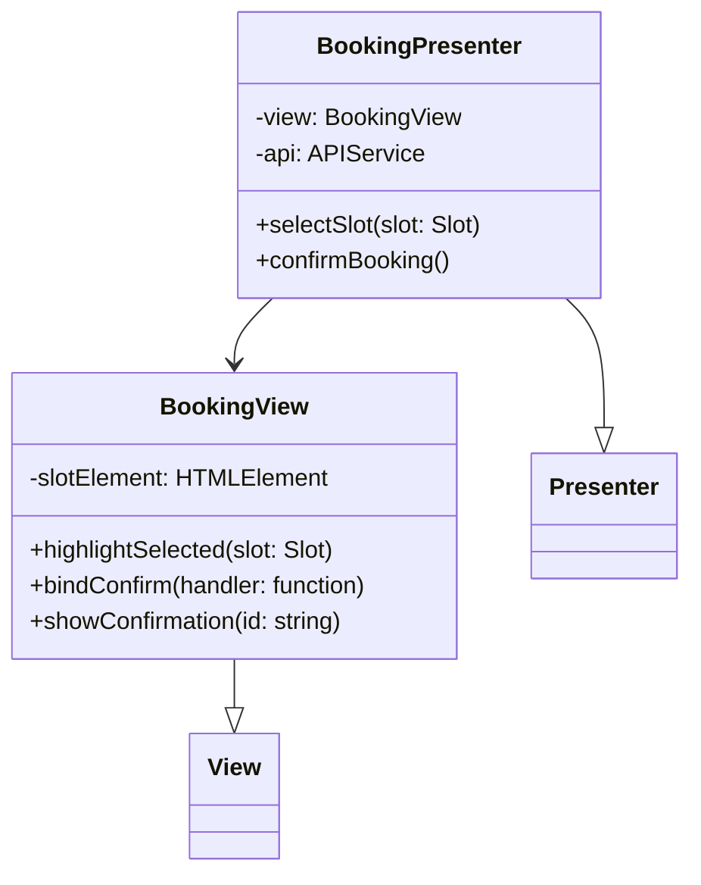
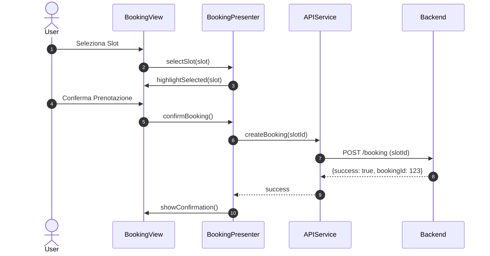
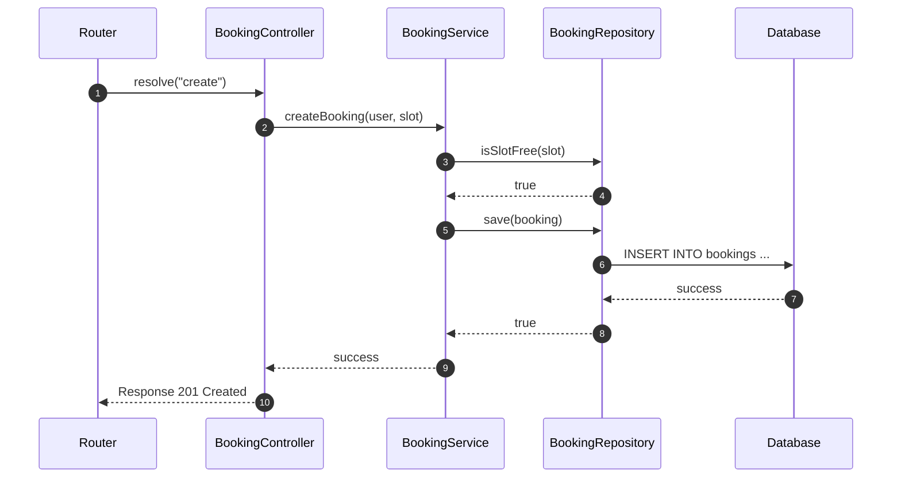

# UC04 - Prenotazione Campo Sportivo

## Diagramma delle Classi

Vedi [Architettura Base](Architettura_Base.md) per le classi comuni.

### Backend



### Frontend



## Diagramma di Attività

```mermaid
flowchart TD
    Start([Inizio]) --> ViewSlots[Visualizza Slot (UC03)]
    ViewSlots --> SelectSlot[Seleziona Slot]
    SelectSlot --> CheckFree{Slot Libero?}
    CheckFree -- No --> Error[Mostra Errore]
    Error --> ViewSlots
    CheckFree -- Si --> Payment[Pagamento (UC08)]
    Payment --> PayResult{Pagamento OK?}
    PayResult -- No --> UnlockSlot[Sblocca Slot]
    UnlockSlot --> Error
    PayResult -- Si --> Save[Salva Prenotazione]
    Save --> Confirm[Mostra Conferma]
    Confirm --> End([Fine])
```

## Diagramma di Sequenza

### Frontend



### Backend (Create Booking)


