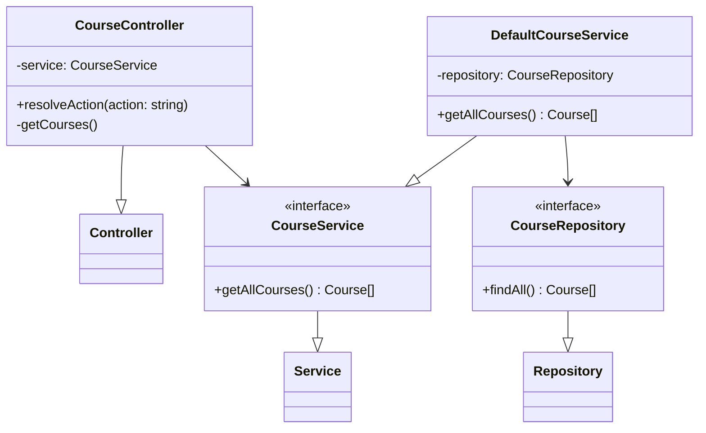
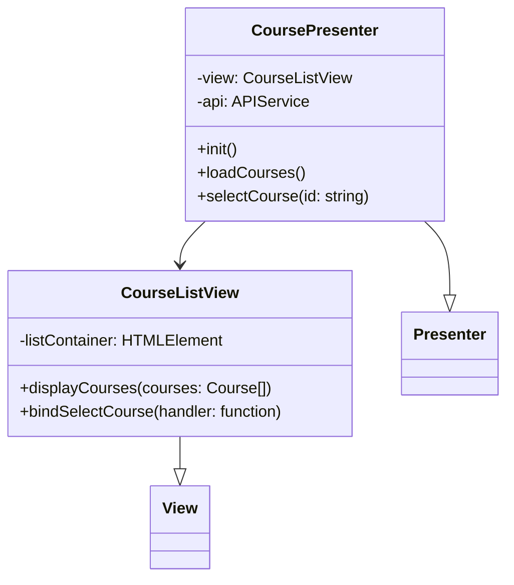
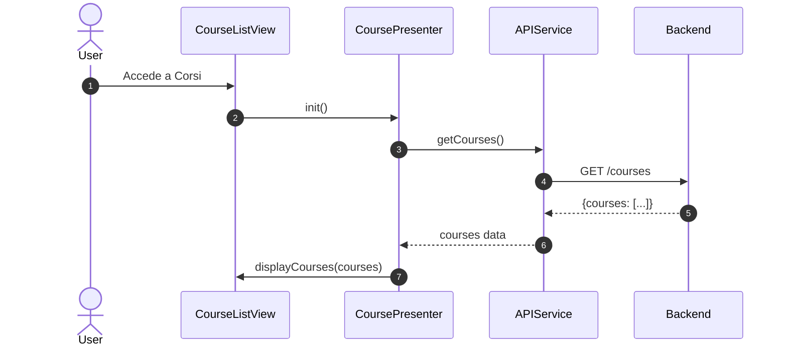
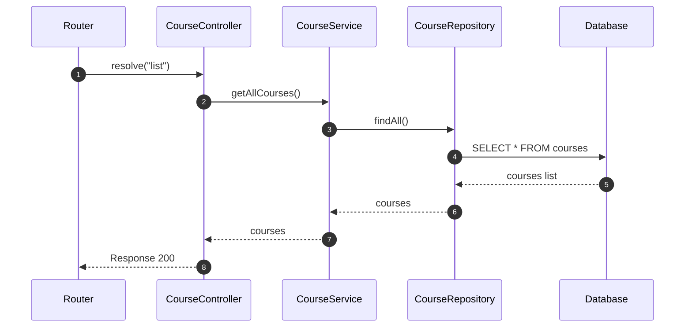

# UC05 - Visualizzazione Corsi

## Diagramma delle Classi

Vedi [Architettura Base](Architettura_Base.md) per le classi comuni.

### Backend



### Frontend



## Diagramma di Attività

```mermaid
flowchart TD
    Start([Inizio]) --> Login[Utente Autenticato]
    Login --> SelectCourses[Menu Corsi]
    SelectCourses --> RenderView[Mostra Vista Elenco]
    RenderView --> FetchData[Richiedi Corsi]
    FetchData --> DisplayList[Mostra Elenco Corsi]
    DisplayList --> Select{Seleziona Corso?}
    Select -- No --> End([Fine])
    Select -- Si --> ShowDetails[Mostra Dettagli (UC06)]
```

## Diagramma di Sequenza

### Frontend



### Backend (Get Courses)


