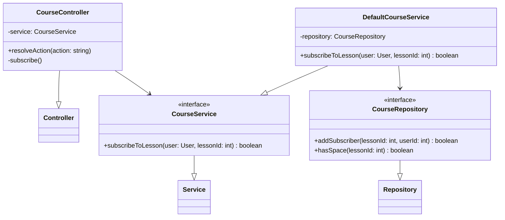
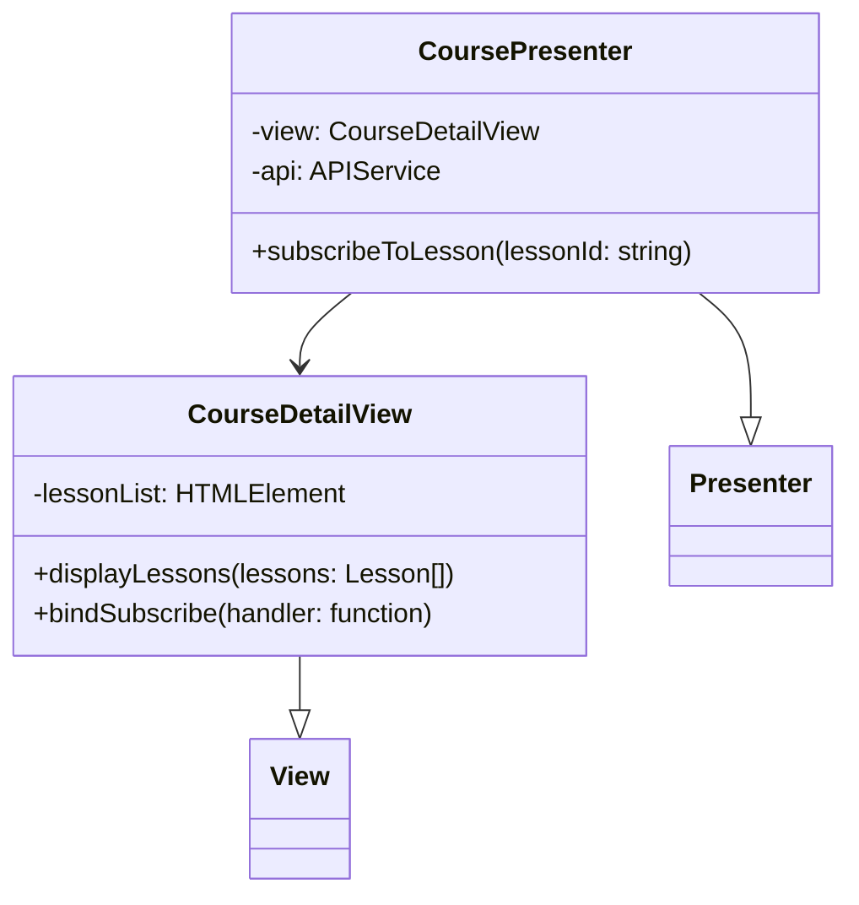
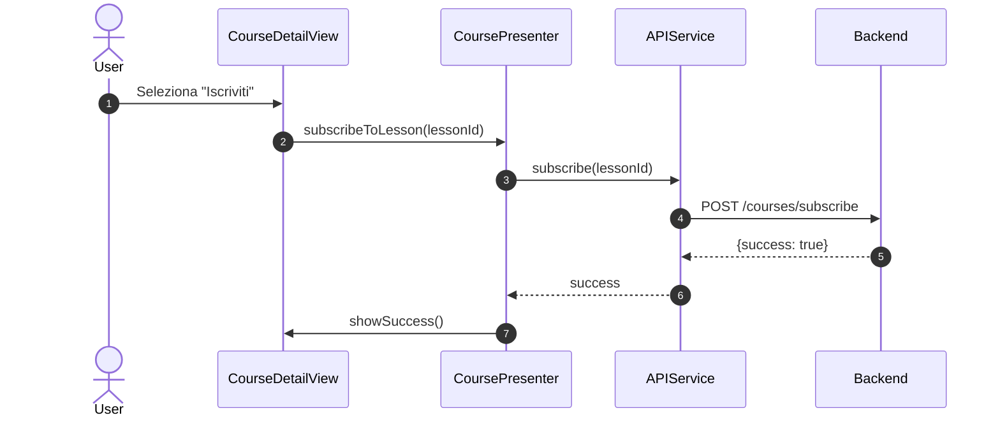
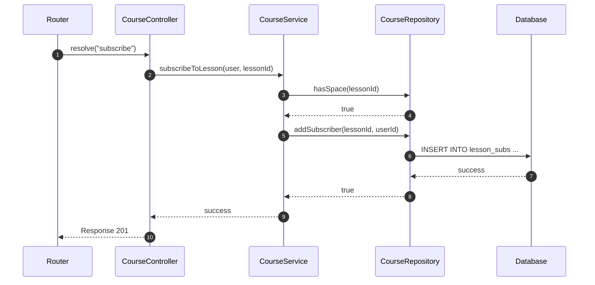

# UC06 - Iscrizione a una Lezione di un Corso

## Diagramma delle Classi

Vedi [Architettura Base](Architettura_Base.md) per le classi comuni.

### Backend



### Frontend



## Diagramma di Attività

```mermaid
flowchart TD
    Start([Inizio]) --> ViewCourses[Visualizza Corsi (UC05)]
    ViewCourses --> SelectLesson[Seleziona Lezione]
    SelectLesson --> CheckSpace{Posti Disponibili?}
    CheckSpace -- No --> Error[Mostra Errore]
    Error --> ViewCourses
    CheckSpace -- Si --> Payment[Pagamento (UC08) o Abbonamento]
    Payment --> PayResult{Pagamento OK?}
    PayResult -- No --> Error
    PayResult -- Si --> Subscribe[Registra Iscrizione]
    Subscribe --> Confirm[Mostra Conferma]
    Confirm --> End([Fine])
```

## Diagramma di Sequenza

### Frontend



### Backend (Subscribe)


