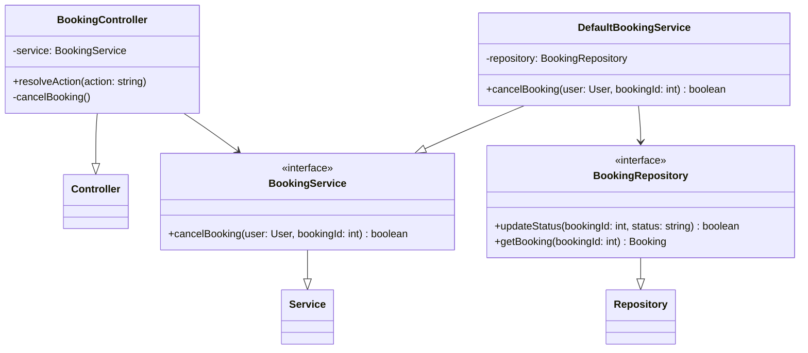
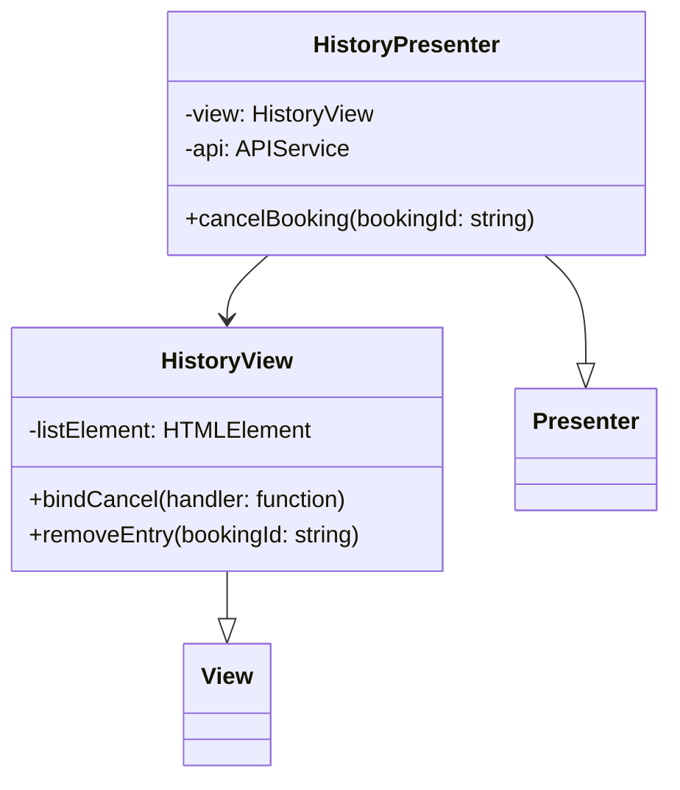
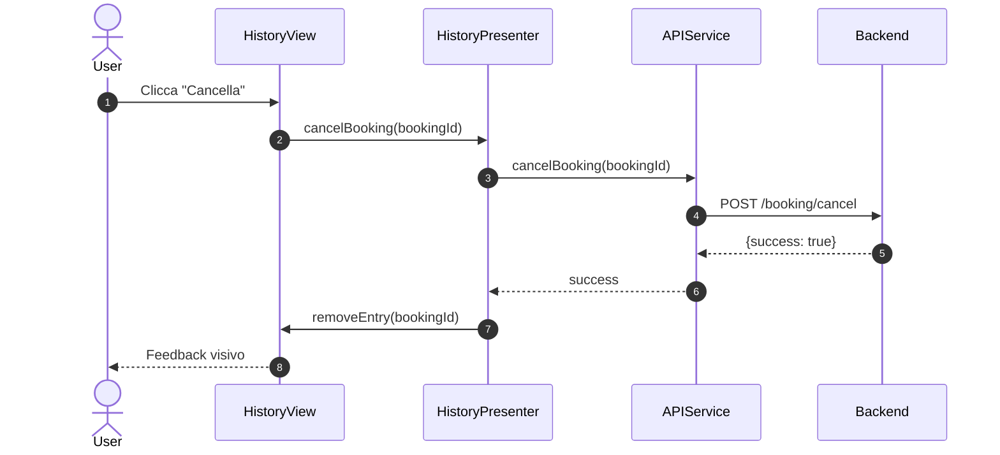
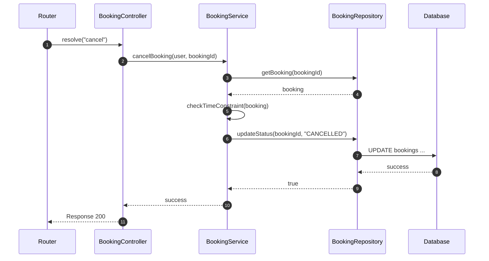

# UC07 - Cancellazione Prenotazione

## Diagramma delle Classi

Vedi [Architettura Base](Architettura_Base.md) per le classi comuni.

### Backend



### Frontend



## Diagramma di Attività

```mermaid
flowchart TD
    Start([Inizio]) --> ViewHistory[Visualizza Storico (UC10)]
    ViewHistory --> SelectItem[Seleziona Prenotazione]
    SelectItem --> CheckTime{> 24h Prima?}
    CheckTime -- No --> Error[Mostra Errore: Troppo Tardi]
    Error --> ViewHistory
    CheckTime -- Si --> Confirm{Conferma?}
    Confirm -- No --> ViewHistory
    Confirm -- Si --> CancelReq[Richiedi Cancellazione]
    CancelReq --> Success{Cancellazione OK?}
    Success -- No --> SysError[Errore Sistema]
    Success -- Si --> Refund[Eventuale Rimborso]
    Refund --> UpdateView[Aggiorna Lista]
    UpdateView --> End([Fine])
```

## Diagramma di Sequenza

### Frontend



### Backend (Cancel)


