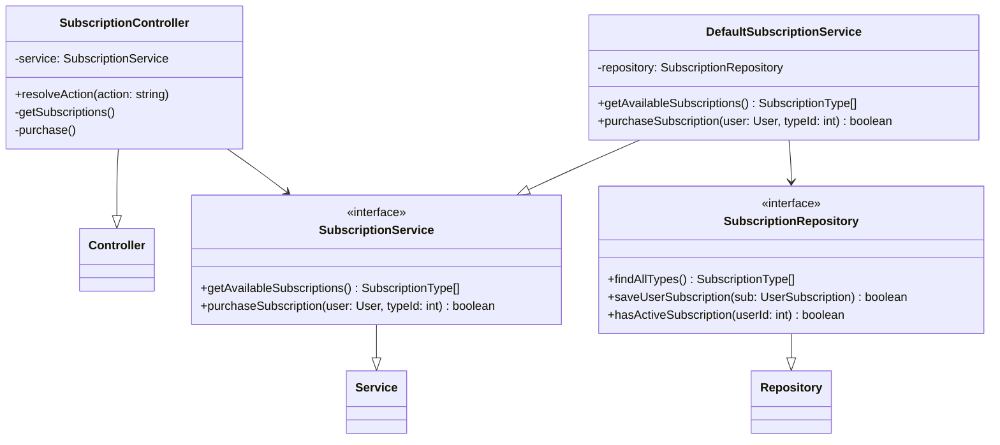
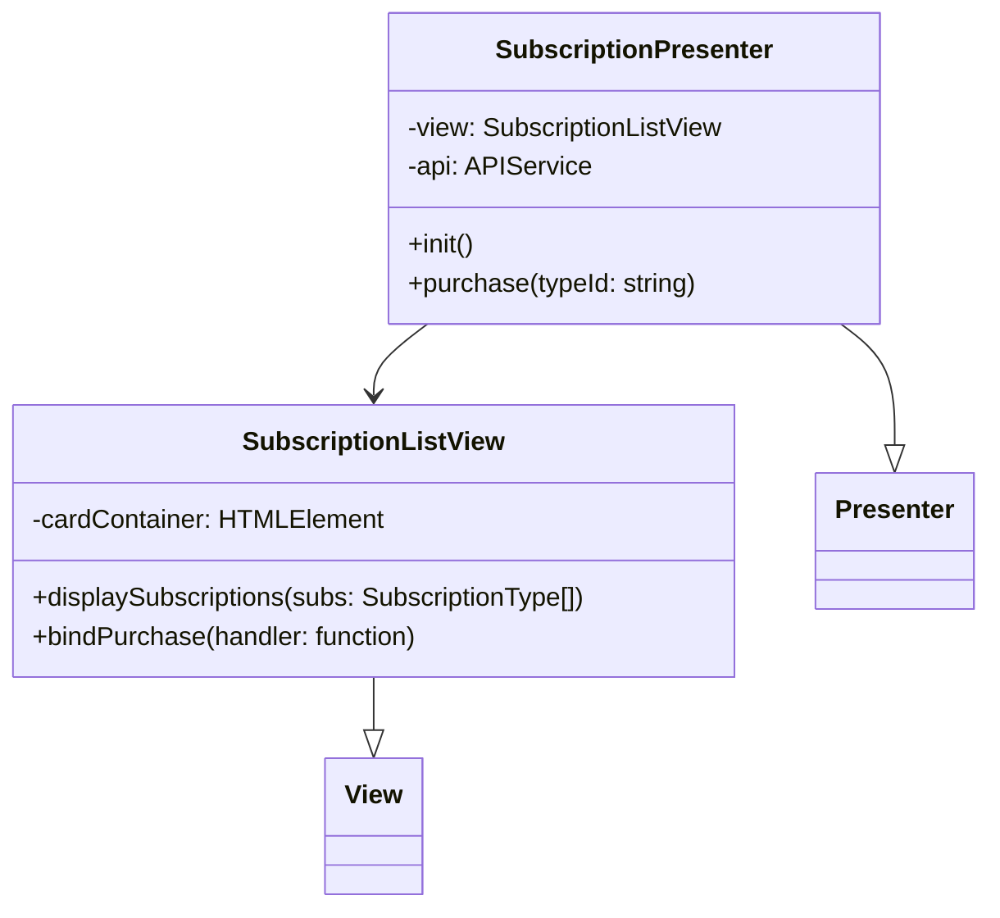
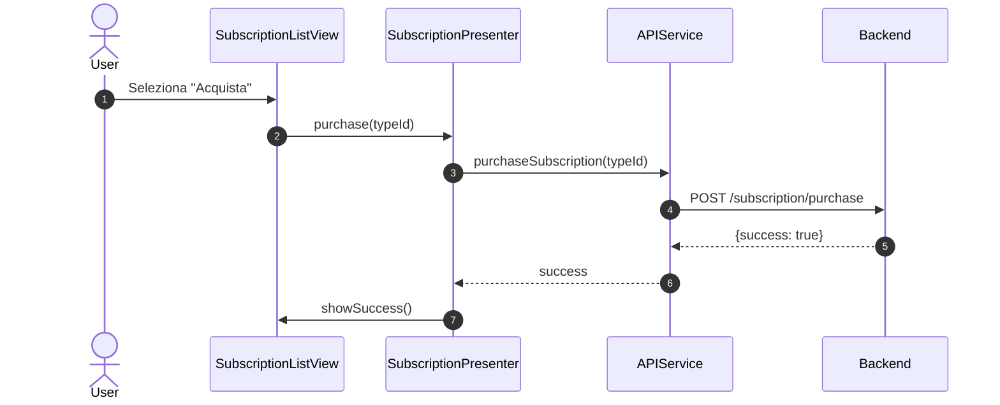
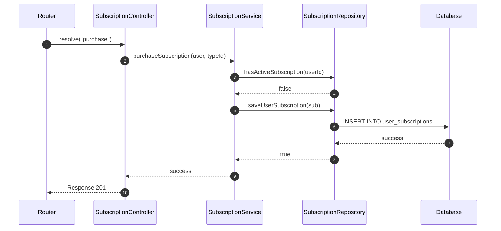

# UC09 - Acquisto Abbonamento

## Diagramma delle Classi

Vedi [Architettura Base](Architettura_Base.md) per le classi comuni.

### Backend



### Frontend



## Diagramma di Attività

```mermaid
flowchart TD
    Start([Inizio]) --> Login[Utente Autenticato]
    Login --> SelectSub[Menu Abbonamenti]
    SelectSub --> RenderView[Mostra Abbonamenti]
    RenderView --> SelectItem[Seleziona Pacchetto]
    SelectItem --> CheckActive{Già Attivo?}
    CheckActive -- Si --> Info[Mostra Info]
    Info --> RenderView
    CheckActive -- No --> Payment[Pagamento (UC08)]
    Payment --> PayResult{Pagamento OK?}
    PayResult -- No --> Error
    PayResult -- Si --> Activate[Attiva Abbonamento]
    Activate --> Confirm[Mostra Conferma]
    Confirm --> End([Fine])
```

## Diagramma di Sequenza

### Frontend



### Backend (Purchase)


