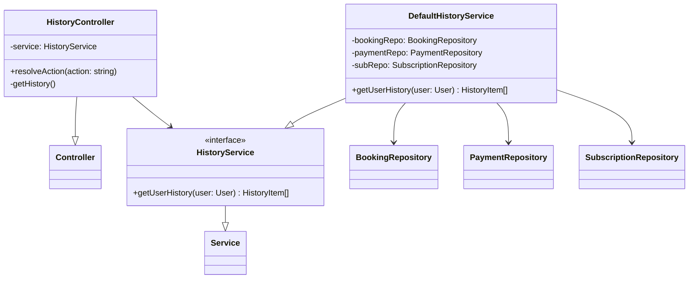
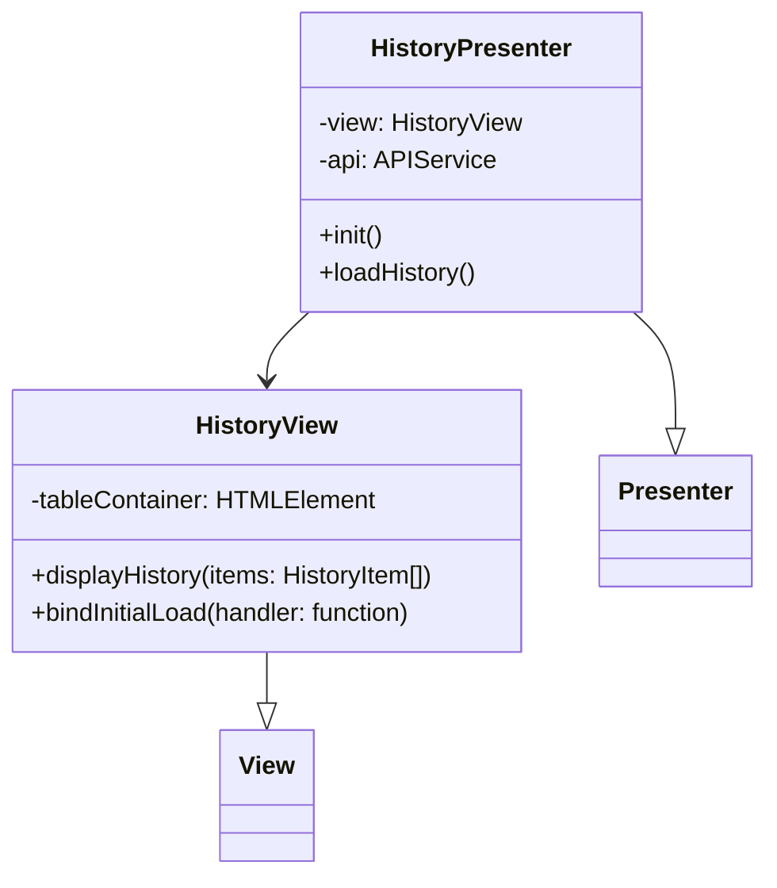
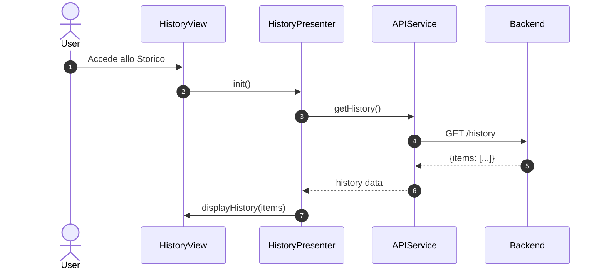
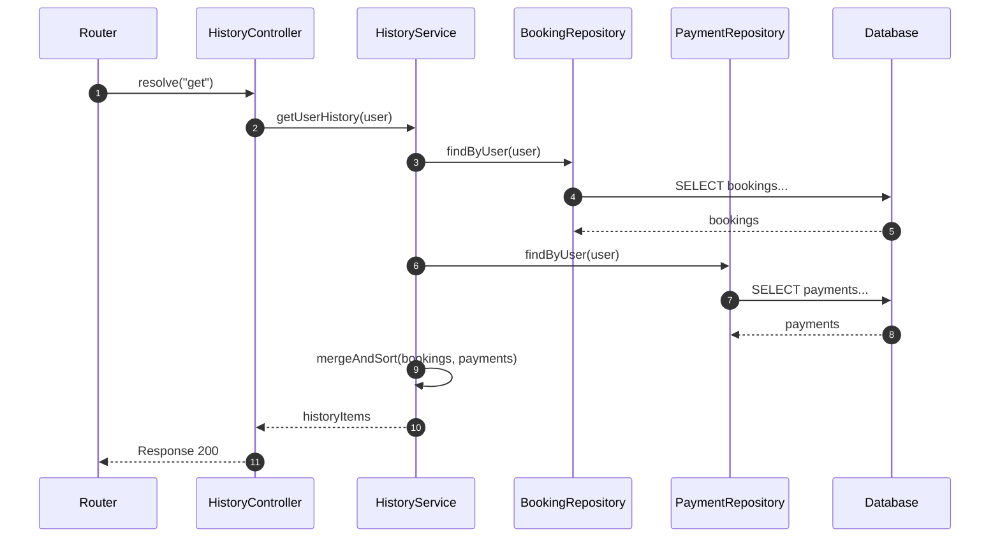

# UC10 - Visualizzazione Storico Prenotazioni e Pagamenti

## Diagramma delle Classi

Vedi [Architettura Base](Architettura_Base.md) per le classi comuni.

### Backend



### Frontend



## Diagramma di Attività

```mermaid
flowchart TD
    Start([Inizio]) --> Login[Utente Autenticato]
    Login --> SelectHistory[Menu Storico]
    SelectHistory --> FetchData[Richiedi Dati]
    FetchData --> RenderList[Mostra Elenco (Prenotazioni/Pagamenti)]
    RenderList --> Filter{Filtra/Dettaglio?}
    Filter -- No --> End([Fine])
    Filter -- Si --> UpdateView[Aggiorna Vista]
    UpdateView --> RenderList
```

## Diagramma di Sequenza

### Frontend



### Backend (Get History)


