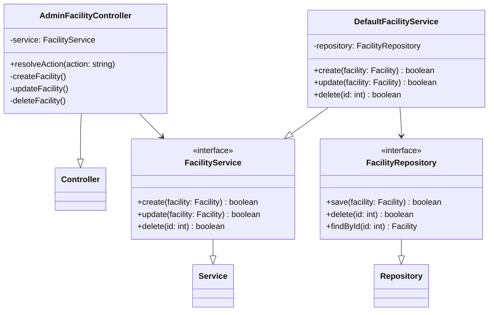
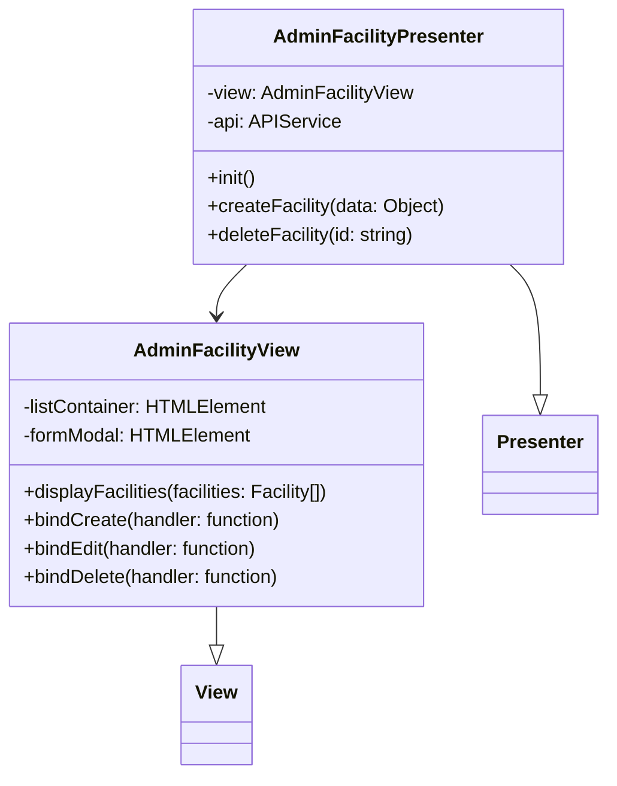
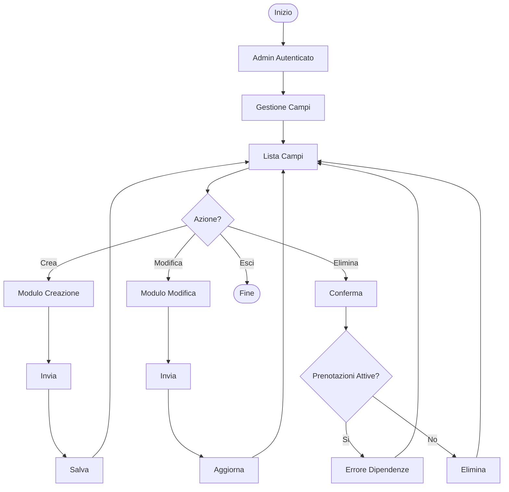
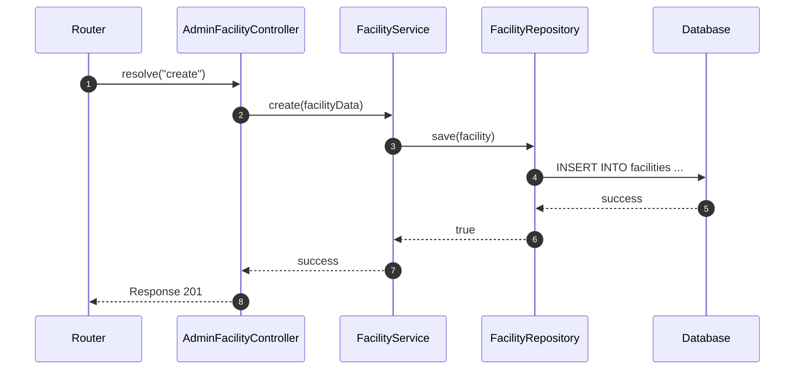

# UC11 - Gestione Campi Sportivi (Admin)

## Diagramma delle Classi

Vedi [Architettura Base](Architettura_Base.md) per le classi comuni.

### Backend

### Frontend

## Diagramma di Attività

## Diagramma di Sequenza

### Backend (Create Facility)

