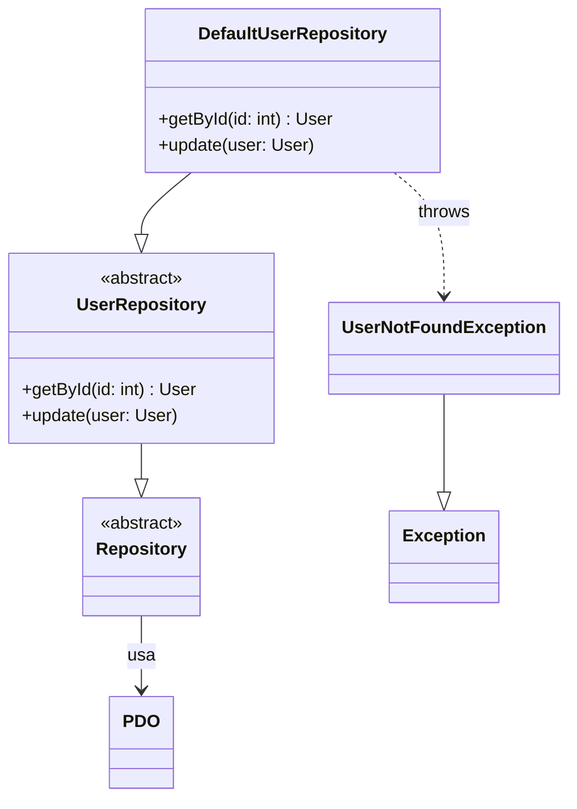
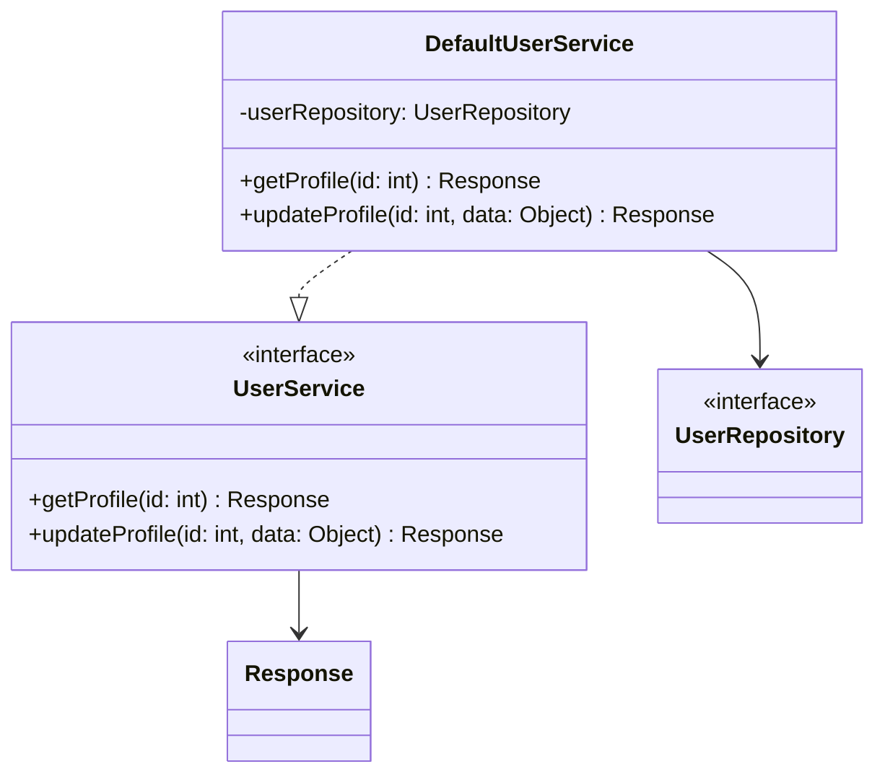
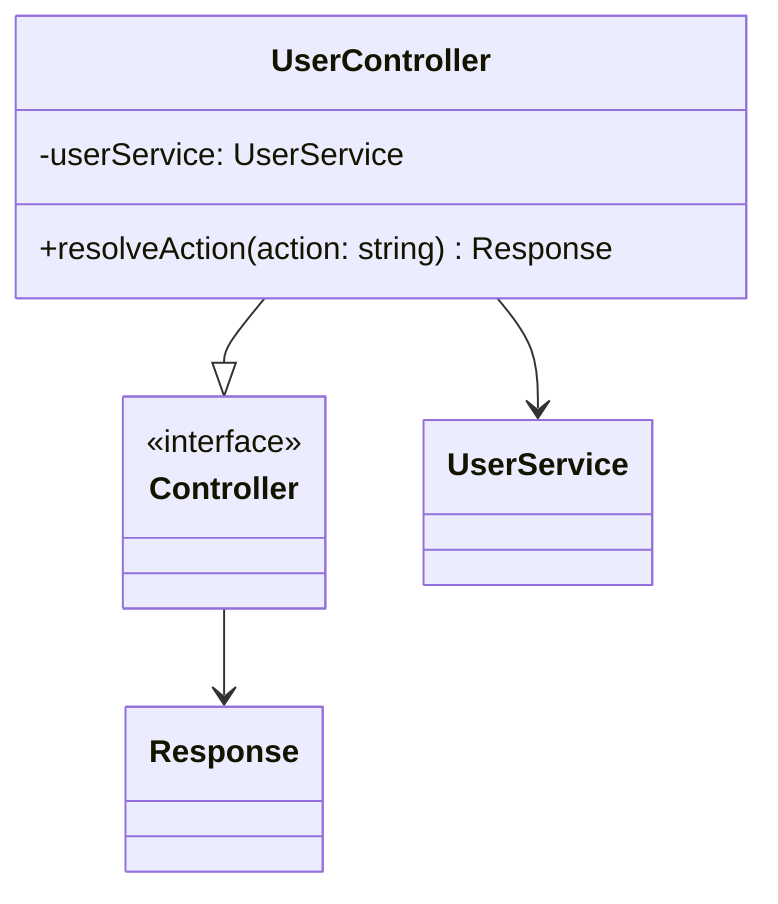
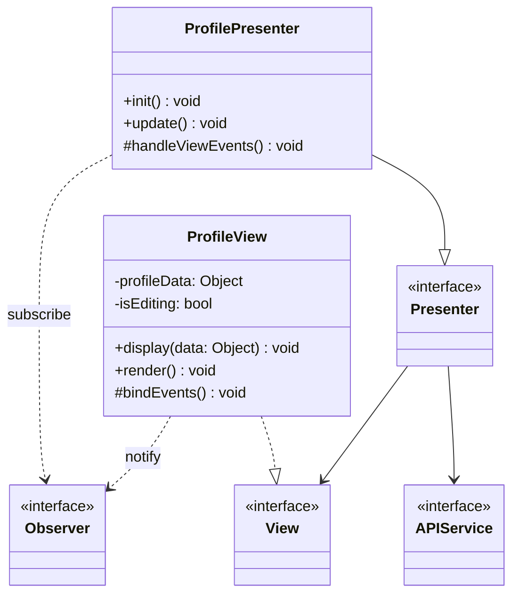
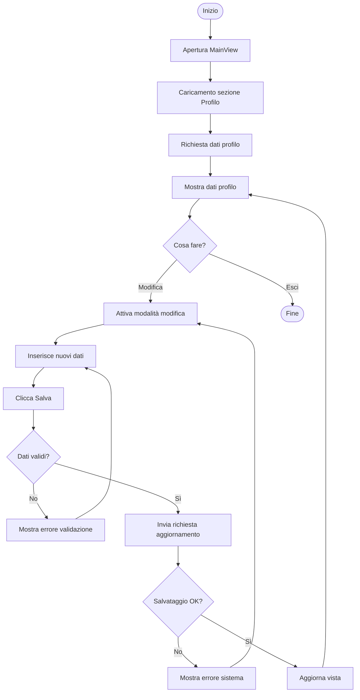
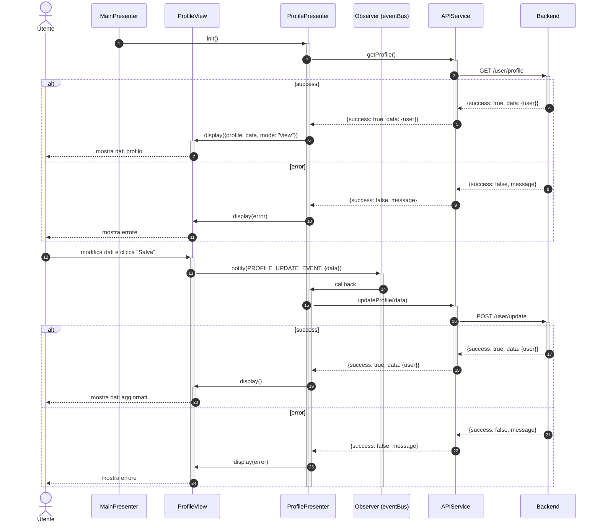
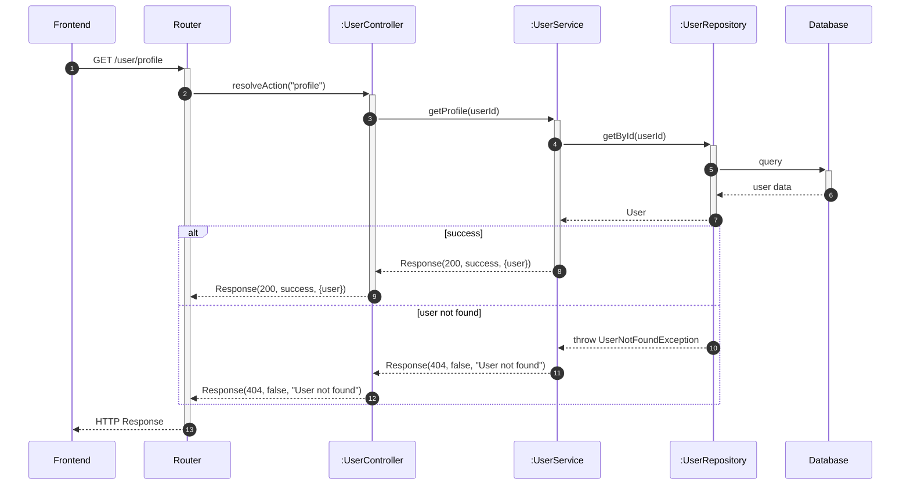

	# UC02 - Visualizzare e Gestire Profilo Utente

Per inizializzazione dei componenti o componenti comuni a tutto il software vedere [Architettura base](./Architettura%20base.md)

---

## Diagrammi delle Classi

### Backend - Repository Layer

### Backend - Service Layer

### Backend - Controller Layer

### Frontend

---

## Diagramma di Attività

---

## Diagrammi di Sequenza

### Frontend

### Backend

