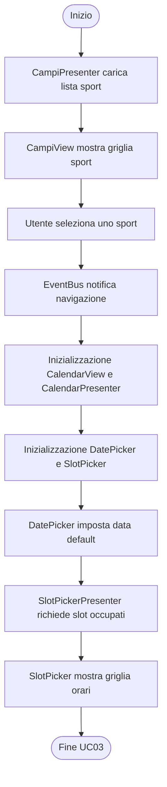
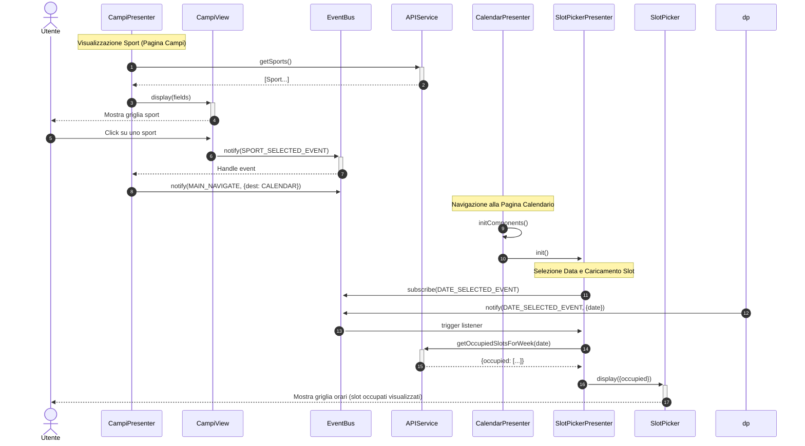
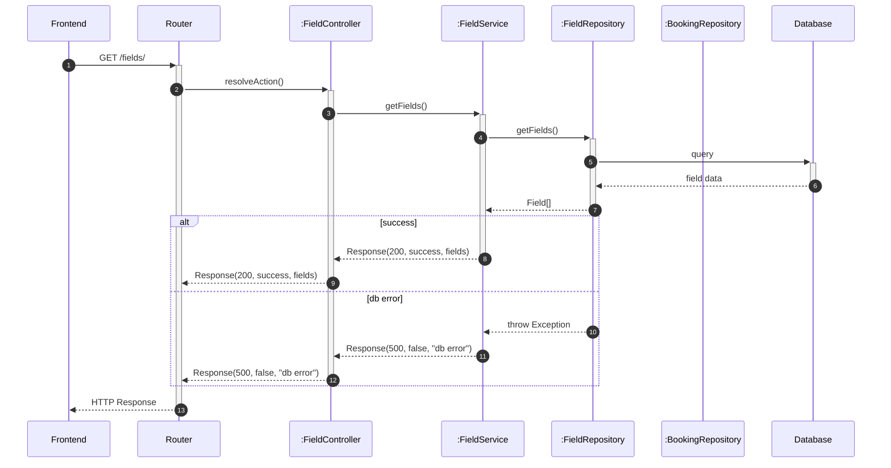
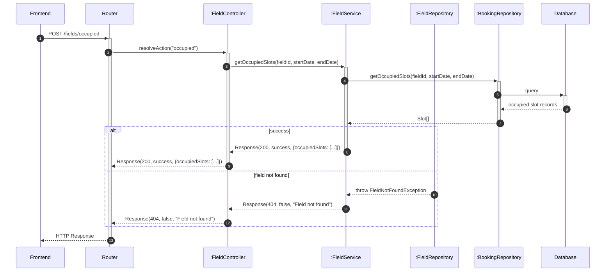

# UC03 - Visualizzazione Disponibilità Campi

Per inizializzazione dei componenti o componenti comuni a tutto il software vedere [Architettura base](./Architettura%20base.md)

---

## Specifica Funzionale

| **Caso d'uso**        | Visualizzazione disponibilità |
| --------------------- | ------------------------------ |
| **ID**                | UC03 |
| **Descrizione**       | L'utente visualizza gli slot temporali liberi per i campi sportivi |
| **Attore principale** | Utente |
| **Attore secondario** | Sistema |
| **Precondizioni**     | 1. L'utente è autenticato. |
| **Postcondizioni**    | 1. Viene mostra un calendario con gli slot temporali disponibili. |
| **Flusso principale** | 1. L'utente seleziona lo sport. 2. Il sistema mostra il calendario per lo sport selezionato. 3. Il sistema evidenzia gli slot occupati. 4. L'utente può navigare tra le settimane. |

---

## Diagramma di Attività

---

## Diagrammi di Sequenza

### Frontend

### Backend

#### Caso GET /fields/

#### Caso POST /fields/occupied

n