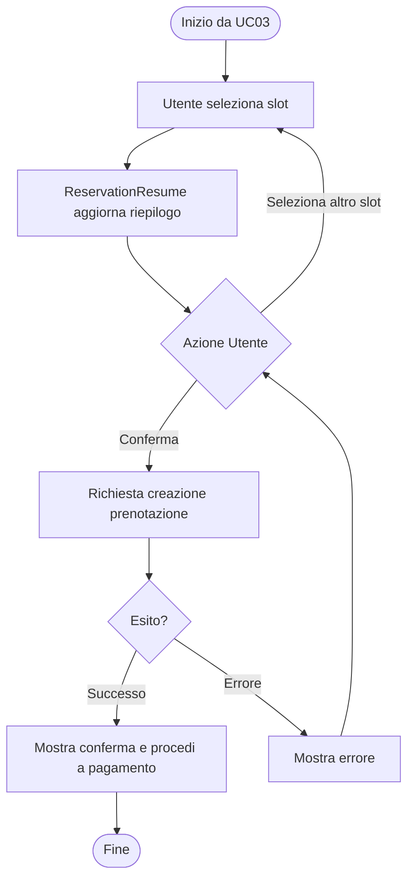
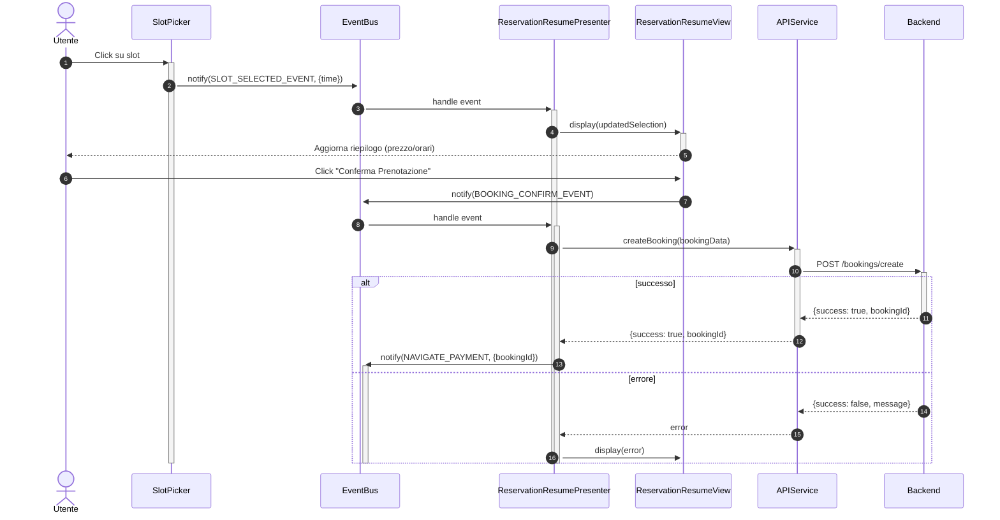
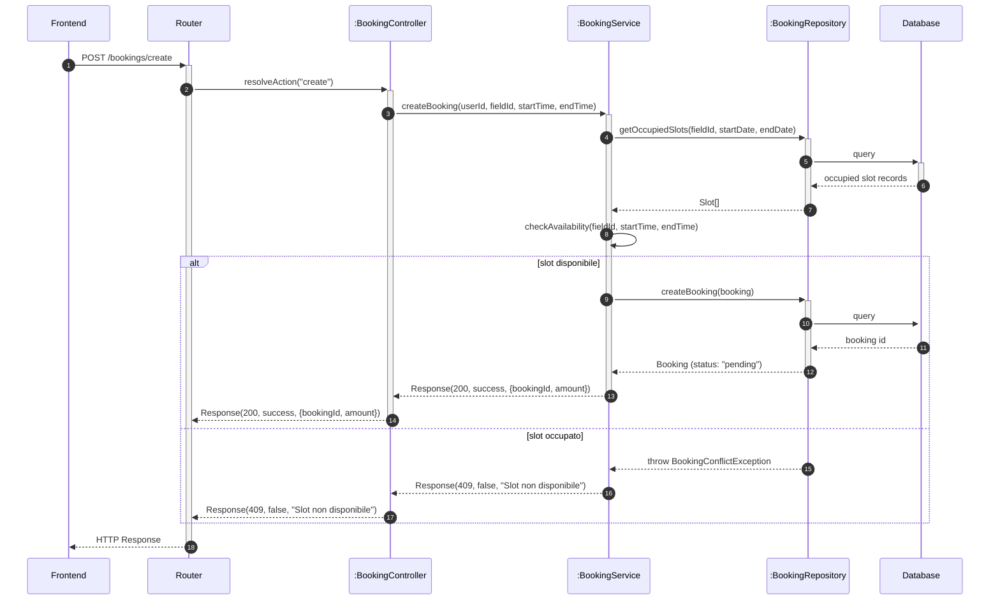

# UC04 - Prenotazione Campo Sportivo

Per inizializzazione dei componenti o componenti comuni a tutto il software vedere [Architettura base](./Architettura%20base.md)

---

## Specifica Funzionale

| **Caso d'uso**        | Prenotazione campo sportivo |
| --------------------- | ---------------------------- |
| **ID**                | UC04 |
| **Descrizione**       | L'utente prenota un campo selezionando uno slot temporale di almeno 30 minuti |
| **Attore principale** | Utente |
| **Attore secondario** | Sistema |
| **Precondizioni**     | 1. L'utente è autenticato. 2. Slot selezionato disponibile. |
| **Postcondizioni**    | 1. Prenotazione registrata nel sistema. 2. Campo risulta occupato per quello slot. |
| **Flusso principale** | 1. L'utente visualizza la disponibilità (**UC03**). 2. Seleziona uno slot libero. 3. Visualizza il riepilogo. 4. Conferma la prenotazione. 5. Procede al pagamento (**UC08**). |

---

## Diagramma di Attività

---

## Diagrammi di Sequenza

### Frontend

### Backend

