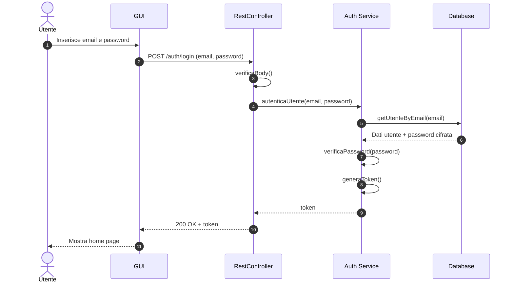
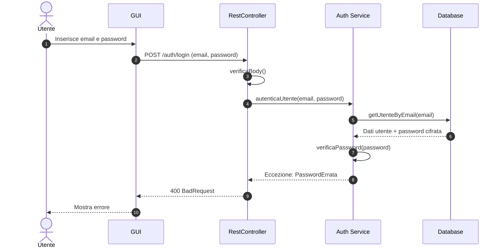
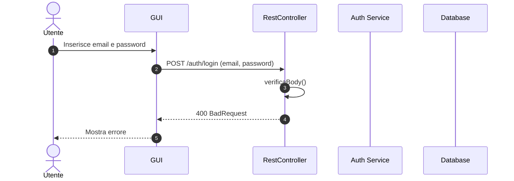
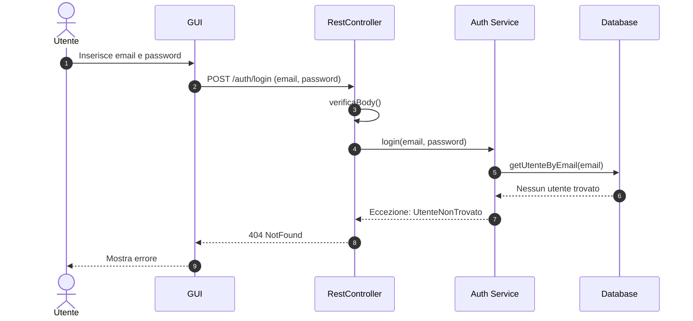
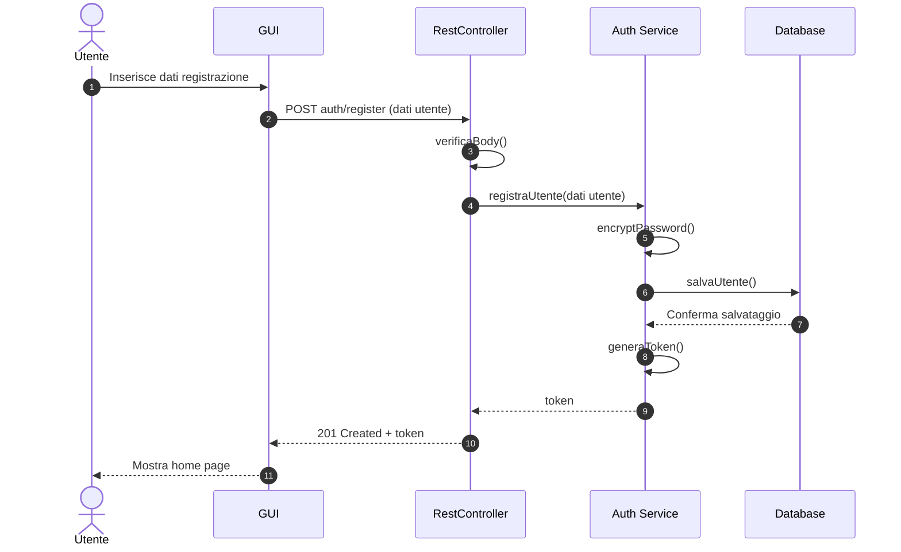

#### Diagramma di sequenza UC01

##### Flusso principale - Autenticazione

##### Flusso principale - Autenticazione, ERR01 password sbagliata

##### Flusso principale - Autenticazione, ERR02  dati malformati

##### Flusso principale - Autenticazione, ERR03 utente non trovato

##### Flusso secondario - Registrazione

