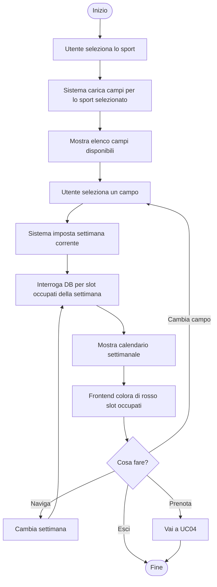
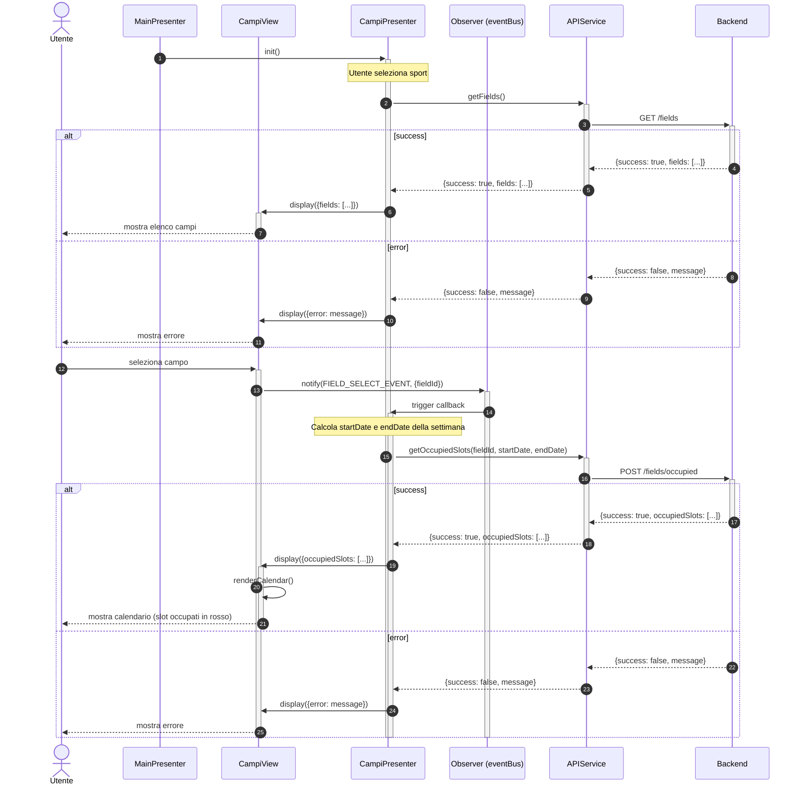
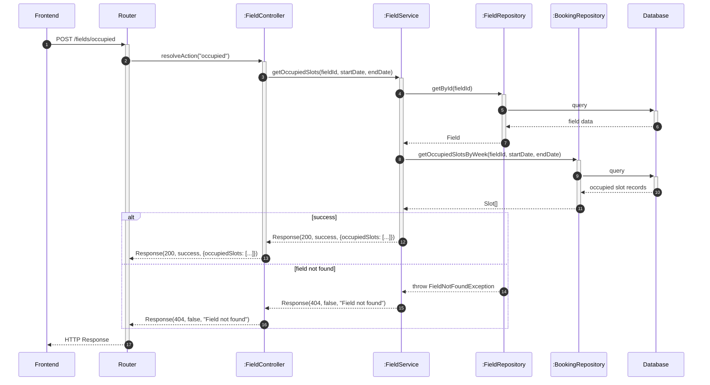

# UC03 - Visualizzazione Disponibilità Campi

Per inizializzazione dei componenti o componenti comuni a tutto il software vedere [Architettura base](./Architettura%20base.md)

Per le classi comuni a UC03 e UC04 vedere [Architettura base - Classi comuni UC03 e UC04](./Architettura%20base.md#classi-comuni-uc03-e-uc04)

---

## Diagramma di Attività

---

## Diagrammi di Sequenza

### Frontend

### Backend

