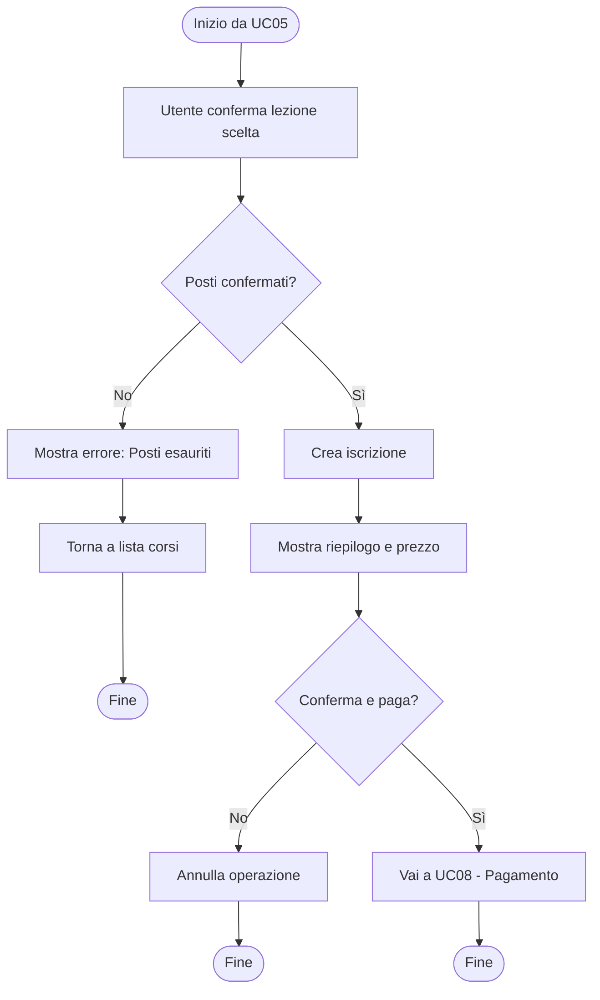
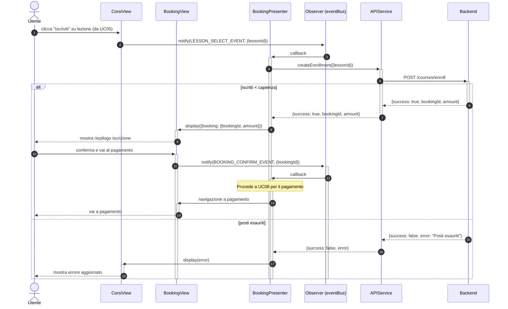

# UC06 - Iscrizione a una Lezione

Per inizializzazione dei componenti o componenti comuni a tutto il software vedere [Architettura base](./Architettura%20base.md)

--- 

## Diagramma di Attività



---

## Diagrammi di Sequenza

### Frontend



### Backend
 
```mermaid
 sequenceDiagram
     autonumber
 
     participant frontend as Frontend
     participant router as Router
    participant controller as :CourseBookingController
     participant service as :CourseBookingService
     participant courseRepo as :CourseRepository
     participant bookingRepo as :CourseBookingRepository
     participant db as Database
 
     frontend ->>+ router: POST /courses/enroll
     router ->>+ controller: resolveAction("enroll")
     controller ->>+ service: createBooking(userId, lessonId)

     alt    
         service ->>+ bookingRepo: createBooking(lessonId, userId)
         bookingRepo ->>+ db: insert
         db -->> bookingRepo: id
         bookingRepo -->>- service: CourseBooking (status: "pending")
         
         service -->>- controller: Response(200, success, {bookingId, amount})
         controller -->>- router: Response(200, success, {bookingId, amount})
         
     else max capacity
         service -->> controller: Response(409, false, "Posti esauriti")
         controller -->> router: Response(409, false, "Posti esauriti")
     end
 
     router -->>- frontend: HTTP Response
 ```
