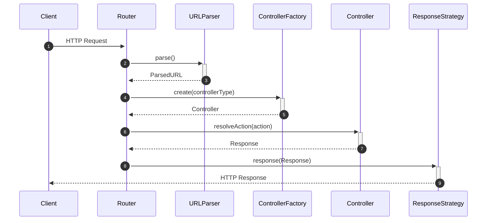
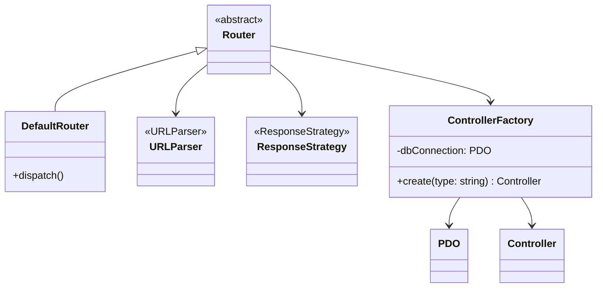
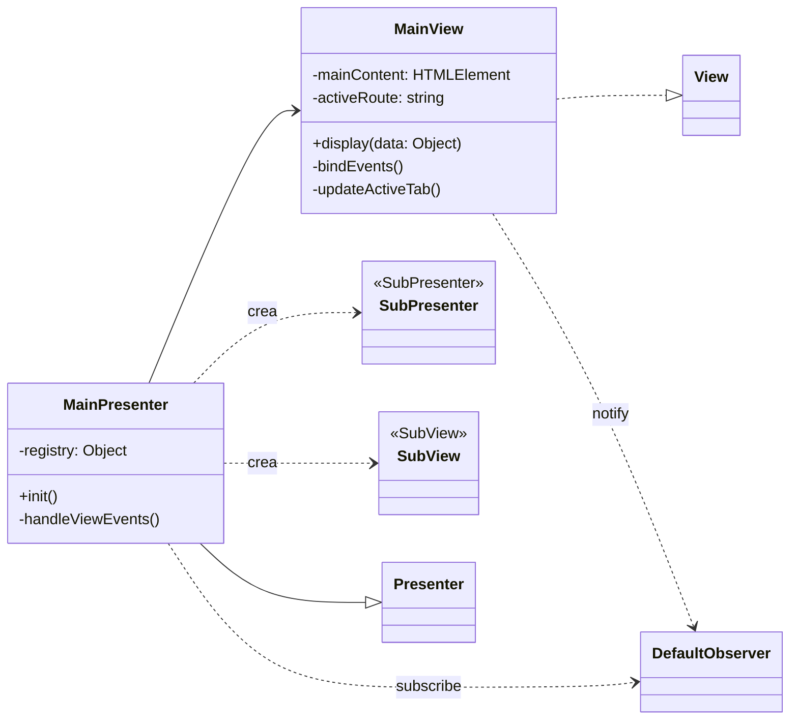
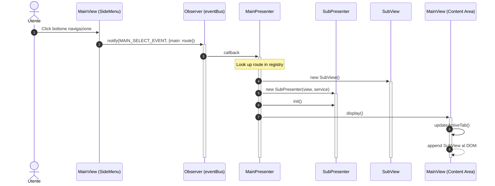
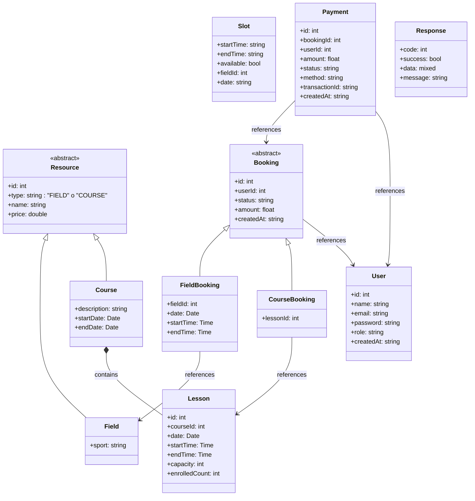

# Architettura Base

Questo documento descrive l'architettura generale del sistema. Le interfacce e classi astratte sono documentate in file separati nella directory `architettura_base/`.

## Interfacce e Classi Astratte

Per maggiori dettagli su ciascuna interfaccia o classe astratta, consultare i file dedicati:

### Backend
- [Router](architettura_base/Router.md) - Classe astratta per il routing delle richieste HTTP
- [URLParser](architettura_base/URLParser.md) - Interfaccia per il parsing delle URL
- [ResponseStrategy](architettura_base/ResponseStrategy.md) - Interfaccia per l'invio delle risposte (Strategy Pattern)
- [Controller](architettura_base/Controller.md) - Classe astratta per i controller
- [Repository](architettura_base/Repository.md) - Classe astratta per l'accesso ai dati

### Frontend
- [View](architettura_base/View.md) - Interfaccia per le view (MVP Pattern)
- [Presenter](architettura_base/Presenter.md) - Classe astratta per i presenter (MVP Pattern)
- [Observer](architettura_base/Observer.md) - Interfaccia per il pattern Observer
- [APIService](architettura_base/APIService.md) - Interfaccia per le chiamate API

---

I seguenti diagrammi mostrano come viene gestita una chiamata HTTP dal backend. 
Per la creazione del controller associato alla chiamata viene utilizzata una factory.
Per motivi di debug, per l'invio della risposta al client viene utilizzato il design pattern "Strategy".

## Backend - Flusso Request/Response

### Diagramma di Sequenza

### Diagramma delle Classi

---

## Gestione Navigazione (MainView & MainPresenter)

Il sistema di navigazione principale è gestito dal `MainPresenter`, che agisce come orchestratore per le diverse sezioni dell'applicazione.

### Diagramma delle Classi

### Diagramma di Sequenza (Navigazione)

---

## Model - Classi Comuni

I seguenti model rappresentano le entità principali del sistema e sono utilizzati in diversi casi d'uso.

---
