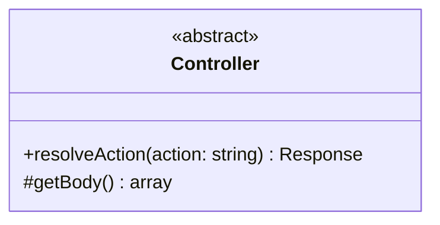

# Controller (Classe Astratta)

Questa è la classe astratta utilizzata nel progetto per la **gestione delle richieste HTTP** nel backend.

## Descrizione

La classe astratta `Controller` definisce la struttura base per tutti i controller dell'applicazione. Fornisce metodi comuni per gestire le richieste, elaborare i dati e creare risposte.

## Struttura

## Responsabilità

- **resolveAction()**: Esegue l'action richiesta (metodo astratto da implementare)
- **getBody()**: Recupera i dati dal body della richiesta

## Implementazioni

Esempi di controller concreti:
- `AuthController`: gestisce autenticazione
- `FieldController`: gestisce i campi sportivi
- `BookingController`: gestisce le prenotazioni

## Dipendenze

- Restituisce: `Response`
- Utilizzata da: `Router`
- Creata da: `ControllerFactory`
