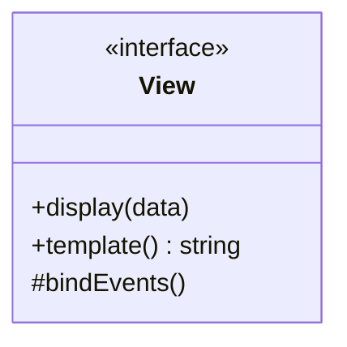
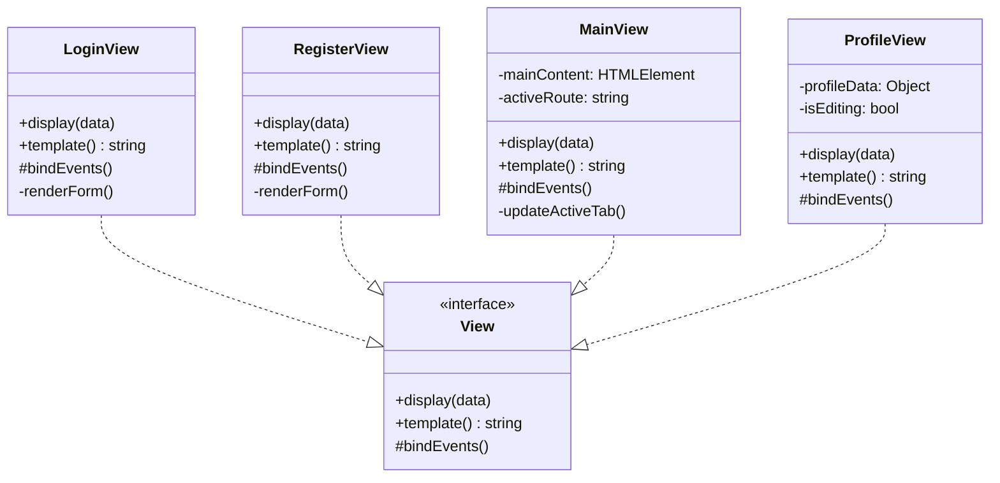
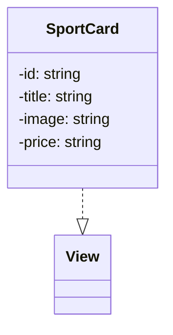
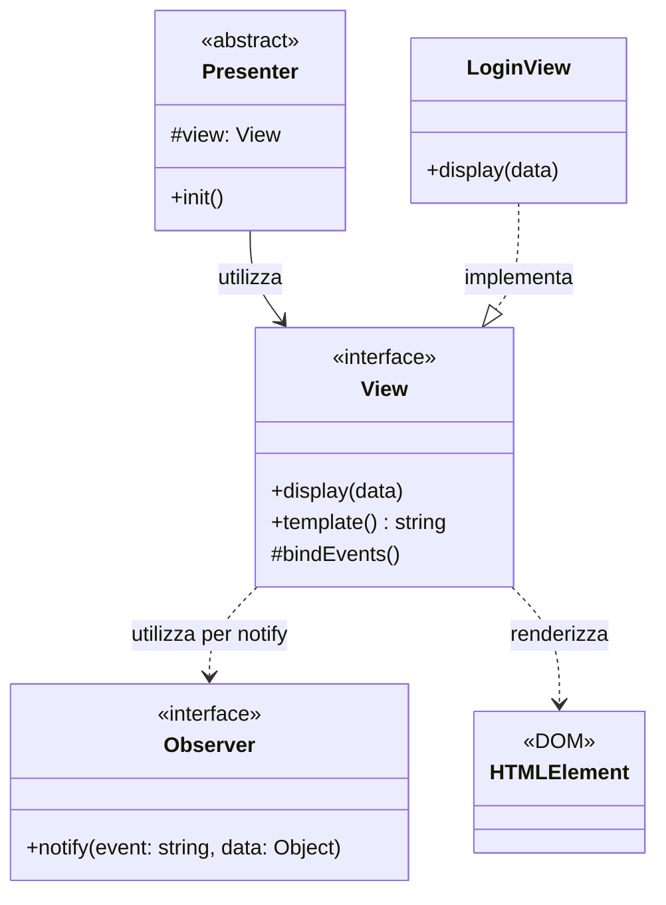

# View Interface

Questa è l'interfaccia utilizzata nel progetto per la **visualizzazione dei componenti** nel pattern MVP (Model-View-Presenter).

## Descrizione

L'interfaccia `View` definisce il contratto per tutti i componenti di visualizzazione dell'applicazione frontend. Ogni View è responsabile della renderizzazione dell'interfaccia utente e della gestione degli eventi DOM.

## Metodi

## Responsabilità

- **display(data)**: Aggiorna la visualizzazione con nuovi dati
- **template()**: Restituisce il template HTML della view
- **bindEvents()**: Collega gli eventi DOM agli handler

## Pattern

Implementa la parte **View** del pattern **MVP (Model-View-Presenter)** con comunicazione tramite **Observer Pattern**.

## Implementazioni

Le seguenti classi implementano questa interfaccia:

### Componenti Riutilizzabili
- **SportCard** - Card per visualizzare singolo sport
  - Utilizzata da: `CampiView`
  - Responsabilità: Renderizzare un singolo sport con immagine, prezzo

## Dipendenze

Il seguente diagramma mostra le relazioni e dipendenze di questa interfaccia:

### Relazioni
- **Comunica con**: `Presenter` - tramite pattern Observer
- **Utilizza**: `Observer` (DefaultObserver) - per notificare eventi
- **Renderizza**: `HTMLElement` - elementi DOM
- **Implementata da**: `LoginView`, `RegisterView`, `MainView`, `CampiView`, `BookingView`, `ProfileView`

