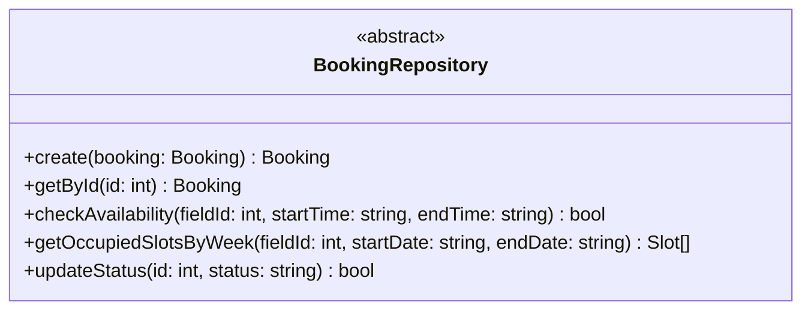
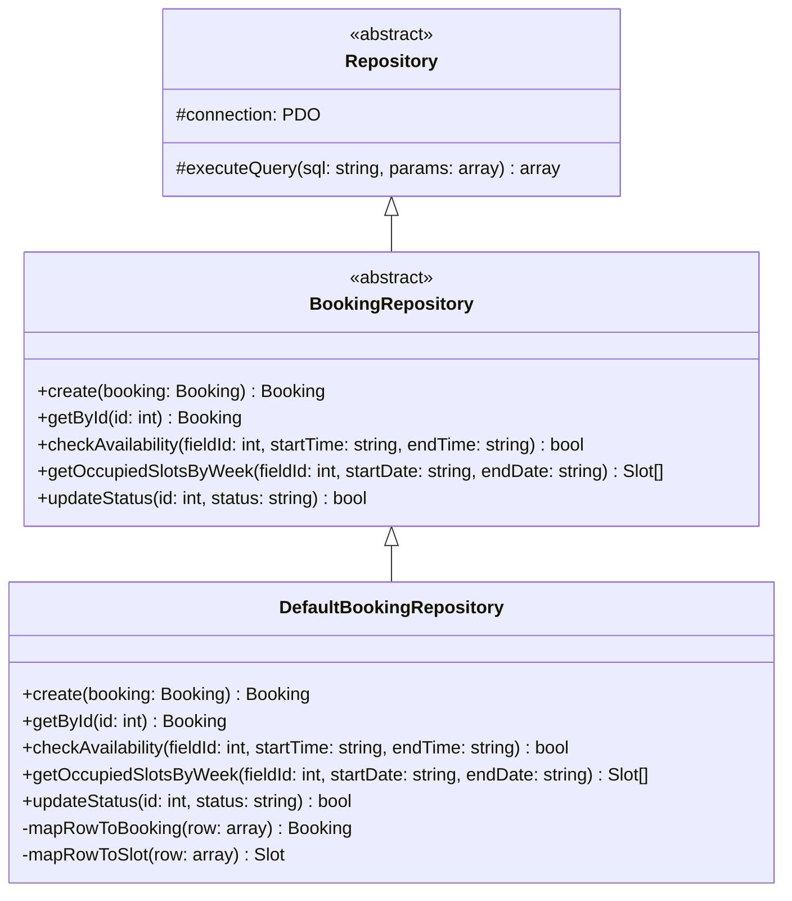
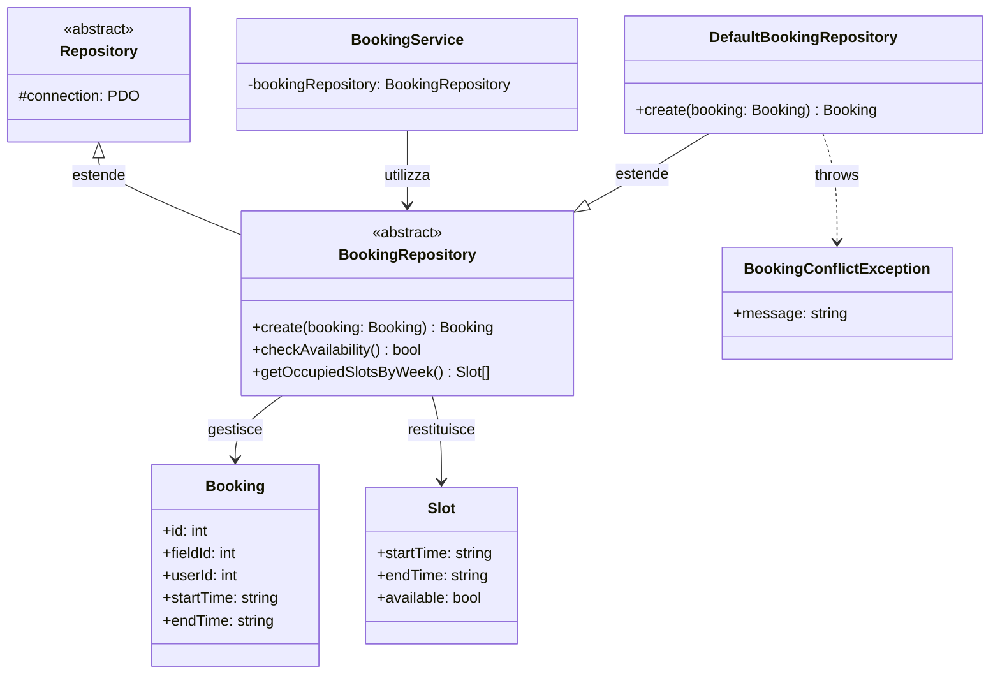

# BookingRepository (Classe Astratta)

Questa è la classe astratta utilizzata nel progetto per l'**accesso ai dati delle prenotazioni** nel database.

## Descrizione

La classe astratta `BookingRepository` estende `Repository` e definisce i metodi specifici per gestire le operazioni sulle prenotazioni dei campi sportivi.

## Struttura

## Responsabilità

- Creare nuove prenotazioni
- Recuperare prenotazioni per ID
- Verificare la disponibilità di un campo in un determinato orario
- Recuperare gli slot occupati in una settimana
- Aggiornare lo stato di una prenotazione

## Implementazioni

Le seguenti classi estendono questa classe astratta:

### DefaultBookingRepository
- **Scopo**: Implementazione standard del repository per prenotazioni
- **Utilizzo**: Utilizzato in produzione per gestione prenotazioni
- **Caratteristiche**: Transazioni per atomicità, lock pessimistico per evitare race conditions

## Eccezioni

Può lanciare:
- `BookingConflictException`: quando si tenta di prenotare uno slot già occupato
- `BookingNotFoundException`: quando una prenotazione non viene trovata

## Dipendenze

Il seguente diagramma mostra le relazioni e dipendenze di questa classe:

### Relazioni
- **Estende**: `Repository` - eredita connessione PDO e metodi base
- **Gestisce**: `Booking` - entità prenotazione
- **Restituisce**: `Slot[]` - array di slot temporali
- **Utilizzata da**: `BookingService`, `FieldService` - per logica business
- **Implementata da**: `DefaultBookingRepository`
- **Eccezioni**: Lancia `BookingConflictException`, `BookingNotFoundException`

