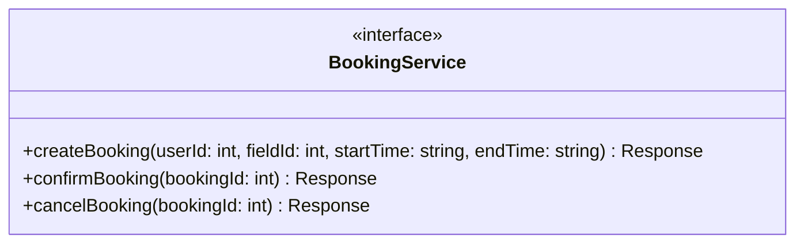
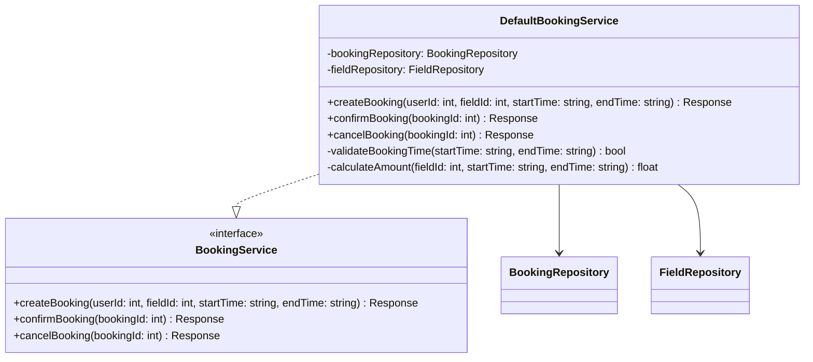
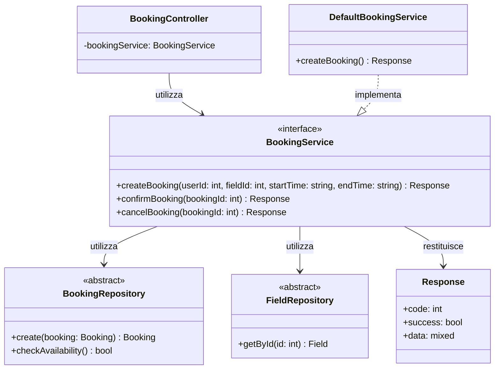

# BookingService Interface

Questa è l'interfaccia utilizzata nel progetto per la **logica di business relativa alle prenotazioni** nel backend.

## Descrizione

L'interfaccia `BookingService` definisce il contratto per i servizi che gestiscono la logica di business delle prenotazioni, inclusa la creazione, conferma e cancellazione.

## Metodi

## Responsabilità

- Creare nuove prenotazioni con validazione
- Confermare prenotazioni esistenti
- Cancellare prenotazioni
- Applicare regole di business (es. validazione orari)
- Gestire transazioni e conflitti

## Implementazioni

Le seguenti classi implementano questa interfaccia:

### DefaultBookingService
- **Scopo**: Implementazione standard del servizio per prenotazioni
- **Utilizzo**: UC04 - Prenotazione campo sportivo
- **Caratteristiche**: Validazione orari, calcolo importo, gestione stati prenotazione

## Dipendenze

Il seguente diagramma mostra le relazioni e dipendenze di questa interfaccia:

### Relazioni
- **Utilizza**: `BookingRepository` - per gestione prenotazioni
- **Utilizza**: `FieldRepository` - per validazione campi e calcolo prezzi
- **Restituisce**: `Response` - risposta formattata
- **Utilizzata da**: `BookingController`
- **Implementata da**: `DefaultBookingService`
