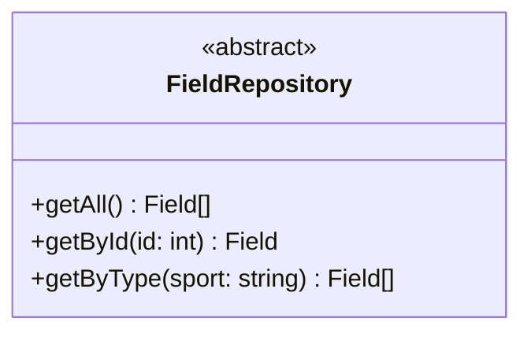
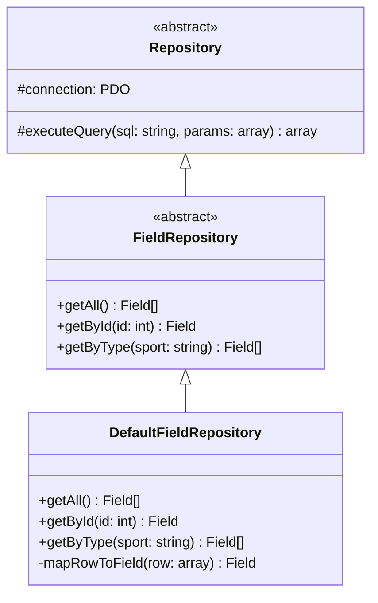
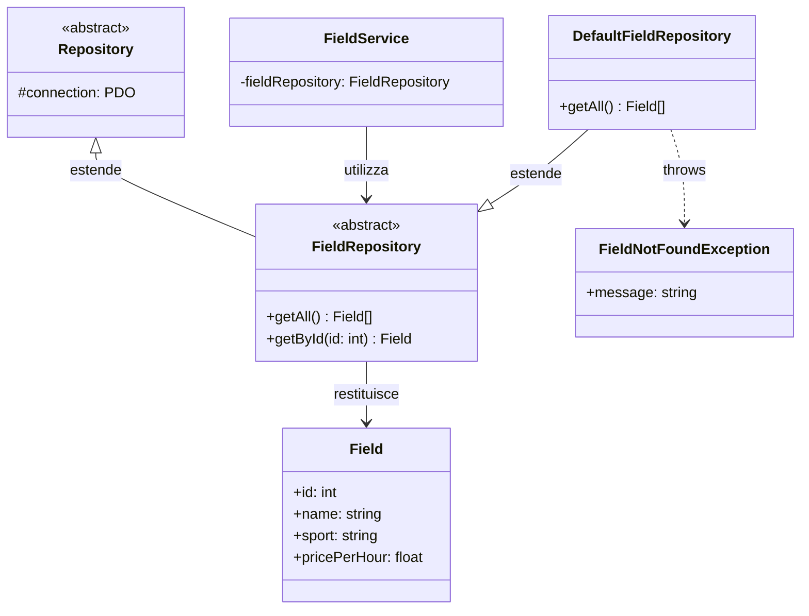

# FieldRepository (Classe Astratta)

Questa è la classe astratta utilizzata nel progetto per l'**accesso ai dati dei campi sportivi** nel database.

## Descrizione

La classe astratta `FieldRepository` estende `Repository` e definisce i metodi specifici per gestire le operazioni CRUD sui campi sportivi.

## Struttura

## Responsabilità

- Recuperare tutti i campi sportivi
- Recuperare un campo specifico per ID
- Filtrare i campi per tipo di sport

## Implementazioni

Le seguenti classi estendono questa classe astratta:

### DefaultFieldRepository
- **Scopo**: Implementazione standard del repository per campi sportivi
- **Utilizzo**: Utilizzato in produzione per accesso ai dati dei campi
- **Caratteristiche**: Query SQL ottimizzate, mapping automatico row→Field

## Eccezioni

Può lanciare:
- `FieldNotFoundException`: quando un campo non viene trovato

## Dipendenze

Il seguente diagramma mostra le relazioni e dipendenze di questa classe:

### Relazioni
- **Estende**: `Repository` - eredita connessione PDO e metodi base
- **Restituisce**: `Field` - entità campo sportivo
- **Utilizzata da**: `FieldService` - per logica business campi
- **Implementata da**: `DefaultFieldRepository`
- **Eccezioni**: Lancia `FieldNotFoundException`

