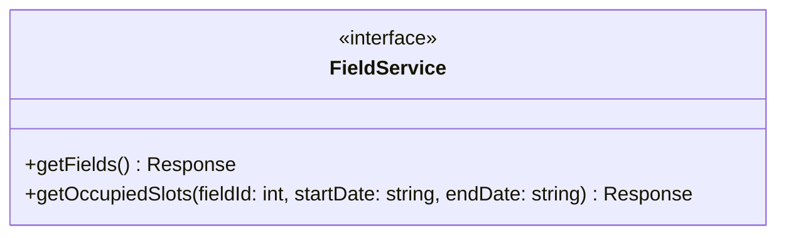
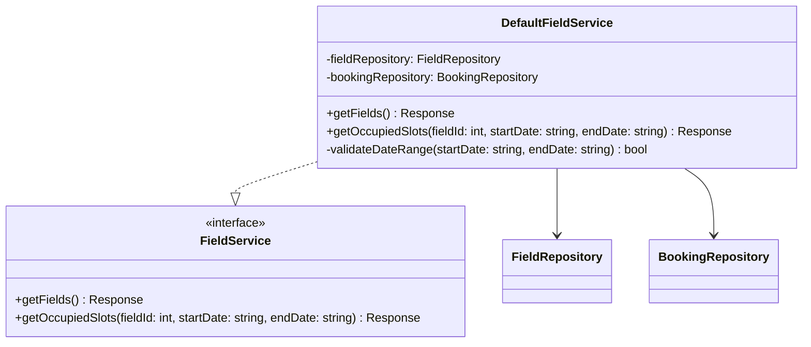
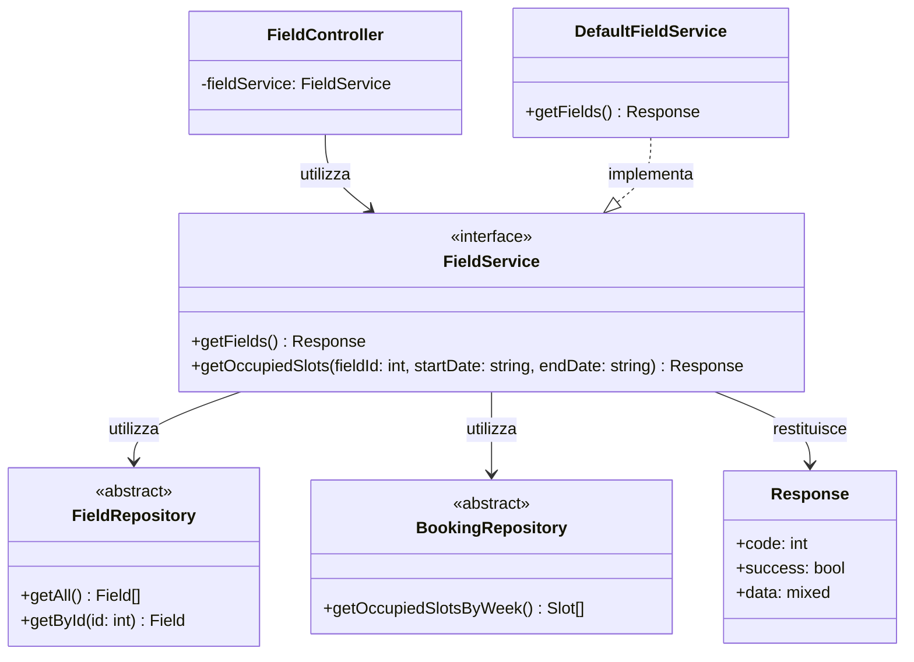

# FieldService Interface

Questa è l'interfaccia utilizzata nel progetto per la **logica di business relativa ai campi sportivi** nel backend.

## Descrizione

L'interfaccia `FieldService` definisce il contratto per i servizi che gestiscono la logica di business dei campi sportivi, inclusa la visualizzazione dei campi e degli slot disponibili.

## Metodi

## Responsabilità

- Recuperare l'elenco dei campi sportivi
- Recuperare gli slot occupati per un campo in un periodo specifico
- Applicare la logica di business necessaria
- Restituire risposte formattate

## Implementazioni

Le seguenti classi implementano questa interfaccia:

### DefaultFieldService
- **Scopo**: Implementazione standard del servizio per campi sportivi
- **Utilizzo**: UC03 - Visualizzazione disponibilità campi
- **Caratteristiche**: Validazione date, aggregazione dati da più repository

## Dipendenze

Il seguente diagramma mostra le relazioni e dipendenze di questa interfaccia:

### Relazioni
- **Utilizza**: `FieldRepository` - per accesso dati campi
- **Utilizza**: `BookingRepository` - per slot occupati
- **Restituisce**: `Response` - risposta formattata
- **Utilizzata da**: `FieldController`
- **Implementata da**: `DefaultFieldService`
