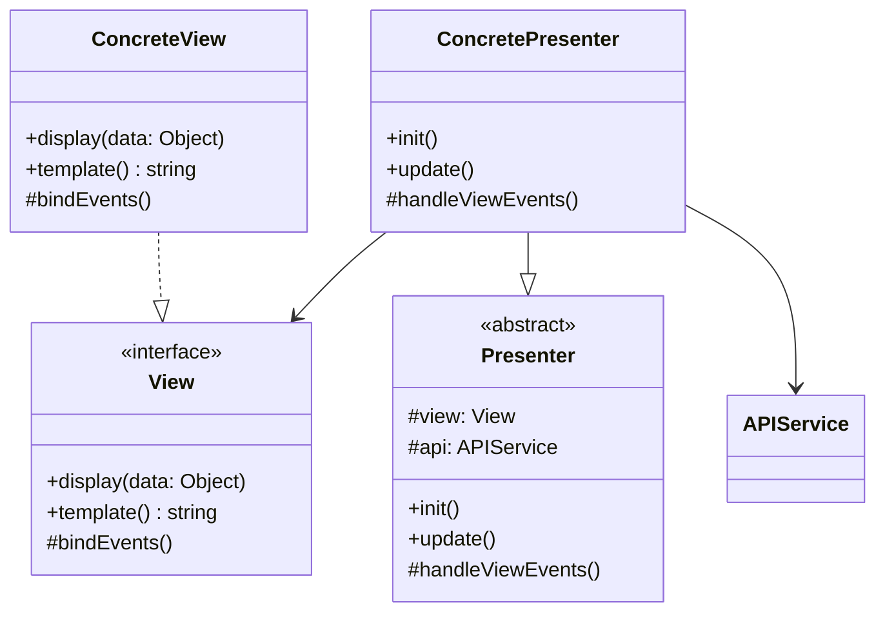
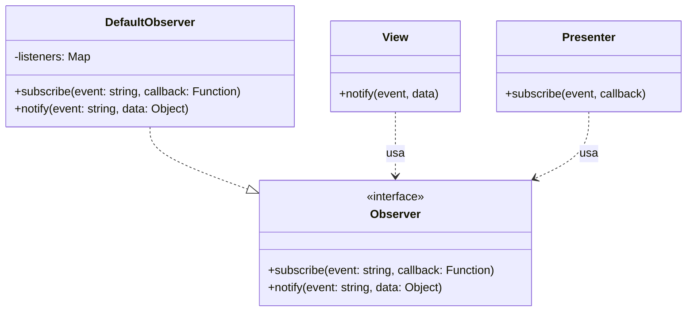
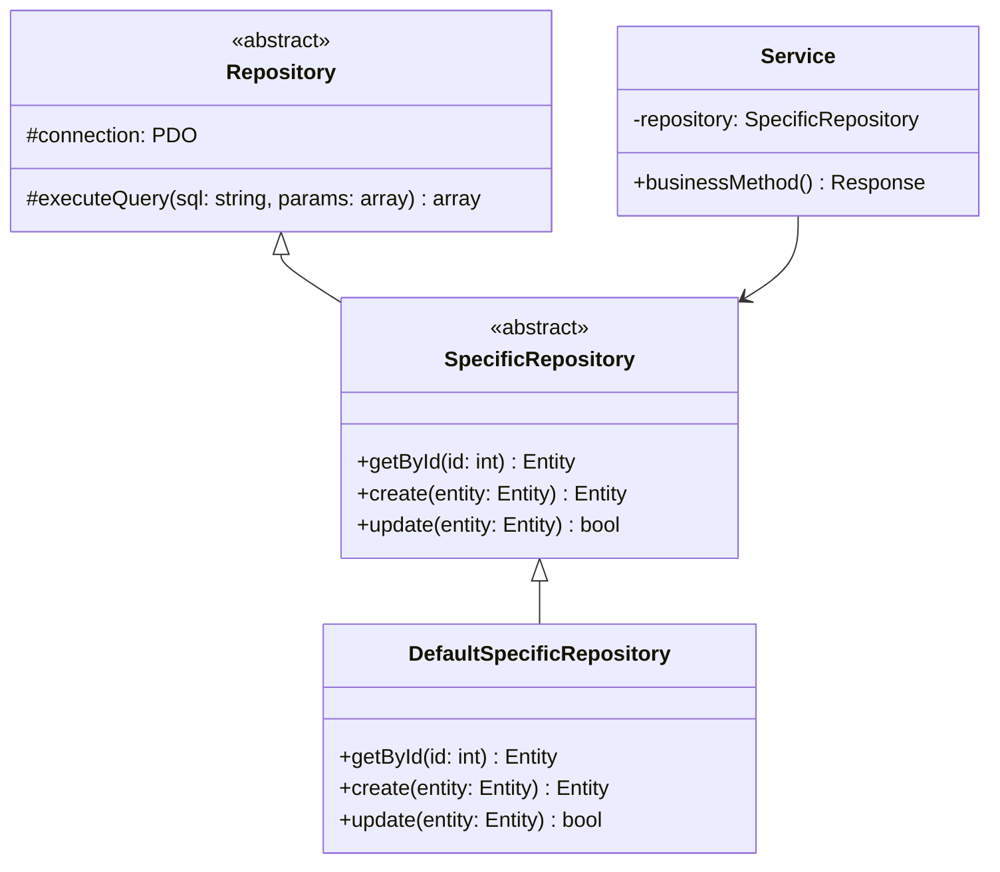
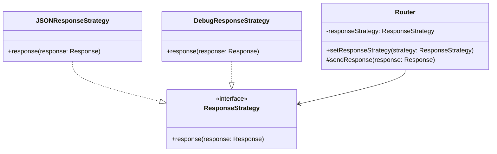
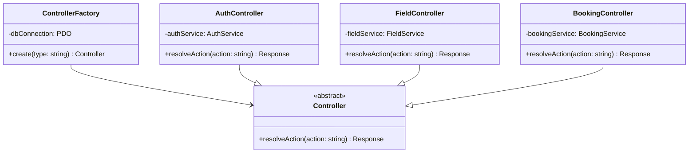
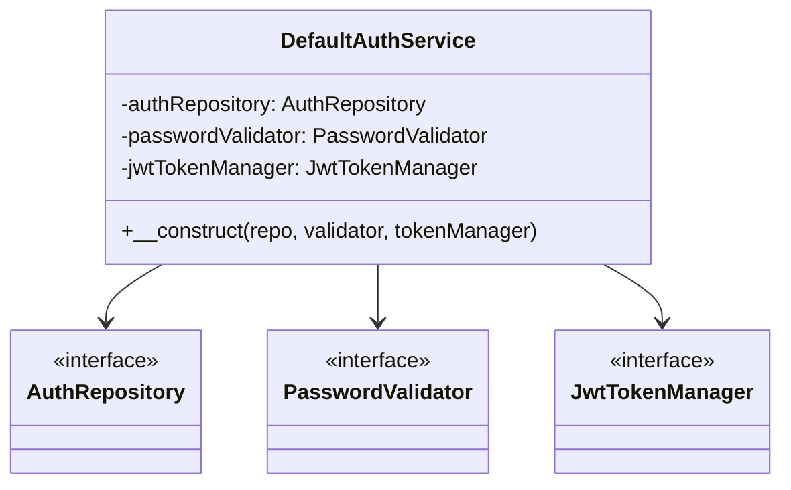
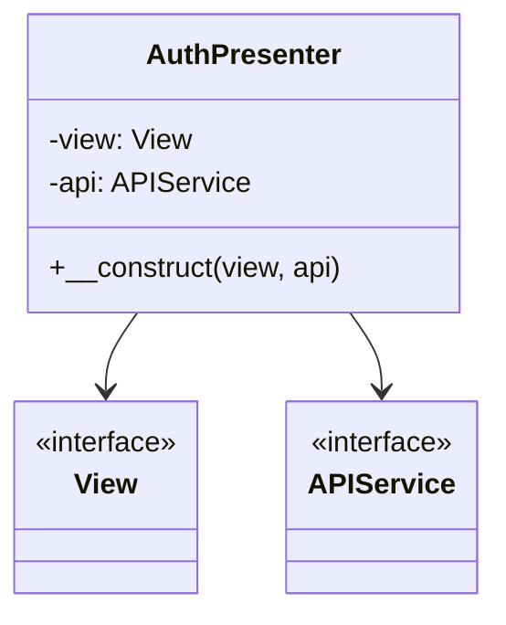
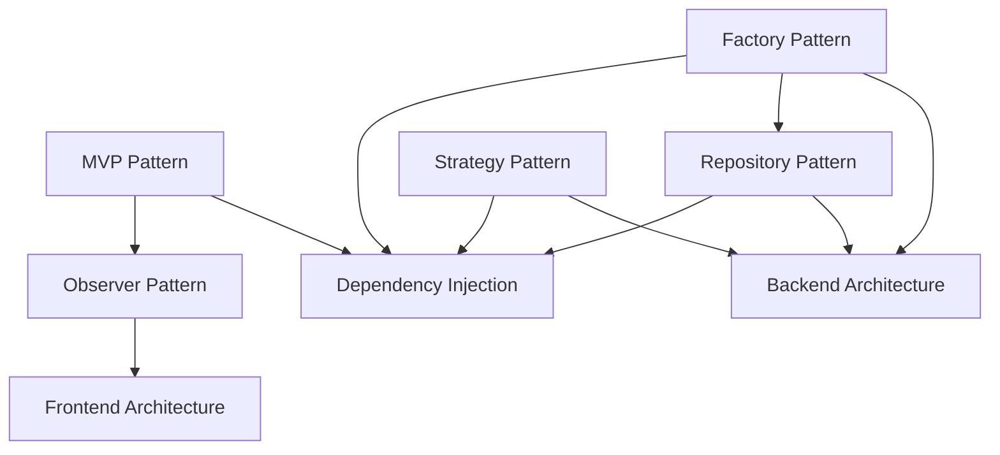

# Design Patterns Utilizzati nel Progetto

Questo documento descrive i design pattern implementati nell'architettura del sistema.

---

## 📋 Indice dei Pattern

1. [Model-View-Presenter (MVP)](#model-view-presenter-mvp)
2. [Observer Pattern](#observer-pattern)
3. [Repository Pattern](#repository-pattern)
4. [Strategy Pattern](#strategy-pattern)
5. [Factory Pattern](#factory-pattern)
6. [Dependency Injection](#dependency-injection)

---

## Model-View-Presenter (MVP)

### Scopo
Separare la logica di presentazione dalla logica di business e dalla visualizzazione, migliorando la testabilità e la manutenibilità del codice frontend.

### Componenti

### Vantaggi
- **Testabilità**: Il Presenter può essere testato indipendentemente dalla View
- **Separazione delle responsabilità**: View gestisce solo la UI, Presenter gestisce la logica
- **Riusabilità**: Le View possono essere riutilizzate con Presenter diversi

### Implementazioni
- `AuthPresenter` + `LoginView` / `RegisterView`
- `MainPresenter` + `MainView`
- `CampiPresenter` + `CampiView`
- `BookingPresenter` + `BookingView`
- `ProfilePresenter` + `ProfileView`

---

## Observer Pattern

### Scopo
Permettere la comunicazione event-driven tra View e Presenter, disaccoppiando i componenti.

### Struttura

### Flusso di Comunicazione
1. **View** notifica un evento tramite `notify()`
2. **Observer** propaga l'evento a tutti i subscriber
3. **Presenter** riceve l'evento tramite callback registrato con `subscribe()`

### Vantaggi
- **Disaccoppiamento**: View e Presenter non si conoscono direttamente
- **Flessibilità**: Facile aggiungere nuovi listener
- **Manutenibilità**: Centralizzazione della gestione eventi

### Implementazione
- `DefaultObserver`: implementazione concreta con Map per gestire i listeners
- Utilizzato in tutti i componenti MVP del frontend

---

## Repository Pattern

### Scopo
Astrarre l'accesso ai dati, separando la logica di business dalla logica di persistenza.

### Struttura

### Vantaggi
- **Astrazione**: Il Service non conosce i dettagli di implementazione del database
- **Testabilità**: Facile creare mock dei repository per i test
- **Centralizzazione**: Tutta la logica di accesso ai dati in un unico posto
- **Riusabilità**: I repository possono essere riutilizzati da più service

### Implementazioni
- `AuthRepository` → `DefaultAuthRepository`
- `UserRepository` → `DefaultUserRepository`
- `FieldRepository` → `DefaultFieldRepository`
- `BookingRepository` → `DefaultBookingRepository`

---

## Strategy Pattern

### Scopo
Permettere di cambiare dinamicamente l'algoritmo di invio delle risposte HTTP (es. per debug, logging, formati diversi).

### Struttura

### Vantaggi
- **Flessibilità**: Cambio dinamico della strategia di risposta
- **Open/Closed Principle**: Nuove strategie senza modificare il Router
- **Testabilità**: Facile testare diverse strategie

### Utilizzo
- Invio risposte HTTP in produzione vs debug
- Logging delle risposte
- Formattazione diversa (JSON, XML, ecc.)

---

## Factory Pattern

### Scopo
Centralizzare la creazione dei controller, gestendo le dipendenze in modo consistente.

### Struttura

### Vantaggi
- **Centralizzazione**: Tutta la logica di creazione in un unico punto
- **Dependency Injection**: La factory gestisce le dipendenze
- **Manutenibilità**: Facile aggiungere nuovi controller

### Utilizzo
- `ControllerFactory::create('auth')` → crea `AuthController`
- `ControllerFactory::create('field')` → crea `FieldController`
- `ControllerFactory::create('booking')` → crea `BookingController`

---

## Dependency Injection

### Scopo
Invertire il controllo delle dipendenze, migliorando testabilità e flessibilità.

### Esempi

#### Backend - Service Layer

#### Frontend - Presenter

### Vantaggi
- **Testabilità**: Facile iniettare mock per i test
- **Flessibilità**: Cambio implementazioni senza modificare il codice
- **Loose Coupling**: Dipendenze da interfacce, non da implementazioni concrete

---

## 🔗 Relazioni tra Pattern

---

## 📚 Riferimenti

- [Architettura Base](../Architettura%20base.md)
- [Gang of Four - Design Patterns](https://en.wikipedia.org/wiki/Design_Patterns)
- [Martin Fowler - Patterns of Enterprise Application Architecture](https://martinfowler.com/eaaCatalog/)

---

## 🎯 Best Practices

1. **Preferire composizione a ereditarietà**: Usare interfacce e dependency injection
2. **Programmare verso interfacce**: Non dipendere da implementazioni concrete
3. **Single Responsibility**: Ogni classe ha una sola responsabilità
4. **Open/Closed Principle**: Aperto all'estensione, chiuso alla modifica
5. **Dependency Inversion**: Dipendere da astrazioni, non da concretizzazioni
