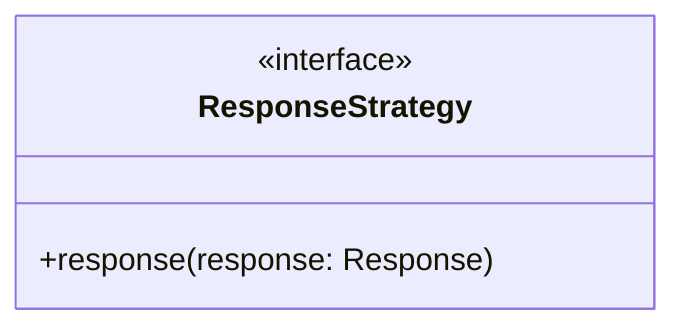
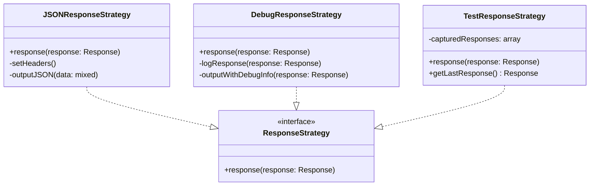
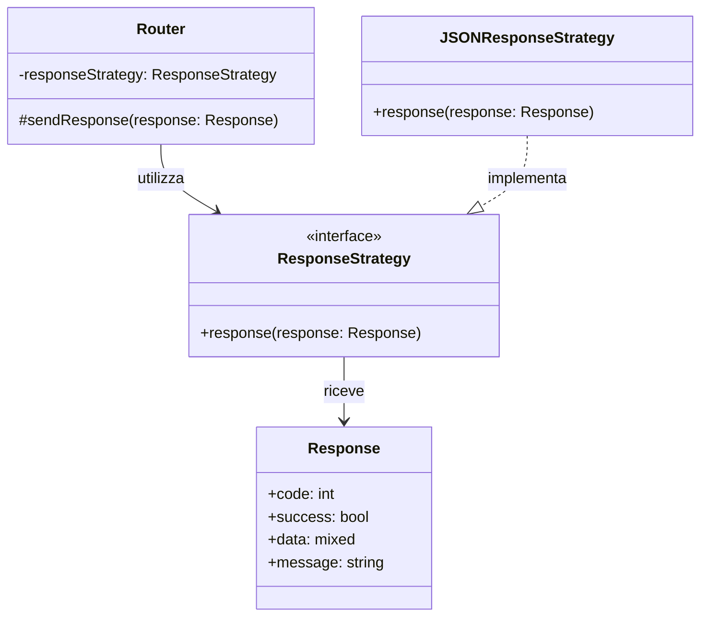

# ResponseStrategy Interface

Questa è l'interfaccia utilizzata nel progetto per l'**invio delle risposte HTTP** al client, implementando il design pattern Strategy.

## Descrizione

L'interfaccia `ResponseStrategy` definisce il contratto per inviare risposte HTTP al client. Permette di cambiare dinamicamente la strategia di risposta (ad esempio per debug, logging, o formati diversi).

## Metodi

## Utilizzo

Questa interfaccia viene implementata da classi concrete che si occupano di:
- Formattare la risposta HTTP
- Impostare gli header appropriati
- Inviare la risposta al client
- Gestire eventuali logging o debug

## Pattern

Implementa il **Strategy Pattern** per permettere diverse modalità di invio della risposta (produzione, debug, test).

## Implementazioni

Le seguenti classi implementano questa interfaccia:

### JSONResponseStrategy
- **Scopo**: Invia risposte HTTP in formato JSON standard
- **Utilizzo**: Modalità di produzione
- **Caratteristiche**: Imposta header JSON, gestisce CORS

### DebugResponseStrategy
- **Scopo**: Invia risposte con informazioni di debug aggiuntive
- **Utilizzo**: Ambiente di sviluppo
- **Caratteristiche**: Include stack trace, query SQL, timing

### TestResponseStrategy
- **Scopo**: Cattura le risposte per testing
- **Utilizzo**: Test automatizzati
- **Caratteristiche**: Non invia output, memorizza le risposte

## Dipendenze

Il seguente diagramma mostra le relazioni e dipendenze di questa interfaccia:

### Relazioni
- **Utilizzata da**: `Router` - per l'invio delle risposte HTTP
- **Riceve**: `Response` - oggetto contenente i dati della risposta
- **Implementata da**: `JSONResponseStrategy`, `DebugResponseStrategy`, `TestResponseStrategy`

