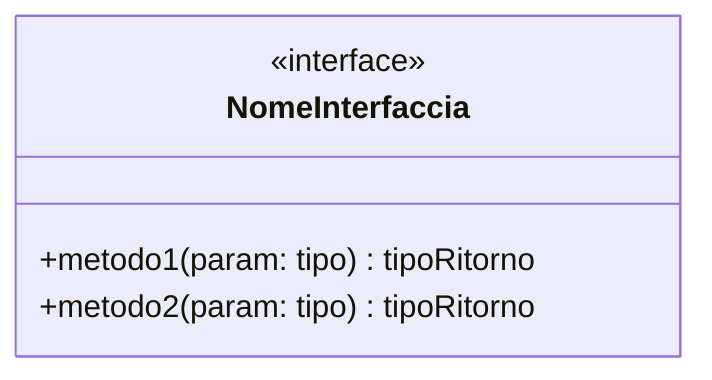
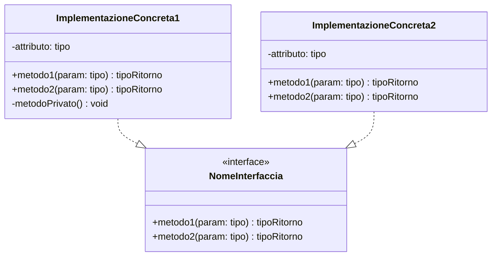
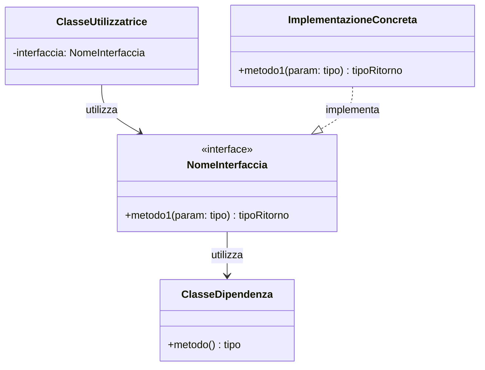

# [Nome Interfaccia/Classe Astratta]

Questa è l'interfaccia/classe astratta utilizzata nel progetto per **[scopo principale]**.

## Descrizione

[Descrizione dettagliata dello scopo e del ruolo di questa interfaccia/classe astratta nel sistema]

## Metodi/Struttura

## Responsabilità

- **metodo1()**: [Descrizione della responsabilità]
- **metodo2()**: [Descrizione della responsabilità]
- [Altre responsabilità generali]

## Pattern

[Se applicabile, descrivere quale design pattern implementa e perché]

## Implementazioni

Le seguenti classi implementano questa interfaccia:

### [NomeImplementazione1]
- **Scopo**: [Descrizione dello scopo specifico]
- **Utilizzo**: [Dove e come viene utilizzata]

### [NomeImplementazione2]
- **Scopo**: [Descrizione dello scopo specifico]
- **Utilizzo**: [Dove e come viene utilizzata]

## Utilizzo nel Progetto

[Descrizione di come questa interfaccia viene utilizzata nel contesto del progetto]

## Dipendenze

Il seguente diagramma mostra le relazioni e dipendenze di questa interfaccia/classe:

### Relazioni
- **Utilizzata da**: [Lista di classi che utilizzano questa interfaccia]
- **Utilizza**: [Lista di altre interfacce/classi utilizzate]
- **Restituisce**: [Tipi di ritorno principali]
- **Implementata da**: [Lista implementazioni concrete]

## Esempi di Utilizzo

[Se applicabile, mostrare esempi di codice o scenari d'uso]

## Note Aggiuntive

[Eventuali note importanti, considerazioni di design, o limitazioni]

---

**Vedi anche:**
- [Link ad altre interfacce correlate]
- [Link all'architettura base](../Architettura%20base.md)
