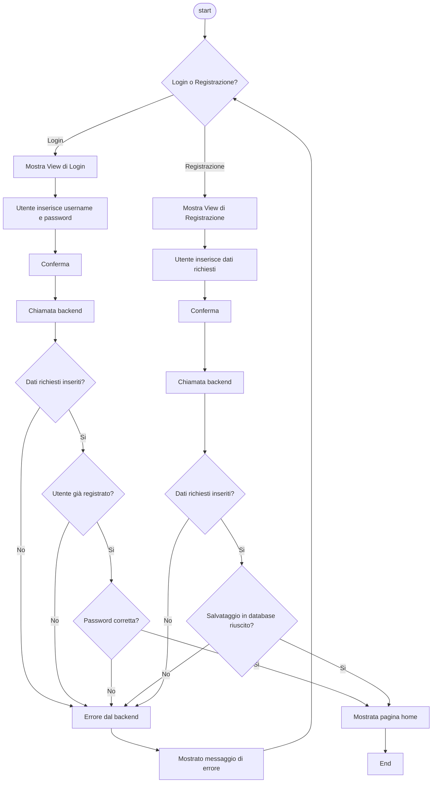

```mermaid
flowchart TD
    Start([start]) --> first_question{Login o Registrazione?}

        first_question --> |Login| login_start[Mostra View di Login]

            login_start --> login_insert[Utente inserisce username e password]
            login_insert --> confirm[Conferma]
            confirm --> chiamata[Chiamata backend]
            chiamata --> body_verify{Dati richiesti inseriti?}
            
            body_verify --> |No| backend_error[Errore dal backend]
            
             body_verify --> |Si| user_in_db{Utente già registrato? }
                user_in_db --> |No| backend_error
                 user_in_db --> |Si| password_verify{Password corretta?}
                    password_verify --> |Si| show_home[Mostrata pagina home]
                    password_verify --> |No| backend_error

    first_question --> |Registrazione| register_start[Mostra View di Registrazione]
        register_start --> insert_register[Utente inserisce dati richiesti]
        insert_register --> register_confirm[Conferma]
        register_confirm --> register_backend[Chiamata backend]
        register_backend --> register_verify{Dati richiesti inseriti?}
        register_verify --> |Si| db_save{Salvataggio in database riuscito?}
            db_save --> |Si| show_home
            db_save --> |No| backend_error

        register_verify --> |No| backend_error


    backend_error --> error_message[Mostrato messaggio di errore]
    error_message --> first_question
    show_home --> End
```
