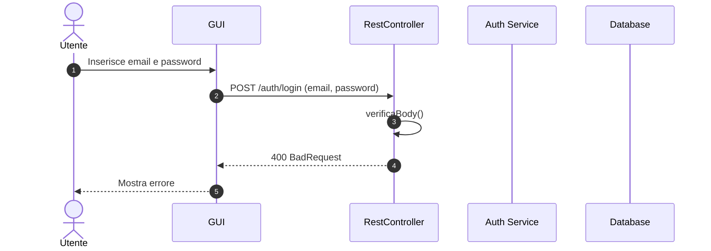

```mermaid
sequenceDiagram
    autonumber
    actor Utente
    participant GUI as GUI
    participant API as RestController
    participant Auth as Auth Service
    participant DB as Database

    Utente ->> GUI: Inserisce email e password
    GUI ->> API: POST /auth/login (email, password)
	API ->> API: verificaBody()
    API -->> GUI: 400 BadRequest
    GUI -->> Utente: Mostra errore
```