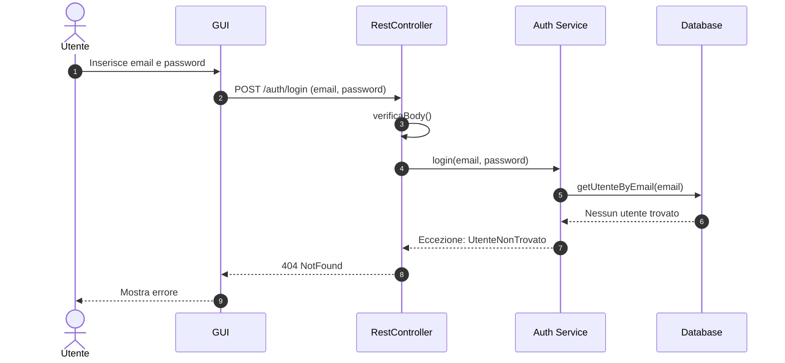

```mermaid
sequenceDiagram
    autonumber
    actor Utente
    participant GUI as GUI
    participant API as RestController
    participant Auth as Auth Service
    participant DB as Database

    Utente ->> GUI: Inserisce email e password
    GUI ->> API: POST /auth/login (email, password)
	API ->> API: verificaBody()
    API ->> Auth: login(email, password)
    Auth ->> DB: getUtenteByEmail(email)
    DB -->> Auth: Nessun utente trovato
    Auth -->> API: Eccezione: UtenteNonTrovato
    API -->> GUI: 404 NotFound
    GUI -->> Utente: Mostra errore
```