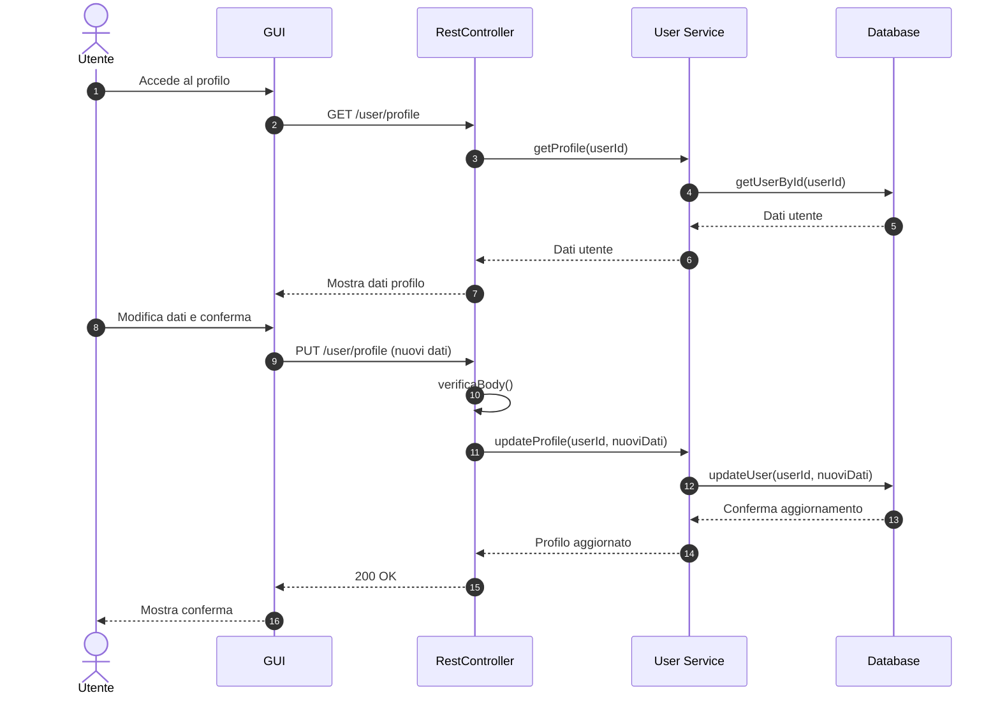

```mermaid
sequenceDiagram
    autonumber
    actor Utente
    participant GUI as GUI
    participant API as RestController
    participant UserService as User Service
    participant DB as Database

    %% Visualizzazione
    Utente ->> GUI: Accede al profilo
    GUI ->> API: GET /user/profile
    API ->> UserService: getProfile(userId)
    UserService ->> DB: getUserById(userId)
    DB -->> UserService: Dati utente
    UserService -->> API: Dati utente
    API -->> GUI: Mostra dati profilo

    %% Modifica
    Utente ->> GUI: Modifica dati e conferma
    GUI ->> API: PUT /user/profile (nuovi dati)
    API ->> API: verificaBody()
    API ->> UserService: updateProfile(userId, nuoviDati)
    UserService ->> DB: updateUser(userId, nuoviDati)
    DB -->> UserService: Conferma aggiornamento
    UserService -->> API: Profilo aggiornato
    API -->> GUI: 200 OK
    GUI -->> Utente: Mostra conferma
```