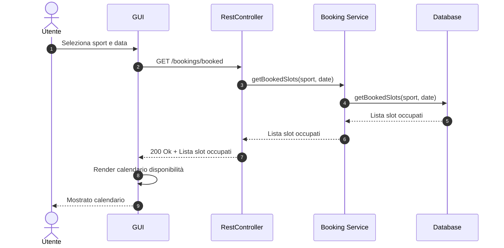

```mermaid
sequenceDiagram
    autonumber
    actor Utente
    participant GUI as GUI
    participant API as RestController
    participant BookingService as Booking Service
    participant DB as Database

    Utente ->> GUI: Seleziona sport e data
    GUI ->> API: GET /bookings/booked
    API ->> BookingService: getBookedSlots(sport, date)
    BookingService ->> DB: getBookedSlots(sport, date)
    DB -->> BookingService: Lista slot occupati
    BookingService -->> API: Lista slot occupati
    API -->> GUI: 200 Ok + Lista slot occupati
    GUI ->> GUI: Render calendario disponibilità
    GUI -->> Utente: Mostrato calendario
```