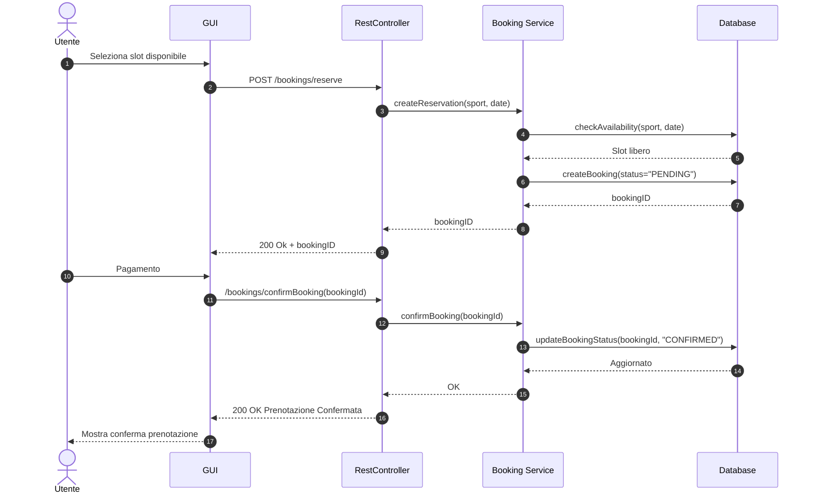

```mermaid
sequenceDiagram
    autonumber
    actor Utente
    participant GUI as GUI
    participant API as RestController
    participant BookingService as Booking Service
    participant DB as Database

    Utente ->> GUI: Seleziona slot disponibile
    GUI ->> API: POST /bookings/reserve
    API ->> BookingService: createReservation(sport, date)
    BookingService ->> DB: checkAvailability(sport, date)
    DB -->> BookingService: Slot libero
    BookingService ->> DB: createBooking(status="PENDING")
    DB -->> BookingService: bookingID
    BookingService -->> API: bookingID
    API -->> GUI: 200 Ok + bookingID
    Utente ->> GUI: Pagamento  
    GUI ->> API: /bookings/confirmBooking(bookingId)   
    API ->> BookingService: confirmBooking(bookingId)
    BookingService ->> DB: updateBookingStatus(bookingId, "CONFIRMED")
    DB -->> BookingService: Aggiornato
    BookingService -->> API: OK
    API -->> GUI: 200 OK Prenotazione Confermata
    GUI -->> Utente: Mostra conferma prenotazione
```