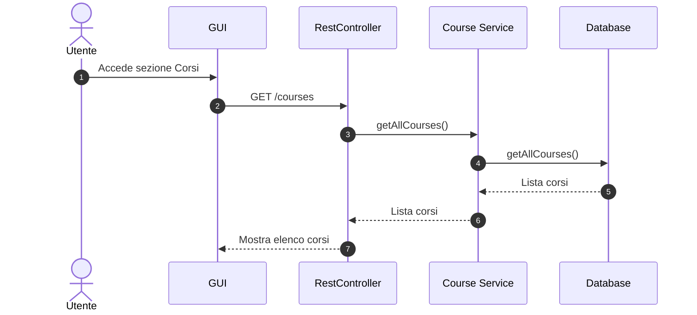

```mermaid
sequenceDiagram
    autonumber
    actor Utente
    participant GUI as GUI
    participant API as RestController
    participant CourseService as Course Service
    participant DB as Database

    Utente ->> GUI: Accede sezione Corsi
    GUI ->> API: GET /courses
    API ->> CourseService: getAllCourses()
    CourseService ->> DB: getAllCourses()
    DB -->> CourseService: Lista corsi
    CourseService -->> API: Lista corsi
    API -->> GUI: Mostra elenco corsi
```