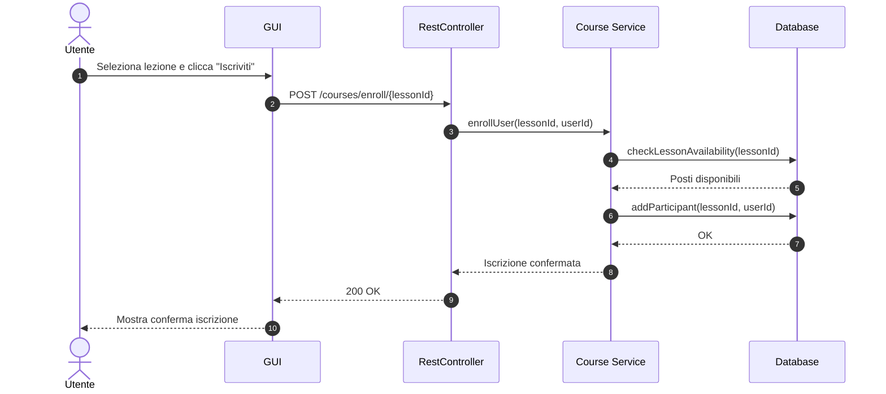

```mermaid
sequenceDiagram
    autonumber
    actor Utente
    participant GUI as GUI
    participant API as RestController
    participant CourseService as Course Service
    participant DB as Database

    Utente ->> GUI: Seleziona lezione e clicca "Iscriviti"
    GUI ->> API: POST /courses/enroll/{lessonId}
    API ->> CourseService: enrollUser(lessonId, userId)
    CourseService ->> DB: checkLessonAvailability(lessonId)
    DB -->> CourseService: Posti disponibili
    
    CourseService ->> DB: addParticipant(lessonId, userId)
    DB -->> CourseService: OK
    CourseService -->> API: Iscrizione confermata
    API -->> GUI: 200 OK
    GUI -->> Utente: Mostra conferma iscrizione
```