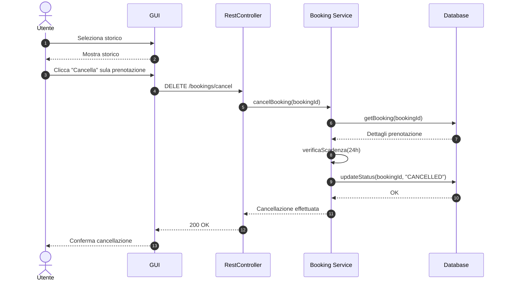

```mermaid
sequenceDiagram
    autonumber
    actor Utente
    participant GUI as GUI
    participant API as RestController
    participant BookingService as Booking Service
    participant DB as Database

    Utente ->> GUI: Seleziona storico 
    GUI -->> Utente: Mostra storico
    Utente ->> GUI: Clicca "Cancella" sula prenotazione
    GUI ->> API: DELETE /bookings/cancel
    API ->> BookingService: cancelBooking(bookingId)
    BookingService ->> DB: getBooking(bookingId)
    DB -->> BookingService: Dettagli prenotazione
    
    BookingService ->> BookingService: verificaScadenza(24h)
    
    BookingService ->> DB: updateStatus(bookingId, "CANCELLED")
    DB -->> BookingService: OK
    
    BookingService -->> API: Cancellazione effettuata
    API -->> GUI: 200 OK
    GUI -->> Utente: Conferma cancellazione
```