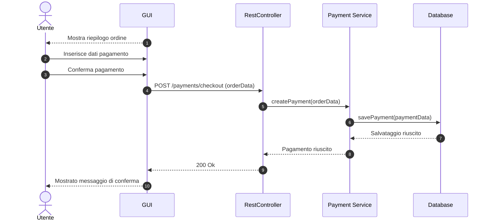

```mermaid
sequenceDiagram
    autonumber
    actor Utente
    participant GUI as GUI
    participant API as RestController
    participant PaymentService as Payment Service
    participant DB as Database

    GUI -->> Utente: Mostra riepilogo ordine
    Utente ->> GUI: Inserisce dati pagamento
    Utente ->> GUI: Conferma pagamento
    GUI ->> API: POST /payments/checkout (orderData)
    API ->> PaymentService: createPayment(orderData)

    PaymentService ->> DB: savePayment(paymentData)
    DB -->> PaymentService: Salvataggio riuscito 
    PaymentService -->> API: Pagamento riuscito
    API -->> GUI: 200 Ok 
    GUI -->> Utente: Mostrato messaggio di conferma
```